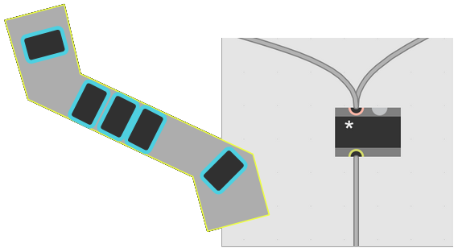
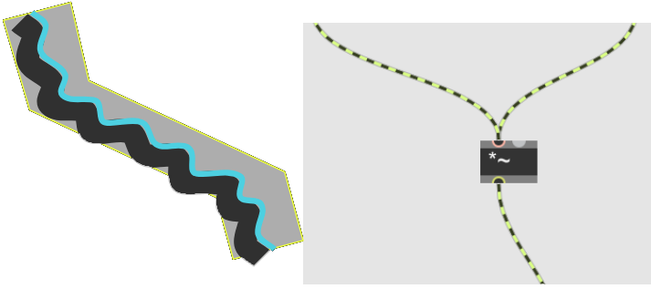
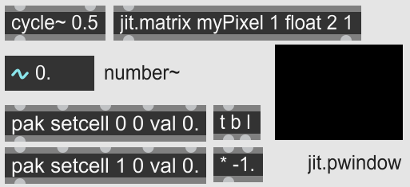

# Data and signal flow<!-- omit in toc -->

We introduce the fundamentals of Max/Pd and apply them in a basic example.

[Introduction](#introduction) . [Anatomy of objects](#anatomy-of-objects) . [Types](#types) . [Exercise: audio-pixel visualiser](#exercise-audio-pixel-visualiser)

## Introduction

It's time to take our first steps in Max (and Pure Data). Remember to check out the [[resources]] page for other points of entry into [Max](resources#max) and [Pd](resources#pd).

I'll be mentioning hotkeys as we go, so we can get around faster. See [this slide](slides/02-05-types-flow#3) for the most common ones, and you can look up cheatsheets online.

## Anatomy of objects

Max/Pd works by generating and transmitting data from one *object* to another. An object has *inlets* (on top) and *outlets* (on the bottom), and stores and processes data. The data flows downstream via *patch cords* connecting objects.

As an example, press **N** and type in ```+```, then hit Enter. The [+ ] object adds two numbers together:




Connect number boxes (key **I**) to the inlets and outlets and now you can see it in action. But first, you need to *lock* the program, or *patch*. Hit the lock icon, or **Ctrl+click** anywhere on the canvas.

, which you access (with the patch unlocked) by **Alt+click**ing on the object. Whenever you're in doubt, or looking for inspiration or related info, check out these help patches. Understanding them is the best way to learn Max. And just like any patch, you can unlock them and copy-paste anything you find useful into your project.

There are two types of inlets: <span style="color:lightcoral">hot</span> and <span style="color:cornflowerblue">cold</span>. Cold inlets <span style="color:cornflowerblue">set the internal state</span> of an object, while hot inlets both set the state, **and** <span style="color:lightcoral">trigger an operation</span> (usually resulting in an output down the object's outlet).

This distinction between hot and cold inlets, and their layout on an object (most often the hot inlet comes first, with cold inlet(s) to its right) dictates Max/Pd's dataflow architecture, including matters like [right-to-left ordering](https://docs.cycling74.com/max8/tutorials/basicchapter05), and [trigger](https://docs.cycling74.com/max8/refpages/trigger)ing data to be stored and executed in sequence, sometimes with other operations and/or time passing inbetween.

Let's focus for a minute on the [message] object (key **M**).



<br/>
Notice how a ```set ``` message to the left input (or any input in the Max object’s right, cold, inlet) sets the content, and anything else into the left, hot, inlet, causes downward triggering of the current content.

## Types

So far we have dealt with objects functioning at the *control rate*, or about 1000 operations per second. MSP, or signal-based, objects run at *audio rate*, which is the sampling rate of your DAC. This allows us to generate and process sound in real time. 


In the right-hand patch I note in comments (key **C**) the name of the graphical objects used. See their help files to find out more.

The float number (key **F**) controls the frequency of the [sinewave](https://en.wikipedia.org/wiki/Sine_wave) generator. Everything downstream of the [cycle~] object is a signal: as long as the audio engine is on (which can be toggled by clicking on the [ezdac~]... make sure your speaker volume is at a reasonable setting first), connected MSP objects will process signal values, which flow continuously through the striped-green patch cords. With the patch locked, drag on the float number box to change the frequency. Notice that as you drag above 20-40 Hz, the sine wave becomes audible.

 for the distinction between Max / control rate, and MSP / audio rate, is the following:





Max data is sent, like "messages through a tube". MSP data flows, like "water down a pipe". Max *atoms* are triggered individually. MSP *signals* flow continuously.

Finally we have the Jitter *matrix* domain. Jitter objects share aspects of both Max and MSP: they are usually synced to a trigger source (see [[qmetro](https://docs.cycling74.com/max8/refpages/qmetro)]), which then allows for continuous sending of frames. The [[jit.matrix](https://docs.cycling74.com/max8/refpages/jit.matrix)] help patch is a good introduction.

See below a table of the main data types in Max, their canonic containers and corresponding hotkeys, and basic objects associated with them.



| Type | Container | Hotkey | Operations |
|---|---|-|:---|
|bang|[bang]|**B**|[delay] [trigger]|
|int|[number]|**I**| [+ ] [- ] [* ] [/ ] [> ] [pipe] [sel] [route] ... |
|float|[flonum]|**F**| [scale] [slide] ... |
|symbol|[message]|**M**| [coll] ```set ``` |
|list|[message]|**M**| [pack]/[pak] [unpack] [zl] |
|signal|[number~]| | [cycle~] [+~ ] [*~ ] [abs~] [avg~] ... |
|matrix|[jit.matrix]| **J** | [jit.op] [jit.fill] ... | 

Another useful resource is this [type conversion table](https://www.kadenze.com/courses/programming-max-structuring-interactive-software-for-digital-arts-i/resources/1777) from the Max MOOC @ Kadenze--a great starting point for navigating between different types. 

Which leads us to this...

## Exercise: audio-pixel visualiser


We've already seen how the [scope~] object allows us to see the amplitude of a sinewave (or any signal) over time. Another, perhaps more dynamic way to display the same information, would be to map its instantaneous value to the brightness of a pixel: see the right-hand animation for an example.

You can recreate this effect using the objects below:



Tip: try getting the first pixel (mapping values 0. to 1.) to work first, and then work on the negative side. Make sure you understand what each object does, and pay attention to which inlet you connect. To any outlet, you can connect a [print] or a [message] (use the right inlet) to monitor messages being sent, or a [scope~] to monitor the signal.

General tip: when an object doesn't work as intended, a good idea is to reset it by editing it, adding a space and hitting **Enter**. This reinitialises the object, setting all its internal variables to the default:



This trick sometimes helps with MSP objects as well, on the rare occasion when they get "stuck" and won't process sound for some reason.


[//begin]: # "Autogenerated link references for markdown compatibility"
[resources]: resources.md "Getting started"
[//end]: # "Autogenerated link references"