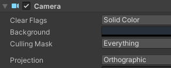

# From Processing to Unity<!-- omit in toc -->

We start from basic principles, introducing Unity concepts as we need them in a toy example, transitioning from a simple p5js game.

[Mini-game from scratch](#mini-game-from-scratch) . [Unity-fying our project](#unity-fying-our-project)


## Mini-game from scratch

This session isn't an introduction to making 2D games in Unity. For that, you should first follow a lesson such as [Ruby's Adventure](https://learn.unity.com/project/ruby-s-2d-rpg). In fact, since we bypass many helpers particular to Unity, this workflow is not generally recommended. Our plan here is to make a bridge from the open world of Processing to the game-specific model of Unity, and learn more about both sides in the process.

We begin from last semester's basic [circle-and-square game](https://openprocessing.org/sketch/998046):

<iframe src="https://openprocessing.org/sketch/998046/embed/" width="800" height="400"></iframe>

 writing code in Unity, we need to set the stage. Start a new 2D project and set the scene view as follows:


...and the camera:



That should get you up and running with a blank 2D canvas. Now let's create our two entities: the player avatar and the collectable item.
First, make a new `Sprites` folder in the Project, underneath your `Assets`:

```Assets: Create > Folder > "Sprites"```

Right-click inside it and create two sprites:

```Create > Sprites > Square, Circle```

In order for them to appear in your scene, you need to create `GameObject`s to host them. Right-click in your Hierarchy panel and:

```Scene: 2D Object > Sprite```

...twice, for a `Player` and an `Apple` object. Drag the corresponding sprites onto the gameobjects. 
You can adjust the `Scale` parameter to turn the `Player`'s square into a rectangle. And don't forget to set some colours:


 that both your objects are situated at the origin, or the (0, 0) spatial coordinates, which
coincide with the center of your camera's viewport. But you may remember that this isn't how Processing works: it holds (0, 0) as the top-left
display window corner.

Now, you have two options here. You might change the location of the camera so that (0, 0) points to a corner:


This would allow you to port the p5.js code with minimal changes. The other option is to leave the origin in the middle, and deal with it in code.
Since this seems more paradigmatic to Unity, I will go for it and not move the camera. But feel free to try both.

We're finally ready to create our script. As with the sprites, this will be an asset located in a Project folder:

```Assets: Create > Folder > "Scripts"```

Then right-click and:

```Create > C# Script > "Main"```

Again, we need an object in the scene to *contain* the script asset. Technically, this could be any of our existing objects: the `MainCamera`, the `Player` or the `Apple`. However, it's good practice to reserve another object in the Hierarchy for the main app code:

```Scene: Create Empty > "GameController"```

Finally, drop the ```Main``` script onto ```GameController```'s inspector, and open it in your code editor.

 should look familiar to you by now: instead of p5.js's `setup()` and `draw()` we now have `Start()` and `Update()`. As mentioned above, the main adjustment we'll have to make will be camera-related. This is due to Processing dealing directly with screen coordinates, and Unity distinguishing between *viewport* (or screen) and *world* coordinates. To this end we shall use two methods of Unity's `Camera` class: [ViewportToWorldPoint](https://docs.unity3d.com/ScriptReference/Camera.ViewportToWorldPoint.html) and [ScreenToWorldPoint](https://docs.unity3d.com/ScriptReference/Camera.ScreenToWorldPoint.html).

The first method is used to find out, in world units rather than pixels, the size of the screen.
Since the viewport's (1, 1) position points to a corner, translating it to the world gives us half its width:



```cs
private float halfWidth, halfHeight;

// Start is called before the first frame update
void Start()
{
    Vector2 cView = Camera.main.ViewportToWorldPoint(new Vector3(1, 1, Camera.main.nearClipPlane));
    halfWidth = cView.x;
    halfHeight = cView.y;
    Debug.Log(halfHeight + " " + halfWidth);
```

You can now run the game and check the console to find out your viewport dimensions. Notice that if you resize the viewport frame and restart the game, the reported size will also change. *What values do you expect to see if you pass `ViewportToWorldPoint(new Vector(0, 0, ...` instead of `(1, 1, ...`?*

 `setup()` deals with initial positions---and so will our `Start()`.

`player` and `apple` now need to refer to the `GameObject`s in our scene. 

`dest`, the target position, is an internal variable of the type `Vector2`. 

`step` can be a public variable, adjustable in the Unity editor.

```cs
private GameObject player;
private GameObject apple;
private Vector2 dest;
public float step;
...
void Start()
{
...
    player = GameObject.Find("Player");
    apple = GameObject.Find("Apple");
    // Player starts in the middle:
    player.transform.position = new Vector2(0, 0);
    // Apple starts at random position
    float width = halfWidth * 2;
    float height = halfHeight * 2;
    apple.transform.position = new Vector2(Random.value * width - halfWidth, Random.value * height - halfHeight);
    dest = player.transform.position + new Vector3(0.1f, 0.1f, 0);
}
```

Then, in the `Update()` function, we use `ScreenToWorldPoint` to interpret the mouse position in world coordinates. The rest is just a matter of translation:

| from p5.js | to Unity |
| ---------- | -------- |
| `mouseIsPressed` | `Input.GetMouseButton` |
| `dist` | `Vector2.Distance` |
| [`mag`](https://p5js.org/reference/#/p5/mag) | `Vector2.magnitude` |
| `+=` | `Transform.Translate` |

*Can you tell the difference between class members starting with capital letters (e.g. `Distance`) and those starting with small letters (e.g. `magnitude`)?*

```cs
void Update()
{
    if (Input.GetMouseButton(0)) {
        dest = Camera.main.ScreenToWorldPoint(Input.mousePosition);
    }
    float dist = Vector2.Distance(dest, player.transform.position);
    Vector2 move = (step * (dest - (Vector2)player.transform.position) / dist);
    if (move.magnitude < dist) {
        player.transform.Translate(move);
    }        
    // if player is close to apple:
    float pToA = Vector2.Distance(player.transform.position, apple.transform.position);
    if (pToA < 0.9f) {            
        float width = halfWidth * 2;
        float height = halfHeight * 2;
        apple.transform.position = new Vector2(Random.value * width - halfWidth, Random.value * height - halfHeight);
    }
}
```

Obviously, the actual drawing of the sprites, refreshing of the canvas between frames, etc are done implicitly by Unity in the back-end.

*Notice that we've re-used the same 3 lines of code to reposition the apple to a random point. Writing the exact same code twice should give you pause:* *maybe you can turn these three lines into a helper function.*

You can now test the project, and play around with different values for `step` until you get the right feel.

## Unity-fying our project

Our game now already leverages some of Unity's abilities. But there are many we haven't yet touched--from methods that make our life easier, to larger features such as the collision/physics engine. Can you think of some? Maybe start from the [script reference](https://docs.unity3d.com/ScriptReference/Vector2.html), or review [Ruby's Adventure](https://learn.unity.com/project/ruby-s-2d-rpg).

Before you start working, plan ahead and consider if you want to incrementally refactor the project to be more Unity-compliant, or if you'd find it easier to remake it from scratch. Sometimes, especially in the early stages, stopping to recreate the project from the ground up can be a refreshing practice.