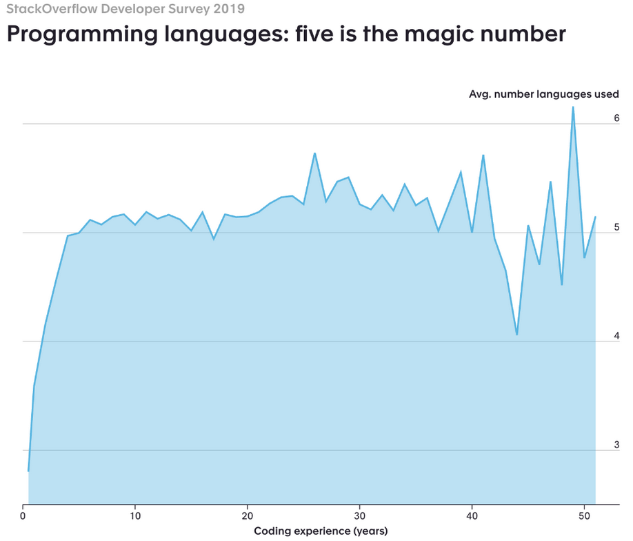

class: center, middle
.title[Creative Coding and Software Design 1]
<br/><br/>
.subtitle[Intro to Creative Coding for Interactive Arts]
<br/><br/><br/><br/><br/><br/>
.date[Oct 2022] 
<br/><br/><br/>
.note[Created with [Liminal](https://github.com/jonathanlilly/liminal) using [Remark.js](http://remarkjs.com/) + [Markdown](https://github.com/adam-p/markdown-here/wiki/Markdown-Cheatsheet) +  [KaTeX](https://katex.org)]

???

Author: Grigore Burloiu, UNATC
    
---
name: toc
class: left
# ★ Table of Contents ★      <!-- omit in toc -->
      
1. [Semester overview](#semester-overview)
2. [What we cover](#what-we-cover)
3. [Tools](#tools)
4. [Processing](#processing)
5. [An "AI Simulator"](#an-ai-simulator)

        
<!-- Comment out the next slide if you don't want the Table of Contents link -->         
---
layout: true  .toc[[★](#toc)]
        
---
name: semester-overview  
class: left
# Semester overview

- 2h lab: new concepts in practice
- 2h lecture: theory, discussion

[Syllabus](https://www.notion.so/itpma/Creative-Coding-and-Software-Design-1-2924578f95ba4de1a95ce28ab0e1ae50)

[Classroom](https://classroom.google.com/)

[my site](https://rvirmoors.github.io/ccia/): Creative Coding for Interactive Arts

---
## General advice

bring laptops, [take notes](https://www.lesswrong.com/posts/T382CLwAjsy3fmecf/how-to-take-smart-notes-ahrens-2017), build stuff

ask questions! [pluralistic ignorance](https://youarenotsosmart.com/2019/07/02/yanss-157-the-psychology-behind-why-people-dont-speak-out-against-and-even-defend-norms-they-secretly-despise/)

[curse of knowledge](https://towardsdatascience.com/the-curse-of-knowledge-8deb4769bff9)

google, stackoverflow etc

--

BUILD STUFF!

---

## Making mistakes

neuroplasticity

--

mistakes: good for learning!

--

how many?

--

15% mistakes (["the 85% rule"](https://youtu.be/t1F7EEGPQwo?t=117))

--

so: challenge yourself & BUILD STUFF.

---
name: what-we-cover
# What we cover

creative coding: not just "visual apps"

focus on **interaction**

--

[creative applications](http://www.creativeapplications.net/)

--

[resources](https://github.com/terkelg/awesome-creative-coding)


---
## Glossary

scripting ~ coding ~ programming ~ developing

--

architecture … algorithm

--

design patterns

coding style 

more [software](https://en.wikipedia.org/wiki/Software_design) [design](https://en.wikipedia.org/wiki/Code_Complete)    

---
## Programming components

.right-column[
<iframe width="100%" src="https://www.youtube.com/embed/MrQrkioQoEA" title="YouTube video player" frameborder="0" allow="accelerometer; autoplay; clipboard-write; encrypted-media; gyroscope; picture-in-picture" allowfullscreen></iframe>
]

intention
- ideas, goals
- → `//comments`

--

invention
- logic, algorithms
- → [flowcharting](https://www.visual-paradigm.com/tutorials/flowchart-tutorial/), pseudocode

--

adaptation
- programming language, compiler, SW+HW architecture
- → code

---
## Features

of "standard" text-based code:

- reproducible

--

- readable

--

- diffable

---
name: tools       
class: left
# Tools

- Processing / Java
- p5.js / JS
- *oF / C++*


- Python
- Arduino


- *Unity / C#*
- *Godot / GDScript*
- *PICO-8 / lua*


- Max
- Pd
- TouchDesigner


- [GitHub](https://desktop.github.com/)

See more [resources](../resources).

---
class: center
## How many languages will you learn?



---
## What's the "best" programming language?

A. depends on your target domain
- → Processing/Java, p5.js, Max, Pd, oF/C++, TD, Unity/C#, Godot, Unreal/C++, pico-8,  ...

--

B. PYTHON!
- accessible, modular, multi-platform = “swiss army knife” language

--

C. it doesn't matter!
- you can pick up and learn any language/tool: fundamentals are similar


---
name: processing
# Processing

.right-column[
[books](https://processing.org/books/)


]

.left-column[
install @ [processing.org](https://processing.org/)

[p5js editor](https://editor.p5js.org/) / [openprocessing](https://openprocessing.org/)

[p5js and Processing](https://github.com/processing/p5.js/wiki/Processing-transition)

also install [GitHub Desktop](https://desktop.github.com/)
]

---
## p5 program flow

| `setup()`         | / | execute once at init |
|-------------------|---|----------------------|
|`draw()`           | / | execute every frame  |
| `mouseClicked()` etc  | / | triggered *events* |

[basic example](https://processing.org/examples/setupdraw.html), [p5js](https://p5js.org/examples/structure-setup-and-draw.html)

--

.left-column[

## drawing basics

```java
size(200,200);  // settings
rectMode(CENTER);
rect(100,100,20,100); //drawing
ellipse(100,70,60,60);
ellipse(81,70,16,32); 
ellipse(119,70,16,32); 
line(90,150,80,160);
line(110,150,120,160);
```
]

.right-column[


- [examples](https://processing.org/examples), [p5js](https://p5js.org/examples/)
- [reference](https://processing.org/reference/), [p5js](https://p5js.org/reference/)
- [basic tutorial](https://processing.org/tutorials/coordinatesystemandshapes), [p5js](https://p5js.org/learn/coordinate-system-and-shapes.html)
]


---
name: an-ai-simulator
class: center
# An "AI Simulator"

[Universal Paperclips](http://www.decisionproblem.com/paperclips/)

[(original version)](https://web.archive.org/web/20171009230721/http://www.decisionproblem.com/paperclips/index2.html)
- [article about the game](https://if50.substack.com/p/2017-universal-paperclips) / Aaron A. Reed

---
class: center
## An "AI Simulator"

