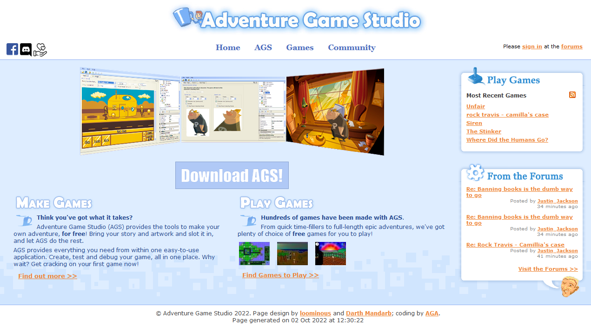
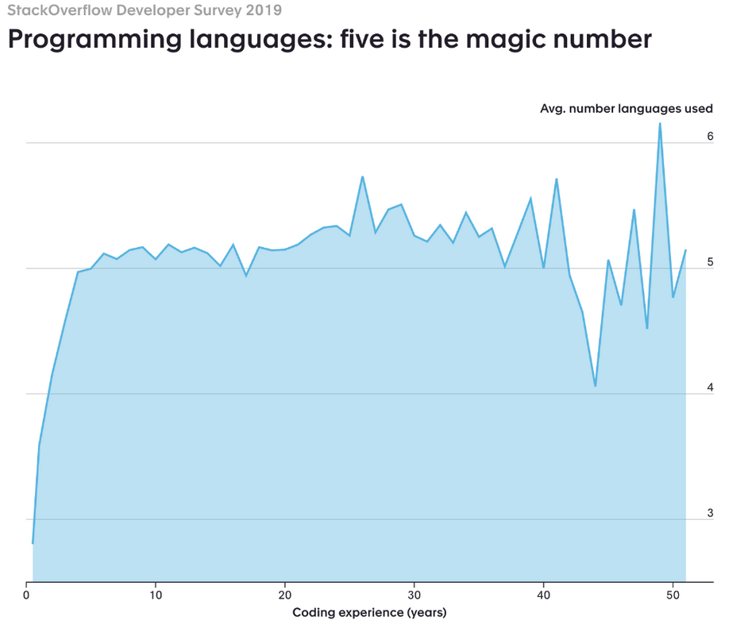

class: center, middle
.title[Game Development 1]
  
.subtitle[Intro to Game Development]
      
.date[Oct 2023] 
   
.note[Created with [Liminal](https://github.com/jonathanlilly/liminal) using [Remark.js](http://remarkjs.com/) + [Markdown](https://github.com/adam-p/markdown-here/wiki/Markdown-Cheatsheet) +  [KaTeX](https://katex.org)]

???

Author: Grigore Burloiu, UNATC
    
---
name: toc
class: left
# ★ Table of Contents ★      <!-- omit in toc -->
      
1. [Semester overview](#semester-overview)
2. [Me \& games](#me--games)
3. [Dev \& you](#dev--you)
4. [Tools](#tools)
5. [Bitsy](#bitsy)
6. [Assignment](#assignment)

        
<!-- Comment out the next slide if you don't want the Table of Contents link -->         
---
layout: true  .toc[[★](#toc)]
        
---
name: semester-overview  
class: left
# Semester overview

lectures (2h): Grig
- 50%: assignments (per class)
- weeks 1, 3, 8-12

labs (2h): Mara
- 50%: lab (30p) + final (20p)
- weeks 2, 4-7, 13-14

--

[Classroom](https://classroom.google.com/)

[my site](https://rvirmoors.github.io/ccia/): Creative Coding for Interactive Arts

this slideshow: MANY links

---
## General advice

bring laptops, take notes, build stuff

ask questions! [pluralistic ignorance](https://youarenotsosmart.com/2019/07/02/yanss-157-the-psychology-behind-why-people-dont-speak-out-against-and-even-defend-norms-they-secretly-despise/)

[curse of knowledge](https://towardsdatascience.com/the-curse-of-knowledge-8deb4769bff9)

google, stackoverflow etc

--

[don't trust advice](https://youtu.be/miwrDpbb25Q)[.](https://www.gamesindustry.biz/everything-i-said-was-wrong)

--

BUILD STUFF!

---
## Making mistakes

neuroplasticity

--

mistakes ➡ learning

--

how many?

--

15% mistakes (["the 85% rule"](https://youtu.be/t1F7EEGPQwo?t=117))

--

so... challenge yourself & BUILD STUFF.

---

name: me--games
# Me & games

90s gamer

--

--

.right-column[     
00s failed gamedev
]

.left-column[
    
]

---
class: center
## Recent favs

<iframe width="100%" height="300" src="https://www.youtube.com/embed/hEAP-4iUirY?start=23" title="YouTube video player" frameborder="0" allow="accelerometer; autoplay; clipboard-write; encrypted-media; gyroscope; picture-in-picture" allowfullscreen></iframe>

--

<iframe width="33%" height="200" src="https://www.youtube.com/embed/0We8a8AFPp8" title="YouTube video player" frameborder="0" allow="accelerometer; autoplay; clipboard-write; encrypted-media; gyroscope; picture-in-picture" allowfullscreen></iframe>
<iframe width="32%" height="200" src="https://www.youtube.com/embed/cSmZcN7AgHQ" title="YouTube video player" frameborder="0" allow="accelerometer; autoplay; clipboard-write; encrypted-media; gyroscope; picture-in-picture" allowfullscreen></iframe>
<iframe width="33%" height="200" src="https://www.youtube.com/embed/1fEtE2SJSeo" title="YouTube video player" frameborder="0" allow="accelerometer; autoplay; clipboard-write; encrypted-media; gyroscope; picture-in-picture" allowfullscreen></iframe>

---
## Gamedev favs

- [Emily Short](https://emshort.blog/) (Galatea)
- [Yahtzee Croshaw](https://fullyramblomatic-yahtzee.blogspot.com/) (7 Days a Skeptic, Zero Punctuation)
- [Tim Cain](https://www.youtube.com/@CainOnGames) (Fallout)
- [Ron Gilbert](https://grumpygamer.com/) (Monkey Island)
- [Eleanor Dare](https://rejectedshortstories.uk/2021/12/10/eleanor-dare-some-work/) (stories in 3D)
- [Stacey Mason](https://cerebralarcade.com/) (Responsive Narrative)

- [Terry Cavanagh](https://distractionware.com) (Super Hexagon)
- [Ian MacLarty](http://ianmaclarty.com/index.html) (Catacombs of Solaris)
- [Derek Yu](http://www.derekyu.com/) (Spelunky)
- [Lucas Pope](https://dukope.com/) (Papers Please, Return of the Obra Dinn)

- [Tom Hall](https://www.lexaloffle.com/bbs/?uid=32135) (Commander Keen)
- [Gabe Cuzzillo](https://twitter.com/GabeCuzzillo) (Ape Out)
- [JP LeBreton](https://jp.itch.io/) (Doom mods)

- PICO-8 devs - [liquidream](https://liquidream.itch.io/), [krystman](https://krystman.itch.io/), [paranoid cactus](https://paranoidcactus.itch.io/), [isaac](https://isaacgames.itch.io/)

- [Eggplant](https://eggplant.show/) - The Secret Lives of Games podcast [.](http://nealen.net/)[.](https://content.sakai.rutgers.edu/access/content/group/5682b464-6179-4684-b203-41db7bfc0bea/lectures/)

---
name: dev--you
# Dev & you

<iframe width="49%" height=500px src="https://www.youtube.com/embed/7YpFGkG-u1w?start=834" title="YouTube video player" frameborder="0" allow="accelerometer; autoplay; clipboard-write; encrypted-media; gyroscope; picture-in-picture" allowfullscreen></iframe>
<iframe width="50%" height=500px src="https://www.youtube.com/embed/8u2tooYxicE?start=78" title="YouTube video player" frameborder="0" allow="accelerometer; autoplay; clipboard-write; encrypted-media; gyroscope; picture-in-picture" allowfullscreen></iframe>

---
## Dev components

| **intention**  |+| **invention**  |+| **adaptation** |
|---|-|----|-|-- |
| ideas | | logic | | programming |
| goals | | algorithms | | compiler etc |

---
## Dev components

.right-column[
<iframe width="100%" src="https://www.youtube.com/embed/MrQrkioQoEA" title="YouTube video player" frameborder="0" allow="accelerometer; autoplay; clipboard-write; encrypted-media; gyroscope; picture-in-picture" allowfullscreen></iframe>
]

intention
- ideas, goals
- → `//comments`

--

invention
- logic, algorithms
- → [flowcharting](https://www.visual-paradigm.com/tutorials/flowchart-tutorial/), pseudocode

--

adaptation
- programming language, compiler, SW+HW architecture
- → code

---
class: center
## How many languages will you learn?

---
## What's the "best" programming language?

A. depends on your target domain
- → Godot, Unreal, Unity, PICO-8, Twine, Ink, Processing  ...

--

B. PYTHON!
- accessible, modular, multi-platform = “swiss army knife” language

--

C. it doesn't matter!
- you can pick up and learn any language/tool: fundamentals are similar

---
name: tools       
class: left
# Tools

.right-column[
<iframe width="100%" height=300 src="https://www.youtube.com/embed/cQm_Z20Pxlc" title="YouTube video player" frameborder="0" allow="accelerometer; autoplay; clipboard-write; encrypted-media; gyroscope; picture-in-picture" allowfullscreen></iframe>
    
- &nbsp;&nbsp;&nbsp;&nbsp;&nbsp;&nbsp;&nbsp;&nbsp;&nbsp;&nbsp;&nbsp;&nbsp;&nbsp;&nbsp;&nbsp;&nbsp;&nbsp;&nbsp;&nbsp;&nbsp;&nbsp;&nbsp;&nbsp;&nbsp;&nbsp; [GitHub](https://desktop.github.com/)
]

- Bitsy

- *Twine*, *Ink*

- PICO-8 / lua

- Godot / GDScript or C#
- Unity / C#
- *Unreal / Blueprint or C++*

- *Processing / Java*
- *p5.js / JS*

- *Max, Pd, TouchDesigner* …

--

[awesome resources](https://github.com/search?q=awesome+game+development)

---
name: bitsy
class: center
# Bitsy

<iframe width="100%" height="450" frameborder="0" src="https://bitsy.org"></iframe>

<!-- "a little editor for little games or worlds." -->

---
class: center
## Play Bitsy games!

<iframe width="33%" height="247" frameborder="0" src="https://v6p9d9t4.ssl.hwcdn.net/html/2115106/index.html?v=1591302057"></iframe><iframe width="33%" height="247" frameborder="0" src="https://v6p9d9t4.ssl.hwcdn.net/html/2347743/LIMINAL_BITSY_final_build/index.html"></iframe><iframe width="33%" height="247" frameborder="0" src="https://v6p9d9t4.ssl.hwcdn.net/html/1435548/demeterandpersephone/index.html?v=1574335551"></iframe>

<iframe width="100%" height="247" src="https://www.youtube.com/embed/UL68vKUZzJc" title="Turning a Greek Myth into a Game with Bitsy" frameborder="0" allow="accelerometer; autoplay; clipboard-write; encrypted-media; gyroscope; picture-in-picture" allowfullscreen></iframe>

- [find more](https://itch.io/games/made-with-bitsy) on itch.io

---
name: assignment
# Assignment

task
- [make](https://make.bitsy.org/docs/) a [Bitsy](https://www.bitsy.org/) game

deliverables
- game link / upload

due: WEEK 3
