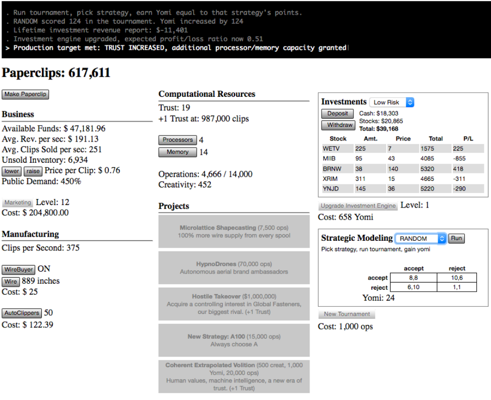
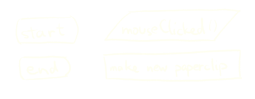

class: center, middle
.title[Creative Coding and Software Design 1]
<br/><br/>
.subtitle[Week 2: Basics]
<br/><br/><br/><br/><br/><br/>
.date[Oct 2021] 
<br/><br/><br/>
.note[Created with [Liminal](https://github.com/jonathanlilly/liminal) using [Remark.js](http://remarkjs.com/) + [Markdown](https://github.com/adam-p/markdown-here/wiki/Markdown-Cheatsheet) +  [KaTeX](https://katex.org)]

???

Author: Grigore Burloiu, UNATC
    
---
name: toc
class: left
# ★ Table of Contents ★      <!-- omit in toc -->
      
1. [An "AI Simulator"](#an-ai-simulator)
2. [Variables](#variables)
3. [Operations](#operations)
4. [Conditionals](#conditionals)

        
<!-- Comment out the next slide if you don't want the Table of Contents link -->         
---
layout: true  .toc[[★](#toc)]

---
name: an-ai-simulator
class: center
# An "AI Simulator"

[Universal Paperclips](http://www.decisionproblem.com/paperclips/)

[(original version)](https://web.archive.org/web/20171009230721/http://www.decisionproblem.com/paperclips/index2.html)
- [article about the game](https://if50.substack.com/p/2017-universal-paperclips) / Aaron A. Reed

---
class: center
## An "AI Simulator"



---
name: variables
# Variables

e.g. *the number of paperclips*

--

memory allocation & types

--

| boolean (`true`/`false`) | / | __ bits |
|---|---|---|
| int | / | 32 bits *(in p5)* |
| float | / | 32 bits |
| double | / | [64 bits](https://processing.org/reference/double.html) |

--

declaration & assignment

```js
    var x;  // declare a new variable "x"
    x = 5;  // assign it a value
```

--

```js
    var x = 5;  // declare and assign at once
```

--

  - p5/Java, Python: *strongly typed*. js: [*weakly/loosely typed*](https://medium.com/@xiaoyunyang/javascript-is-a-loosely-typed-language-meaning-you-dont-have-to-specify-what-type-of-information-137408d54fc7)
  - p5/Java: *statically typed*. Python, js: [*dynamically typed*](https://pythonconquerstheuniverse.wordpress.com/2009/10/03/static-vs-dynamic-typing-of-programming-languages/) 

---
## Paperclips basic algorithm

[flowchart](https://www.visual-paradigm.com/tutorials/flowchart-tutorial/)



--

[p5js web editor](https://editor.p5js.org/) / Processing IDE

```java
void setup() {
    ...
}

void draw() {
    ...
}

void mouseClicked() {
    ...
}
```

---
name: operations
# Operations

| an **expression** | : | *operand*(s), *operator* |
|---------------|---|--------------------------|
| is **evaluated** (into) | : | (*result*) |

--

```java
    clips = clips + 1;
```

- `=` : the *assignment operator*

--

```java
    2 + 2 == 5
```

--

- result: 
```java
    False
```

--

```java
    locked = !locked; // "NOT": an unary operator
```

---
class: center
name: conditionals
# Conditionals


```java
if (condition) {    // expression
    actions();      // operation(s)
} else {
    other_actions(); // ...
}
```