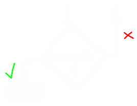

class: center, middle
.title[Game Development 1]
<br/><br/>
.subtitle[Bitsy and variables]
<br/><br/><br/><br/><br/><br/>
.date[Nov 2022] 
<br/><br/><br/>
.note[Created with [Liminal](https://github.com/jonathanlilly/liminal) using [Remark.js](http://remarkjs.com/) + [Markdown](https://github.com/adam-p/markdown-here/wiki/Markdown-Cheatsheet) +  [KaTeX](https://katex.org)]

???

Author: Grigore Burloiu, UNATC
    
---
name: toc
class: left
# ★ Table of Contents ★      <!-- omit in toc -->
      
1. [An "AI Simulator"](#an-ai-simulator)
2. [Variables](#variables)
3. [Bitsy tips](#bitsy-tips)
4. [Operations](#operations)
5. [Conditionals](#conditionals)
6. [Assignment](#assignment)

        
<!-- Comment out the next slide if you don't want the Table of Contents link -->         
---
layout: true  .toc[[★](#toc)]

---
name: an-ai-simulator
class: center
# An "AI Simulator"

[Universal Paperclips](http://www.decisionproblem.com/paperclips/)

[(original version)](https://web.archive.org/web/20171009230721/http://www.decisionproblem.com/paperclips/index2.html)
- [article about the game](https://if50.substack.com/p/2017-universal-paperclips) / Aaron A. Reed

---
class: center
## An "AI Simulator"


---
name: variables
# Variables

e.g. *the number of paperclips*

--

any variable has a *type*

| boolean | : |`true` / `false` |
|---|---|---|
| int | : | `1, 5, 0, -204, ...` |
| float | : | `3.14, -82.50023, ...` |
| string | : | `"hello", "world", ...` |

--

type in Bitsy (JS) and Pico-8 (Lua) is implicit
- these are [*weakly/loosely typed*](https://medium.com/@xiaoyunyang/javascript-is-a-loosely-typed-language-meaning-you-dont-have-to-specify-what-type-of-information-137408d54fc7) languages

--

type in Unity (C#) has to be declared
- C# is a *strongly typed* language (like C, C++, Java, ...)

--

type in Godot (GDScript) [*can*](https://gdscript.com/tutorials/variables/) be declared

---
## Paperclips basic algorithm

.left-column[
    [flowchart](https://www.visual-paradigm.com/tutorials/flowchart-tutorial/)
    ]

.right-column[]

<br/><br/><br/><br/>
--

.left-column[implemented as Bitsy game]

.right-column[
]


---
name: bitsy-tips
# Bitsy tips

.left-column[
- Alt + click to pick something
  

]

--

.right-column[
use [pixsy](https://ruin.itch.io/pixsy) to generate room tiles from an image

more [awesome bitsy](https://github.com/LJNIC/awesome-bitsy) links
- [variables tutorial](https://ayolland.itch.io/trevor/devlog/29520/bitsy-variables-a-tutorial)

[bipsi](https://kool.tools/bipsi/) is an expanded clone of bitsy]

---

## Bitsy teaches itself
  


logic in **dialog** (and **exits&endings**)

variables in **inventory**

---
name: operations
# Operations

| an **expression** | : | *operand*(s), *operator* |
|---------------|---|--------------------------|
| is **evaluated** (into) | : | (*result*) |

--

```java
    clips = clips + 1;
```

- `=` : the *assignment operator*

--

```java
    2 + 2 == 5
```

--

- result: 
```java
    false
```

---
class: center
name: conditionals
# Conditionals



.left-column[
- dialog > lists > branching list

]

.right-column[
```javascript
{
- {condition} ?  //expression
    ...          //operation(s)
- else ?
    ...
}
```

- the `else` branch is optional
]

---
## Need clips AND key to open door?

<iframe width="100%" height="500" src="https://www.youtube.com/embed/AolX6F7q0rk" title="Bitsy: Unlocking a door by collecting ALL items" frameborder="0" allow="accelerometer; autoplay; clipboard-write; encrypted-media; gyroscope; picture-in-picture" allowfullscreen></iframe>

---
name: assignment
# Assignment

task
- [add](https://make.bitsy.org/docs/) **variables** and **logic** to your [Bitsy](https://www.bitsy.org/) game
- optional: upload to itch.io, add to [bitsy jam](https://twitter.com/adamledoux)

deliverables
- game link / upload