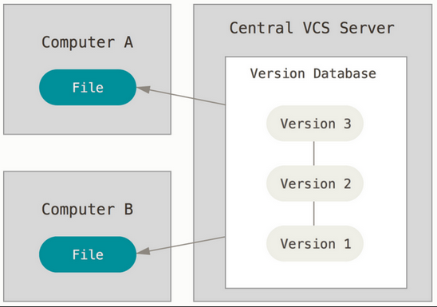
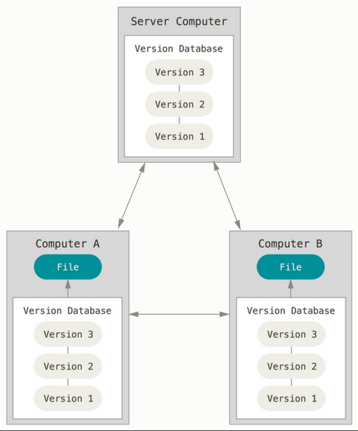
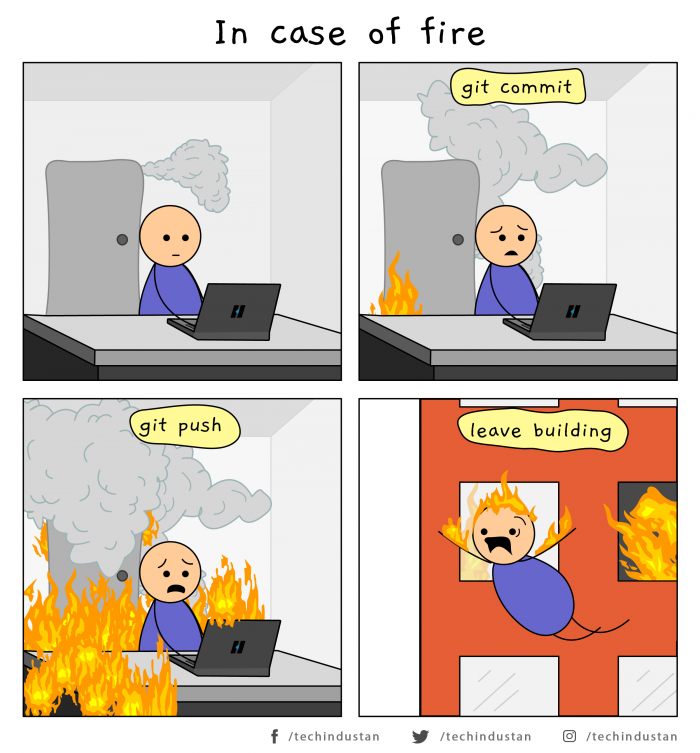
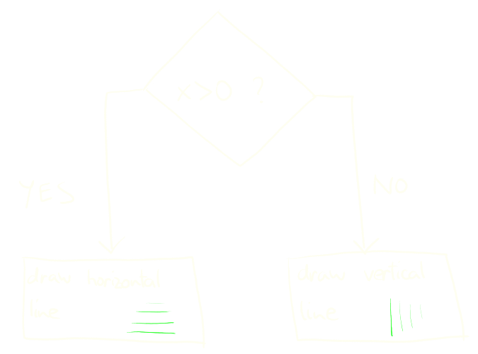

class: center, middle
.title[Creative Coding and Software Design 1]
<br/><br/>
.subtitle[Week 3: Finite State Machines]
<br/><br/><br/><br/><br/><br/>
.date[Oct 2021] 
<br/><br/><br/>
.note[Created with [Liminal](https://github.com/jonathanlilly/liminal) using [Remark.js](http://remarkjs.com/) + [Markdown](https://github.com/adam-p/markdown-here/wiki/Markdown-Cheatsheet) +  [KaTeX](https://katex.org)]

???

Author: Grigore Burloiu, UNATC
    
---
name: toc
class: left
# ★ Table of Contents ★      <!-- omit in toc -->

1. [Version control](#version-control)
2. [Scope](#scope)
3. [Finite state machines](#finite-state-machines)
4. [Mouse interactivity](#mouse-interactivity)

        
<!-- Comment out the next slide if you don't want the Table of Contents link -->         
---
layout: true  .toc[[★](#toc)]

---
name: version-control
# Version control

.left-column[
centralised (e.g. SVN)

]

.right-column[
distributed (e.g. Git)

]

---
## Distributed control

.right-column[
distributed (e.g. Git)

]

Advantages:

- redundancy
- collaboration over multiple remote repos
  - *forking* and *merging*

--

[Git basics](https://www.notion.so/Git-basics-a8cd5b9fabef44afbd91eaea97a8c91f)

--

[Git/hub resources](../resources#git-and-github)

---
class:center



---
class: center
name: scope
# Scope

a.k.a. *visibility* of a variable, in a `{ ... }` block



```java
if (42 > 0) {    
    boolean horizontal = true; // this var is only visible here  
} else {
    boolean horizontal = false;// this var is only visible here
}
print("I just drew ", horizontal);
```

---
class: center
## Global and local variables

global: seen everywhere | local: overrides global


```java
boolean horizontal;     // this is a global variable
if (42 > 0) {    
    boolean horiz = true; // this var only exists here  
} else {
    horizontal = false; // the global variable on top
}
print("I just drew ", horizontal);
```

---
name: finite-state-machines
# Finite state machines

.right-column[
<iframe width="100%" height="300" src="https://www.youtube.com/embed/x1mlHEUwl_8?start=122" title="YouTube video player" frameborder="0" allow="accelerometer; autoplay; clipboard-write; encrypted-media; gyroscope; picture-in-picture" allowfullscreen></iframe>
]

states

transition rules

--

represented by global var(s)

computed every frame
- (self-transition is possible)

deterministic

--

FSM vs [flowcharts](01-02-basics#11). What's different?

--

[more @ wiki](https://en.wikipedia.org/wiki/Finite-state_machine)

example - open and close door

---
name: mouse-interactivity
# Mouse interactivity

system functions and variables:

display: `size(), frameRate(), background()`

mouse status: `mouseX, mouseY, pmouseX, pmouseY, mousePressed`

mouse events: `mousePressed(), mouseClicked()` [et](https://processing.org/reference#input-mouse) [al](https://processing.org/examples/mousefunctions.html)

--

recap [drawing basics](01-01-cc-intro#27)

--

example 
- draw vertical lines towards the mouseX position. Vary line size based on mousing speed. Freeze drawing on mouse click.