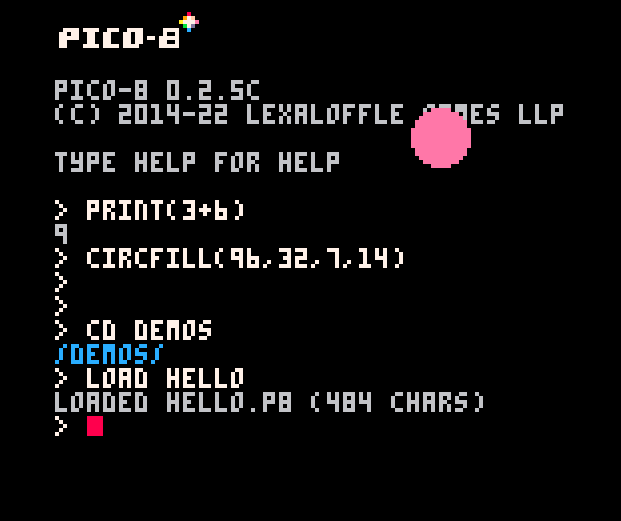
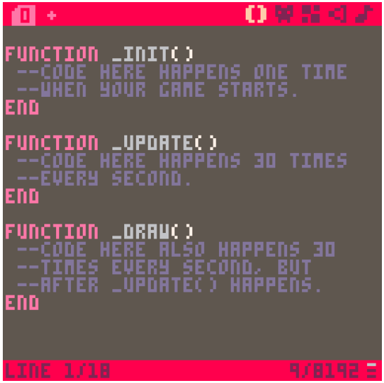
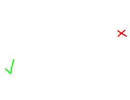

class: center, middle
.title[Game Development 1]
<br/><br/>
.subtitle[PICO-8 and FSMs]
<br/><br/><br/><br/><br/><br/>
.date[Nov 2022]
<br/><br/><br/>
.note[Created with [Liminal](https://github.com/jonathanlilly/liminal) using [Remark.js](http://remarkjs.com/) + [Markdown](https://github.com/adam-p/markdown-here/wiki/Markdown-Cheatsheet) +  [KaTeX](https://katex.org)]

???

Author: Grigore Burloiu, UNATC
    
---
name: toc
class: left
# ★ Table of Contents ★     <!-- omit in toc -->

1. [Welcome to PICO-8](#welcome-to-pico-8)
2. [Coding in p8](#coding-in-p8)
3. [Finite state machines](#finite-state-machines)
4. [Assignment](#assignment)

        
<!-- Comment out the next slide if you don't want the Table of Contents link -->         
---
layout: true  .toc[[★](#toc)]

---
name: welcome-to-pico-8
class: center
# Welcome to PICO-8


---
## PICO-8 is an all-in-one game platform

.right-column[
    <iframe width="100%" height="200" src="https://www.youtube.com/embed/C5TJgIJACtg" title="8 Reasons We Love PICO-8 [2021]" frameborder="0" allow="accelerometer; autoplay; clipboard-write; encrypted-media; gyroscope; picture-in-picture" allowfullscreen></iframe>
]

full game dev suite
- code, sprite, map, audio editors

--

export 
- PNG image, web embed, exe (Win/OSX/Linux)

--

[all games](https://www.lexaloffle.com/bbs/?cat=7&carts_tab=1#mode=carts&sub=2) are open source
- inspect, modify, learn 

--

a set of CONSTRAINTS!


---
class: center
## Try it right now!

<iframe src="https://www.pico-8-edu.com/" style="overflow:hidden" scrolling="no" width="100%" height="500" frameborder="0"></iframe>

PICO-8 [Education Edition](https://www.lexaloffle.com/pico-8.php?page=schools): [pico-8-edu.com](https://www.pico-8-edu.com/)

---

## Where to go?

.left-column[
[homepage](https://www.lexaloffle.com/pico-8.php)

[user manual](https://www.lexaloffle.com/dl/docs/pico-8_manual.html)

[gamedev with pico-8](https://mboffin.itch.io/gamedev-with-pico-8-issue1) zine

[fandom wiki](https://pico-8.fandom.com/wiki) w/ search

[cheatsheet](https://iiviigames.github.io/pico8-api/)
]

--

.right-column[
<iframe width="100%" height="250" src="https://www.youtube.com/embed/87jfTIWosBw?start=2654" title="YouTube video player" frameborder="0" allow="accelerometer; autoplay; clipboard-write; encrypted-media; gyroscope; picture-in-picture" allowfullscreen></iframe>
- why PICO-8? 
- it's **quick**, **playful**, **safe** & **tiny**
]
        

---
name: more-tutorials
## More tutorials

[Demo-Man interactive tutorials](https://demoman.net/)

--

<iframe width="50%" height="300" src="https://www.youtube.com/embed/81WM_cjp9fo?list=PLea8cjCua_P3Sfq4XJqNVbd1vsWnh7LZd" title="Making a Shmup #1 - Hello World - Pico-8 Hero" frameborder="0" allow="accelerometer; autoplay; clipboard-write; encrypted-media; gyroscope; picture-in-picture" allowfullscreen></iframe><iframe width="50%" height="300" src="https://www.youtube.com/embed/YQzwVDMIfyU?list=PLea8cjCua_P0qjjiG8G5FBgqwpqMU7rBk" title="Let's Make Breakout in Pico-8!" frameborder="0" allow="accelerometer; autoplay; clipboard-write; encrypted-media; gyroscope; picture-in-picture" allowfullscreen></iframe>

--

[Nerdy Teachers](https://nerdyteachers.com/PICO-8/)

[Game Dev with PICO-8](https://github.com/nicklalone/CIS---102---Getting-Started-with-Video-Game-Development) lecture notes
- check out the [links](https://github.com/nicklalone/CIS---102---Getting-Started-with-Video-Game-Development#tutorials)

---
name: coding-in-p8
# Coding in p8

[the console](https://www.lexaloffle.com/dl/docs/pico-8_manual.html#_Hello_World)

[the editors](https://www.lexaloffle.com/dl/docs/pico-8_manual.html#Editing_Tools)

[variables](https://www.lexaloffle.com/dl/docs/pico-8_manual.html#Types_and_assignment)

[game loop](https://www.lexaloffle.com/dl/docs/pico-8_manual.html#PICO_8_Program_Structure)

[variable scope](https://www.lexaloffle.com/dl/docs/pico-8_manual.html#Functions_and_Local_Variables)

[conditionals](https://www.lexaloffle.com/dl/docs/pico-8_manual.html#Conditionals)

---
class: center
## the console



| `↑` / `↓` |:| history of commands |
|-|-|-|
|`ENTER` |:| run command |
|`ESC` |:| toggle console / editors |

---
class: center
## the editors


<br/>

| `CTRL-S` |:| quick-save |
|-|-|-|
|`CTRL-R` |:| run game |
|`CTRL-U` |:| code help |

---
class: center
## variables

numbers
- -32768.0 to 32767.99999 


```lua
clips = 3
clips = clips + 1   -- or simply clips += 1
print(clips)
```

--

strings
```lua
message = "hello!"
```
--

booleans
```lua
door_locked = true
```

--

tables (soon!)

---
class: center
## game loop



- `_init()`
- `_update()` / [`_update60()`](https://www.lexaloffle.com/dl/docs/pico-8_manual.html#Running_PICO_8_at_60fps)
- `_draw()`

--

flowchart!

---
## variable scope

```lua
function _init()
    clips = 0
end

function _update()
    if btn(❎) then 
        clips += 1  -- add a clip
    end
end

function _draw()
    cls()   -- clear screen
    print(clips)
end
```

--

variables in Lua are **global** by default

to confine them to a block, declare them as `local`:
```lua
function _init()
    local clips = 0 --cannot be accessed in _update() or _draw()
end
```

---
class: center
## conditionals

.left-column[
```Lua
clips = 5
if clips == 10 then
    print("GAME OVER")
else
    print("KEEP ON CLIPPIN'")
end
```
]

.right-column[

]
---

name: finite-state-machines
# Finite state machines

.right-column[
<iframe width="100%" height="300" src="https://www.youtube.com/embed/x1mlHEUwl_8?start=122" title="YouTube video player" frameborder="0" allow="accelerometer; autoplay; clipboard-write; encrypted-media; gyroscope; picture-in-picture" allowfullscreen></iframe>
]

states

transition rules

--

represented by global var(s)

computed every frame
- (self-transition is possible)

deterministic

--

FSM vs [flowcharts](01-02-basics#11). What's different?

--

- [more @ wiki](https://en.wikipedia.org/wiki/Finite-state_machine)

example - open and close door


---
name: assignment
# Assignment

[Choose](https://www.liquidream.co.uk/) [a](https://isaacgames.itch.io/) [PICO-8](https://www.youtube.com/c/PicoPlaytime) [game](https://paranoidcactus.itch.io/)[,](https://johanpeitz.itch.io/) or make one yourself [from a tutorial](https://mboffin.itch.io/gamedev-with-pico-8-issue1) etc.

draw (on paper, in Paint, etc...)
- a flowchart (including an `if` block at least)
- a FSM diagram

deliverables:
- the game you used (.p8 file)
- your two diagrams, with comments pointing to lines of code

<br/>
*tip: don't try to understand everything all at once, just dig for what interests you!*