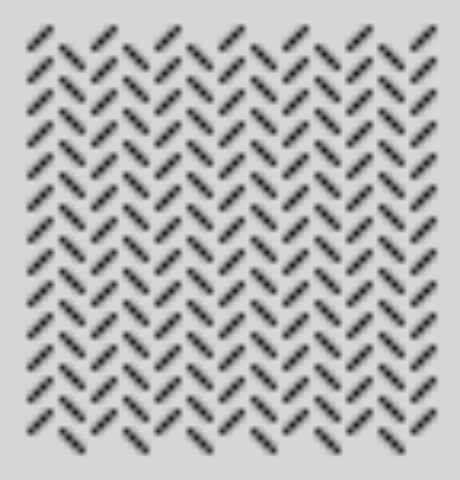
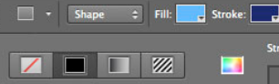

class: center, middle
.title[Creative Coding and Software Design 1]
<br/><br/>
.subtitle[Week 4: Loops]
<br/><br/><br/><br/><br/><br/>
.date[Nov 2021] 
<br/><br/><br/>
.note[Created with [Liminal](https://github.com/jonathanlilly/liminal) using [Remark.js](http://remarkjs.com/) + [Markdown](https://github.com/adam-p/markdown-here/wiki/Markdown-Cheatsheet) +  [KaTeX](https://katex.org)]

???

Author: Grigore Burloiu, UNATC
    
---
name: toc
class: left
# ★ Table of Contents ★      <!-- omit in toc -->

1. [Loops](#loops)
2. [Nested loops](#nested-loops)
3. [Keyboard interactivity](#keyboard-interactivity)
4. [Colour](#colour)

        
<!-- Comment out the next slide if you don't want the Table of Contents link -->         
---
layout: true  .toc[[★](#toc)]

---

<iframe width="100%" height="600" src="https://www.youtube.com/embed/t4CRCJUmWsM?start=42" title="YouTube video player" frameborder="0" allow="accelerometer; autoplay; clipboard-write; encrypted-media; gyroscope; picture-in-picture" allowfullscreen></iframe>

---
name: loops
# Loops

`draw()` → one loop / frame

--

what if we want *n* loops / frame?

---
## Architecture of a loop

`while`

--

`for`

--

exercise
- draw vertical lines up to a specific X coordinate
- [flowchart](01-02-basics#11) before coding

---
## Loops in code

```java
while( cond ) { 
    actions; ...
}

for ( start assgn ; end cond ; increment ) { 
    actions; ...
}
```

--

- the above syntax, annotated --

```java
while( cond ) {     // while cond is true
    actions; ...    // do actions
}

for ( start assgn ; end cond ; increment ) { 
    // standard form:
    // for (int i = 0; i < N; i++)
    actions; ...    // actions to be performed N times
}
```

---
class: center
name: nested-loops
# Nested loops



---
name: keyboard-interactivity
# Keyboard interactivity

the `char` [type](https://processing.org/reference/char.html)

the `String` *composite datatype* ~ *class*

- [characters & strings](https://processing.org/examples/charactersstrings.html) example

--

system functions and variables:

keyboard status: `keyPressed, key, keyCode`

keyboard events: `keyPressed(), keyReleased()` [et](https://processing.org/reference/#input-keyboard) [al](https://processing.org/examples/keyboard.html) [...](https://processing.org/examples/keyboardfunctions.html)

---
name: colour
# Colour

the `color` [type](https://processing.org/reference/color_datatype.html)
- specified in `(R,G,B)` triplets or `#RRGGBB` hex values

--

.right-column[

]

- greyscale: 8 bit
- RGB: 3 x 8b = 24b
- RGBA: (3+1) x 8b = 32b

--

<br/>
.right-column[

]
draw settings
- `background(), stroke(), fill() / noStroke(), noFill()` [...](https://processing.org/reference/stroke_.html)
