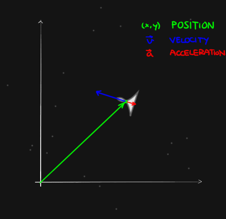
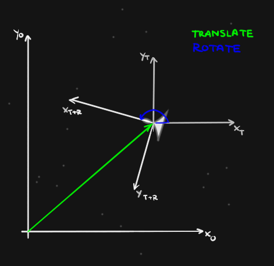
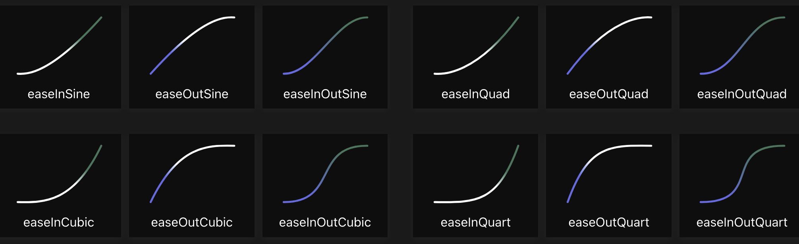

class: center, middle
.title[Game Development 1]
<br/><br/>
.subtitle[Functions]
<br/><br/><br/><br/><br/><br/>
.date[Dec 2023]
<br/><br/><br/>
.note[Created with [Liminal](https://github.com/jonathanlilly/liminal) using [Remark.js](http://remarkjs.com/) + [Markdown](https://github.com/adam-p/markdown-here/wiki/Markdown-Cheatsheet) +  [KaTeX](https://katex.org)]

???

Author: Grigore Burloiu, UNATC
    
---
name: toc
class: left
# ★ Table of Contents ★      <!-- omit in toc -->
1. [Structuring your programs](#structuring-your-programs)
2. [Functions](#functions)
3. [Common uses](#common-uses)
4. [Exercises](#exercises)
5. [Assignment I](#assignment-i)
6. [Physics](#physics)
7. [Linear interpolation (lerp)](#linear-interpolation-lerp)
8. [Assignment II](#assignment-ii)


        
<!-- Comment out the next slide if you don't want the Table of Contents link -->         
---
layout: true  .toc[[★](#toc)]

---
name: structuring-your-programs
# Structuring your programs

an elegant program
- is shorter than most alternatives - *conciseness*
- consists of discrete/replaceable parts - *modularity*
- is often the most efficient solution - *efficiency*
  - *E W Dijkstra, 2000. Denken als Discipline*

<iframe width="100%" height="250px" src="https://www.youtube.com/embed/RCCigccBzIU?start=1050" title="YouTube video player" frameborder="0" allow="accelerometer; autoplay; clipboard-write; encrypted-media; gyroscope; picture-in-picture" allowfullscreen></iframe>

--

- [counterpoint](https://youtu.be/7YpFGkG-u1w?t=1367)

--

What role does programming elegance play in Game Dev?

---
name: functions
# Functions

modularity

reusability

--

.left-column[
  syntax
```lua
function funcName(parameters)
  ... -- actions
  return result  -- optional
end
```
parameters ~ *arguments*
]

--

.right-column[
  p8 API function *calls*
  ```lua
circfill(64,64,10,7)
pressed = btnp(🅾️)
  ```
  [p8 function](https://www.lexaloffle.com/dl/docs/pico-8_manual.html#PICO_8_Program_Structure) *definitions*
  ```lua
function _update()
  print(t())
end
  ```

[custom function](https://www.lexaloffle.com/dl/docs/pico-8_manual.html#Functions_and_Local_Variables) defs & calls
```lua
  x = funcName(2)
```
]


---
name: common-uses
# Common uses

.left-column[
components 
```lua
function drawLeg(which)
function playerState(state)
```
]

.right-column[
operations
```lua
function linearEq(a, x, b)
function gcd(a, b)
```
]

--

logging
```lua
function debug()
```

--

.left-column[
  [setters](https://www.lexaloffle.com/dl/docs/pico-8_manual.html#PSET)
  ```lua
pset(40, 70, 14)
fset(1, 0, true)
  ```
]

.right-column[
  getters
  ```lua
color = pget(40, 70)
flags = fget(1, 0)
  ```
]

---
name: exercises
# Exercises

modules ↔ functions

<iframe width="600" height="444px" src="https://editor.p5js.org/RVirmoors/full/vCF1Kkl-c"></iframe>

---
class: center
## Exercise: space minigame

<iframe style="height:400px" height="400px" width="500px" frameborder="0" scrolling="no" src="p8/ship.html">

---
## Exercise: space minigame

.left-column[
starry background

draw ship shape

rotate arrows

accelerate using button
]

.right-column[

]

---
## custom functions

p8 uses [`spr()`](https://www.lexaloffle.com/dl/docs/pico-8_manual.html#SPR) to display a sprite

but how to rotate it?

--

look for [code](https://www.lexaloffle.com/bbs/?tid=2189) [online](https://www.lexaloffle.com/bbs/?tid=3593)

implement in [your cart](p8/ship_funcs.p8)

---
name: assignment-i
# Assignment I

call the functions in `ship_funcs.p8` in the `_draw()` and `_update()` functions

upload a working `ship.p8` file

---
name: physics
# Physics

remember [basic trig](01-04-gd-loops#drawing)

[vectors](https://natureofcode.com/book/chapter-1-vectors/) and [forces](https://natureofcode.com/book/chapter-2-forces/)

p8 does not include any physics, you need to [code your own](https://heilaut.github.io/pico8-physics-simulations/)

.left-column[

]

--

.right-column[

]

---
name: linear-interpolation-lerp
# Linear interpolation (lerp)

[intro to lerp](https://www.alanzucconi.com/2021/01/24/linear-interpolation/) (Alan Zucconi)

--

no `lerp()` in pico-8... what to do?

--

[google](https://www.reddit.com/r/pico8/comments/17j5f0s/lerp_function/), prototype

--

[the right way to lerp in Unity](https://gamedevbeginner.com/the-right-way-to-lerp-in-unity-with-examples/) (John French)

--


[](https://easings.net/)

related - [easing functions](https://www.lexaloffle.com/bbs/?tid=40577&authuser=1)


---
name: assignment-ii
# Assignment II

outline the program structure for your .p8 game
- use code tabs if you'd like!
- create placeholders for all functions you intend to implement
- start prototyping your core game function

check out the [internal demos](https://www.lexaloffle.com/dl/docs/pico-8_manual.html#_Example_Cartridges) as a guide, or [other](https://sophieh.itch.io/) [games](https://extar.itch.io/)
- (get games via `splore`)