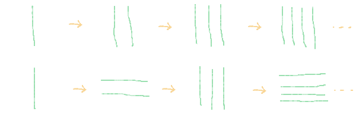

class: center, middle
.title[Game Development 1]
<br/><br/>
.subtitle[Loops]
<br/><br/><br/><br/><br/><br/>
.date[Nov 2023] 
<br/><br/><br/>
.note[Created with [Liminal](https://github.com/jonathanlilly/liminal) using [Remark.js](http://remarkjs.com/) + [Markdown](https://github.com/adam-p/markdown-here/wiki/Markdown-Cheatsheet) +  [KaTeX](https://katex.org)]

???

Author: Grigore Burloiu, UNATC

---
class: center
## the future of learning? (Dec '22)

[](https://chat.openai.com/chat)
    
---
name: toc
class: left
# ★ Table of Contents ★      <!-- omit in toc -->

1. [Keyboard interactivity](#keyboard-interactivity)
2. [Drawing](#drawing)
3. [Loops](#loops)
4. [Assignment](#assignment)

        
<!-- Comment out the next slide if you don't want the Table of Contents link -->         
---
layout: true  .toc[[★](#toc)]

---
name: keyboard-interactivity
# Keyboard interactivity

[system functions](https://www.lexaloffle.com/dl/docs/pico-8_manual.html#Input) - `btn()`, `btnp()`

```lua
-- standard buttons: ⬆️⬇️⬅️➡️🅾️❎
function _update()
    if (btn(🅾️)) then
        sfx(0) -- if O is held down
    end

    if (btnp(❎)) then
        sfx(1) -- if X was just pressed
    end
end
```

--

custom [mouse and keyboard input](https://www.lexaloffle.com/dl/docs/pico-8_manual.html#Mouse_and_Keyboard_Input)
- [lua strings](https://www.lexaloffle.com/dl/docs/pico-8_manual.html#Strings_and_Type_Conversion)

---
name: drawing
# Drawing

.right-column[
- 
- 
]

.left-column[
coordinate system

colors

```lua
circfill(x, y, radius, color)
```

[intro to lua](https://demoman.net/?a=intro-to-lua) @ demoman.net

basic trig: `sin`, `cos`, [`atan2`](https://www.lexaloffle.com/dl/docs/pico-8_manual.html#ATAN2)

randomness: [`rnd`](https://www.lexaloffle.com/dl/docs/pico-8_manual.html#RND)
]

---

<iframe width="100%" height="600" src="https://www.youtube.com/embed/t4CRCJUmWsM?start=42" title="YouTube video player" frameborder="0" allow="accelerometer; autoplay; clipboard-write; encrypted-media; gyroscope; picture-in-picture" allowfullscreen></iframe>

---
name: loops
# Loops

`_update()` → one loop / frame

--

what if we want *n* loops / frame?

---
## Architecture of a loop

`while`

--

`for`

--

exercise
- draw 15 stars (white dots) on a black background
- [flowchart](01-02-gd-basics#10) before coding


---
## Loops in code

recap [conditionals](01-03-pico8#25)

--

```lua
while ( cond ) do
    actions ...
end
```

--

```lua
for i = from,to,increment do 
    actions ...
end
```

--

- the above syntax, annotated --

```lua
while ( cond ) do   -- while cond is true
    actions ...    -- do actions
end

for i = from,to,increment do 
    -- standard form:
    -- for i=1,N
    actions; ...   -- actions to be performed N times
end
```

---
name: assignment
# Assignment

1. a .p8 sketch where
   1. pressing a button draws a vertical line in the center of the screen
   2. pressing again clears the screen & draws 2 equally distanced lines
   3. press again, 3 lines
   4. 4 lines etc

--

2. same as above, but on the even numbers (2, 4, ...) draw horizontal lines

--



--

try to get **as many drawings** as possible in **as few lines of code**

---
## Assignment (cont'd)

outline the program structure for your .p8 game
- use code tabs if you'd like!
- create placeholders for all functions you intend to implement
- start prototyping your core game function

check out the [internal demos](https://www.lexaloffle.com/dl/docs/pico-8_manual.html#_Example_Cartridges) as a guide, or [other](https://sophieh.itch.io/) [games](https://extar.itch.io/)
- (get games via `splore`)