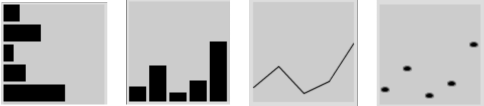
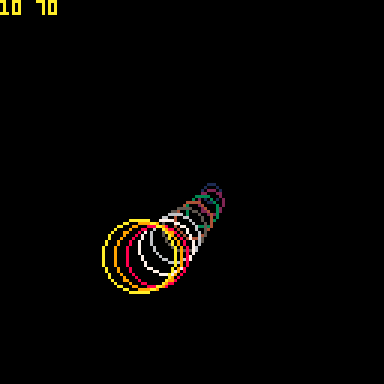

class: center, middle
.title[Game Development 1]
<br/><br/>
.subtitle[Arrays / Tables]
<br/><br/><br/><br/><br/><br/>
.date[Dec 2024] 
<br/><br/><br/>
.note[Created with [Liminal](https://github.com/jonathanlilly/liminal) using [Remark.js](http://remarkjs.com/) + [Markdown](https://github.com/adam-p/markdown-here/wiki/Markdown-Cheatsheet) +  [KaTeX](https://katex.org)]

???

Author: Grigore Burloiu, UNATC

---
name: toc
class: left
# ★ Table of Contents ★      <!-- omit in toc -->

1. [What is an array?](#what-is-an-array)
2. [Common uses](#common-uses)
3. [Animation](#animation)
4. [What about PICO-8 *tables*?](#what-about-pico-8-tables)
5. [Assignment](#assignment)

        
<!-- Comment out the next slide if you don't want the Table of Contents link -->         
---
layout: true  .toc[[★](#toc)]

---
name: what-is-an-array
# What is an array?

an ordered collection of *indexed* variables

--

```lua
a = {} -- start an empty array
a[1] = 0.5
a[2] = -0.25
print(a[1])

a[4] = -1.45
for i=1,4 do 
    print(a[i]) 
end
```

--

[arrays in Lua/PICO-8](https://www.lexaloffle.com/dl/docs/pico-8_manual.html#Tables) are *1-indexed*
- remember: screen coords (0-127) and flags (0-7) are 0-indexed!

[useful functions](https://www.lexaloffle.com/dl/docs/pico-8_manual.html#Table_Functions)
- `add`, `del`, `deli`, `count`, `#`, `all`

---
name: common-uses
# Common uses

[data](https://processing.org/tutorials/arrays/) storage, processing, viz
- `{ 5, 12, 3, 7, 20 }`



--

history [shift right](https://github.com/RVirmoors/cc1/blob/master/cc1-2017/cc1_05_01_history_reasfry/cc1_05_01_history_reasfry.pde) / [circular buffer](https://github.com/RVirmoors/cc1/blob/master/cc1-2017/cc1_05_02_history_circular/cc1_05_02_history_circular.pde)




---
name: animation
# Animation

.left-column[   
animated sprites


]

--

.right-column[
<iframe width="100%" height="200" src="https://www.youtube.com/embed/MkHznc3eO_o?start=375" title="Animating sprites in Pico-8" frameborder="0" allow="accelerometer; autoplay; clipboard-write; encrypted-media; gyroscope; picture-in-picture; web-share" allowfullscreen></iframe>
- what if we want to re-use a sprite for several animations?
]
<br/>

--

<br/><br/><br/><br/><br/><br/><br/><br/><br/><br/>

```lua
left_walk_anim = {1,2,3,4}
down_walk_anim = {1,16,17,18}
```

how do we iterate on `down_walk_anim` ?

---
name: what-about-pico-8-tables
# What about PICO-8 *tables*?

a table = an array + 

--

- both the *indexes* and the *values* can have **mixed types**
- takes the form of [key-value pairs](https://www.lexaloffle.com/dl/docs/pico-8_manual.html#PAIRS)

--

```lua
player = {
	x = 0,
	y = 64,
	state = "idle"
}

print(player["x"]) -- easier: player.x
print(player.state)    
```

--

a value inside a table [can itself be a table](https://NerdyTeachers.com/PICO-8/Guide/?Object-Oriented)
- we'll look at this next semester!

---

name: assignment
# Assignment

1. finish the [nerdy teachers platformer series](https://nerdyteachers.com/Explain/Platformer/): tutorials 6 & 7. Upload your game file(s)
2. back to the [4 sample games](https://www.lexaloffle.com/bbs/?tid=144823) by Bennett Foddy. Write down:
   a. anything that confuses you, or that you would like explained
   b. interesting uses of tables, and how they might translate into our platformer game