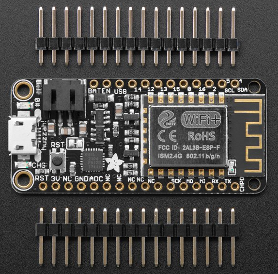
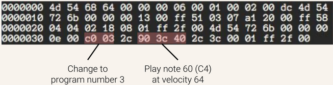
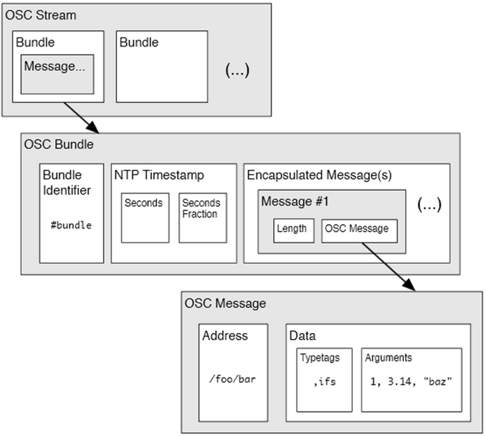

class: center, middle
.title[Creative Coding and Software Design 1]
<br/><br/>
.subtitle[Week 7: Physical Computing]
<br/><br/><br/><br/><br/><br/>
.date[Dec 2021] 
<br/><br/><br/>
.note[Created with [Liminal](https://github.com/jonathanlilly/liminal) using [Remark.js](http://remarkjs.com/) + [Markdown](https://github.com/adam-p/markdown-here/wiki/Markdown-Cheatsheet) +  [KaTeX](https://katex.org)]

???

Author: Grigore Burloiu, UNATC
    
---
name: toc
class: left
# ★ Table of Contents ★      <!-- omit in toc -->

1. [Libraries](#libraries)
2. [Networking](#networking)
3. [HCI](#hci)
4. [Communication](#communication)

        
<!-- Comment out the next slide if you don't want the Table of Contents link -->         
---
layout: true  .toc[[★](#toc)]

---
name: libraries
# Libraries

processing - Sketch > Import Library...

libs: [sound](https://processing.org/reference/libraries/sound/index.html), [net](https://processing.org/reference/libraries/net/index.html), [osc](http://www.sojamo.de/libraries/oscp5/), …

https://processing.org/reference/libraries/ 

---
name: networking
# Networking

**topologies**

one to one - one-way

one to one - bidirectional

--

many to one | collaborative/crowd control

--

one to many | broadcasting

--

many to many | multiplayer

---

## processing.net library

`import processing.net.*`

`Server, Client`

`available()`

`clientEvent(), serverEvent()`

`read(), readString()` …

`write()`

---

## example

multiplayer server & clients

http://learningprocessing.com/examples/chp19/example-19-01-simple-server

http://learningprocessing.com/examples/chp19/example-19-02-simple-client

---
name: hci
# HCI

example [syllabus](http://www.cs.nccu.edu.tw/~whliao/hci2014/) / [slides](https://www.slideshare.net/ZdenekLanc/hci-basics)

design for human physique, age, perception, subconscious, experience, cognition, culture, motivations, mood

--

sensors : physical energy → electricity

data : encoding & transmission

information : processing & feedback

---
## Types of sensors

.left-column[
Capacitive touch

EMG / electromyographic

Switch, button

Video / infrared camera

Microphone

Ultrasound

Knobs & sliders
]

.right-column[
Bend

Magnetic field

Accelerometer

Gyroscope

Photodiode

GPS

…  
]

---

## Common HCI technology

Arduino

Raspberry Pi

Kinect

Wiimote

Drawing tablet (Wacom etc)

BCI

Webcams

Wearables

Mobile devices: control surface + physical sensors

---
## Huzzah Feather

.left-column[
1 analog input

9 digital I/O

Arduino compatible

built-in WiFi controller

LiPoly acc. charger

- https://www.adafruit.com/product/2821
]
.right-column[
  
]

---
## Raspberry Pi 4 B
.left-column[
no analog inputs

22 digital I/O

single-board Linux computer

built-in WiFi & Ethernet

5V/3A DC power

2x uHDMI, USB, SD card, stereo out

- https://www.raspberrypi.org/products/raspberry-pi-4-model-b/ 
]
.right-column[
  
]

---
## Single Board Computers (SBC)

ARM v Intel v ?

software

cost

<iframe width="100%" height="300" src="https://www.youtube.com/embed/RcvMxC81r_g" title="YouTube video player" frameborder="0" allow="accelerometer; autoplay; clipboard-write; encrypted-media; gyroscope; picture-in-picture" allowfullscreen></iframe>

---
## Other platforms (focus on audio)

[Bela](http://users.sussex.ac.uk/~thm21/ICLI_proceedings/2016/Practical/Workshops/129_Bela.pdf)

[Daisy](https://www.electro-smith.com/daisy/daisy)

[Axoloti](http://www.axoloti.com/), [Organelle](https://www.critterandguitari.com/organelle), [Teensy Audio](https://www.pjrc.com/store/teensy3_audio.html), [Pisound](https://blokas.io/), [Aleph](https://monome.org/aleph/)


[comparison sheet](https://docs.google.com/spreadsheets/d/1lCcAwAynyZBDMc9DC4OqhzQerg8pFw5jJp8jHSKzNaE/edit?usp=sharing)

see also "[best SBCs 2021](https://all3dp.com/1/single-board-computer-raspberry-pi-alternative/)"

---
name: communication
# Communication

**input types**

[I2C](https://learn.bela.io/products/trill/all-about-i2c/) - digital standard, 4 pins `VCC GND SDA SCL`, address


--

analog - 3 pins `VCC GND SIG`, [sampled](https://learn.sparkfun.com/tutorials/analog-to-digital-conversion/all)

digital - `0/1`, [PWM](https://learn.sparkfun.com/tutorials/pulse-width-modulation/all)

---
## Protocols

USB cable → [serial](https://github.com/jaimovier/SARCduino) // MIDI etc

WiFi / network → UDP // [OpenSoundControl](../resources#opensoundcontrol)

Web → server-client // Node.js (socket.io etc)

---
## MIDI

.left-column[

- via [Colin Raffel](https://colinraffel.com/talks/ismir2017leveraging.pdf)
]
.right-column[

]

---
## MIDI vs OSC

.left-column[
```midi
144 60 64 (MIDI Note-on)
128 60 64 (MIDI Note-off)
144 60 64 (MIDI Note-on)
```
- pre-determined & standard
- 8bit (0-127)
  - (14bit int, sysex msgs)
- state-dependent (e.g. note-off)
- 16 channels
- atomic changes 
  - one parameter at a time
]
.right-column[
```osc
/wii/ir/x 0.1503
/stylus/pressure 0.014
/camera/look-at 5. 12. 17.
/play-note 15 0.9
```
- user-defined & human-readable
- int, float, string etc
- state-flexible
- unlimited channels
- atomic changes
  - multiple parameters
]

--

<br/><br/><br/><br/><br/><br/><br/><br/><br/><br/><br/><br/><br/><br/>
2020 - [MIDI 2.0](https://www.midi.org/midi-articles/details-about-midi-2-0-midi-ci-profiles-and-property-exchange)

---
## The oscp5 library

.left-column[
[`OscP5`](http://www.sojamo.de/libraries/oscP5/)

`NetAddress`

`OscBundle`

`OscMessage`

`checkTypeTag()`
]
.right-column[

]

<br/><br/><br/><br/><br/><br/><br/><br/><br/><br/><br/><br/><br/><br/>
more [resources](../resources#opensoundcontrol)