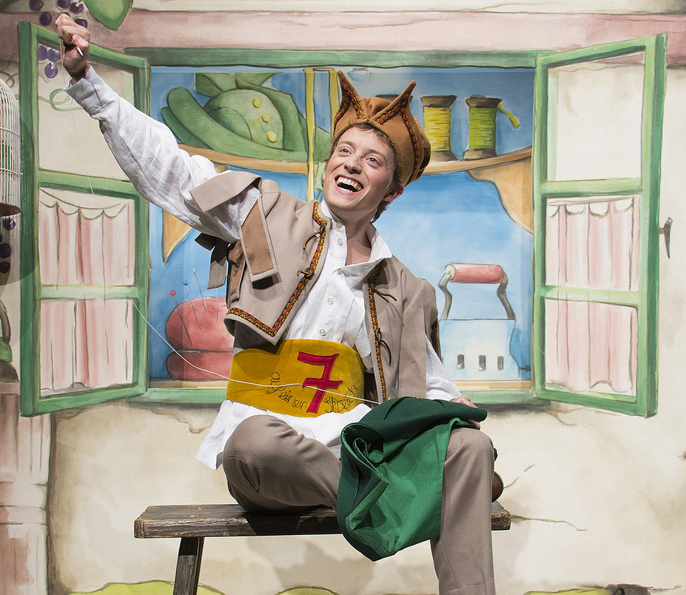

class: center, middle
.title[Game Development 2]
<br/><br/>
.subtitle[Objects]
<br/><br/><br/><br/><br/><br/>
.date[Jan 2025]
<br/><br/><br/>
.note[Created with [Liminal](https://github.com/jonathanlilly/liminal) using [Remark.js](http://remarkjs.com/) + [Markdown](https://github.com/adam-p/markdown-here/wiki/Markdown-Cheatsheet) +  [KaTeX](https://katex.org)]

???

Author: Grigore Burloiu, UNATC
    
---
## Attribution

**PICO-8** is an open ecosystem
- see other people's code & assets
- take and modify them if you wish

--

you SHOULD mention the source! e.g.:
```lua
-- taken from http://....
function rspr(s,x,y,a,w,h)
```

--

**academia** takes plagiarism seriously
- submit a [statement of originality](https://comp.anu.edu.au/courses/comp1720/resources/faq/#how-do-i-fill-out-my-statement-of-originality)
- mention all code & assets you take / use as inspiration
- anything you don't mention is 100% your work!
    
---
name: toc
class: left
# ★ Table of Contents ★     <!-- omit in toc -->

1. [Introducing OOP](#introducing-oop)
2. [OOP in Lua / PICO-8](#oop-in-lua--pico-8)
3. [Next steps](#next-steps)
4. [Assignment](#assignment)

        
<!-- Comment out the next slide if you don't want the Table of Contents link -->         
---
layout: true  .toc[[★](#toc)]
        
---
## a variable

```lua
--
--
    r = 20
    circ(64, 64, r, 7);
--
--
```
---
## a block has variables

```lua
--
  for i = 1, 5 do
    r = i * 4
    circ(64, 64, r, 7);
  end
--
```
---
## a function has blocks has variables

```lua
function draw_circles(x, y)
  for i = 1,5 do
    r = i * 4
    circ(x, y, r, 7);
  end
end
```

---

name: introducing-oop
# Introducing OOP

.left-column[
back to the spaceship example:
- how to create 2+ ships?
- how to clean up global vars?
- how to create new entities cleanly?

<br/>
  - conciseness
  - modularity
  - efficiency
]

.right-column[

    <iframe width="49%" height="50" src="https://www.youtube.com/embed/pTB0EiLXUC8" title="YouTube video player" frameborder="0" allow="accelerometer; autoplay; clipboard-write; encrypted-media; gyroscope; picture-in-picture" allowfullscreen></iframe>
]

---
## Objects

have data &nbsp;&nbsp;&nbsp;&nbsp;&nbsp; &nbsp;&nbsp;&nbsp;&nbsp;&nbsp; &nbsp;&nbsp;&nbsp;&nbsp;&nbsp; &nbsp;&nbsp;&nbsp;&nbsp;&nbsp; `position, size, …`
- ~ attributes 
- ~ fields

--

respond to methods &nbsp;&nbsp;&nbsp;&nbsp;&nbsp; `move(), draw(), …`
- ~ functions 
- ~ messages      

--

are *instances* of a **class**

--

- class ~ type ~ template
- objects ~ variables 

---
## Programming paradigms

Imperative programming: statement ~ command
- e.g. `i = i + 1;`


Procedural programming: procedure ~ function ~ method
- e.g. `i = increment(i);`


Object-oriented programming: class / object
- e.g. `i.increment();`

--

other paradigms exist!
- [declarative programming](https://en.wikipedia.org/wiki/Declarative_programming): not *how*, but *what* to do: e.g. HTML

---
name: oop-in-lua--pico-8
# OOP in Lua / PICO-8

no specific syntax!*
- (unlike C++, C#, Python etc)

...so we make our own!

--

two patterns:

1. basic, using tables
2. tables plus metatables

- *except for metatables

--

first, remember p8 tables: *keys* and *values*

```lua
player = {x = 64, y = 64}
```

---
## 1. basic

```lua
entities = {}

function make_entity(params)
-- constructor
	local e={
		x = 0,
		y = 0,
		health = 100,
		visible = true,
		frames = {12,13,14},
		draw = draw_entity
	}
	for k,v in pairs(params) do
		e[k]=v
	end
	return add(entities,e)
end

player = make_entity({x=3})
print(player.x)
print(player.health)
```

---
## 1. basic (cont'd)

```lua
print(player.draw)
```

--

the `draw` method doesn't exist: we have to define it!

--

```lua
function player.draw()
	print("♥")
end

print(player.draw)
```

--

```lua
enemy = make_entity()
print(enemy.x)
print(enemy.draw)
```

--

we don't have a `draw()` for all entities, just for the `player` object!
```lua
enemy.draw = --...
```

---
## 2. using metatables

```lua
function entities:new(e)
	e = e or {}
	setmetatable(e, self)
	self.__index = self
	
	self.x = 0
	self.y = 0
	self.health = 100
	self.visible = true
	self.frames = {12,13,14}
	
	add(entities, self)
	return e
end

player = entities:new({x=3})
print(player.x)
print(player.health)
```

- *In this pattern, if you call a method of the object and the object doesn't have its own definition, it then goes to the class's definition.* [source](https://www.reddit.com/r/pico8/comments/5loog0/comment/dbyyxg3/?context=3)
  - [more](https://www.lexaloffle.com/dl/docs/pico-8_manual.html#Metatables) on [metatables](https://pico-8.fandom.com/wiki/Setmetatable)

---
## 2. using metatables (cont'd)

it's easy to create a `draw` function for the whole `entities` class now:

```lua
function entities:draw()
	print("♥")
end

player:draw()

enemy = entities:new()
enemy:draw()
```

---
## a function has blocks has variables

```lua
--

function circles(x, y)
  for i = 1,5 do
    r = i * 4
    circ(x, y, r, 7);
  end
end

--
```
---
## a class has functions has blocks has variables
```lua
darts = {}

function darts:circles(x, y)
  for i = 1,5 do
    r = i * 4
    circ(x, y, r, 7);
  end
end

darts:circles(33,33)
```

---
class: center



---
class: center
## 7 hits in one s...emester

- variables  &nbsp;&nbsp;&nbsp;&nbsp;&nbsp; &nbsp;&nbsp;&nbsp;&nbsp;&nbsp; &nbsp;&nbsp;&nbsp;&nbsp;&nbsp; &nbsp;&nbsp;&nbsp;&nbsp;&nbsp; `x = 7`
- types &nbsp;&nbsp;&nbsp;&nbsp;&nbsp; &nbsp;&nbsp;&nbsp;&nbsp;&nbsp; &nbsp;&nbsp;&nbsp;&nbsp;&nbsp;&nbsp;&nbsp; `b = false`
- conditionals &nbsp;&nbsp;&nbsp;&nbsp;&nbsp; &nbsp;&nbsp;&nbsp;&nbsp;&nbsp; &nbsp;&nbsp;&nbsp;&nbsp;&nbsp; `if (not b) print(x)`
- loops &nbsp;&nbsp;&nbsp;&nbsp;&nbsp; &nbsp;&nbsp;&nbsp;&nbsp;&nbsp; &nbsp;&nbsp;&nbsp;&nbsp;&nbsp; `for i=1,x do print(i) end`
- functions &nbsp;&nbsp;&nbsp;&nbsp;&nbsp; &nbsp;&nbsp;&nbsp;&nbsp;&nbsp; &nbsp;&nbsp;&nbsp;&nbsp;&nbsp; `function say(m) print(m) end`
- arrays &nbsp;&nbsp;&nbsp;&nbsp;&nbsp; &nbsp;&nbsp;&nbsp;&nbsp;&nbsp; &nbsp;&nbsp;&nbsp;&nbsp;&nbsp; &nbsp;&nbsp;&nbsp;&nbsp;&nbsp; &nbsp;&nbsp;&nbsp;&nbsp;&nbsp; &nbsp;&nbsp;&nbsp;&nbsp;&nbsp; `a = { 7, 14, 21 }`
- objects &nbsp;&nbsp;&nbsp;&nbsp;&nbsp; &nbsp;&nbsp;&nbsp;&nbsp;&nbsp; &nbsp;&nbsp;&nbsp;&nbsp;&nbsp; `function a:say(m) print(m) end`


---
name: next-steps
# Next steps

<iframe width="49%" height="250" src="https://www.youtube.com/embed/srPKBhzgZhc" title="YouTube video player" frameborder="0" allow="accelerometer; autoplay; clipboard-write; encrypted-media; gyroscope; picture-in-picture" allowfullscreen></iframe>

- using an [external text editor](https://www.lexaloffle.com/dl/docs/pico-8_manual.html#_Using_an_External_Text_Editor)
  - [Making PICO-8 Development Easier](https://amiantos.net/easier-pico-8-development/)

--

keep building, the sky* is the limit!
- *and PICO-8


---

name: assignment
# Assignment

prototype a playable interaction in your p8 game
- should ideally be your main gameplay loop

AND

fill in your [statement-of-originality.yml](../attachments/statement-of-originality.yml)

<br/><br/><br/><br/>

add the `.p8` and `.yml` files to your github