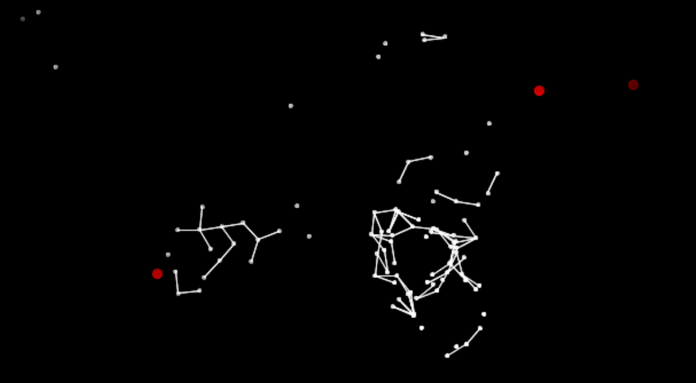

class: center, middle
.title[Creative Coding and Software Design 1]
<br/><br/>
.subtitle[Week 10: Advanced OOP]
<br/><br/><br/><br/><br/><br/>
.date[Jan 2022]
<br/><br/><br/>
.note[Created with [Liminal](https://github.com/jonathanlilly/liminal) using [Remark.js](http://remarkjs.com/) + [Markdown](https://github.com/adam-p/markdown-here/wiki/Markdown-Cheatsheet) +  [KaTeX](https://katex.org)]

???

Author: Grigore Burloiu, UNATC
    
---
name: toc
class: left
# ★ Table of Contents ★     <!-- omit in toc -->

1. [Advanced OOP](#advanced-oop)
2. [Physics recap](#physics-recap)
3. [Example: particle systems](#example-particle-systems)

        
<!-- Comment out the next slide if you don't want the Table of Contents link -->         
---
layout: true  .toc[[★](#toc)]
        
---
name: advanced-oop
# Advanced OOP

inheritance
```java
class Dog extends Animal {  } // gets all of the parent’s methods&vars
```

polymorphism
```java
Animal spot = new Dog(); // modifying parent methods
```
- [example](http://learningprocessing.com/examples/chp22/example-22-02-polymorphism)
- superclass: constructor `super()`, method `super.method()`
```java
(spot instanceof Dog) // → true / false
```

---
name: physics-recap
# Physics recap

position

speed

acceleration

force

--

all of these are *vectors*!

[PVector](https://processing.org/reference/PVector.html) ` :    x, y     |     mag, angle`


---
name: example-particle-systems
# Example: particle systems

.cite[A particle system is a collection of many many minute particles that together represent a fuzzy object. Over a period of time, particles are generated into a system, move and change from within the system, and die from the system.]

--

emitter

lifespan

--

fixed # of particles: [Array](https://processing.org/reference/Array.html)

variable # of particles: [ArrayList](https://processing.org/reference/ArrayList.html)

- [example](https://processing.org/examples/simpleparticlesystem.html)

---
## Variants

[particle web](https://github.com/RVirmoors/cc1/blob/master/cc1-2017/cc1_11_01_particles/cc1_11_01_particles.pde)



[+ deflector](https://github.com/RVirmoors/cc1/blob/master/cc1-2017/cc1_11_04_deflector/cc1_11_04_deflector.pde) (polymorphism)

---
class: center
## Particle effects


(start from [here](https://github.com/RVirmoors/cc1/tree/master/cc1-2021/ship))

--

<br/>
- more: [The Nature of Code](https://natureofcode.com/book/) (D. Shiffman), [examples](https://twitter.com/search?q=natureofcode)