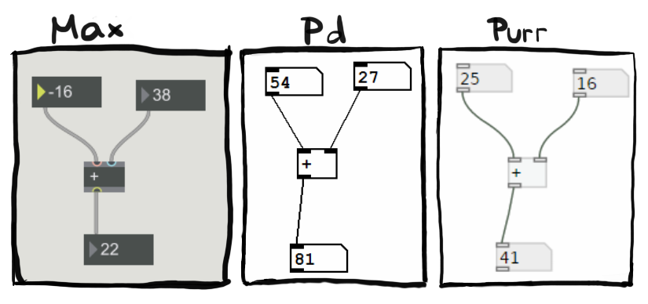

class: center, middle
.title[Creative Coding and Software Design 2]
  
.subtitle[Intro to real-time systems]
      
.date[Feb 2024] 
   
.note[Created with [Liminal](https://github.com/jonathanlilly/liminal) using [Remark.js](http://remarkjs.com/) + [Markdown](https://github.com/adam-p/markdown-here/wiki/Markdown-Cheatsheet) +  [KaTeX](https://katex.org)]

???

Author: Grigore Burloiu, UNATC
    
---
name: toc
class: left
# ★ Table of Contents ★      <!-- omit in toc -->
      
1. [Semester overview](#semester-overview)
2. [Interactive programming](#interactive-programming)
3. [Max \& Pd](#max--pd)
4. [Unity](#unity)
5. [TouchDesigner](#touchdesigner)

        
<!-- Comment out the next slide if you don't want the Table of Contents link -->         
---
layout: true  .toc[[★](#toc)]
        
---
name: semester-overview  
class: left
# Semester overview

[Syllabus](https://www.notion.so/rvirmoors/Creative-Coding-and-Software-Design-2-b6cab9fba18a4e5c85f97fc3f0364aa7)

| 2h lab | ~ | assignments work. practice w/ new concepts |
| --- | | --- |
| 2h lecture | ~ | new concepts. assignments / readings |

Python & TouchDesigner

[version control](01-03-fsm.md#version-control)

Max / Pure Data

Arduino, RPi, [Daisy](https://www.electro-smith.com/daisy/daisy), sensors

---

## Semester objective

create **layered** interaction

--

- beyond "[Mickey Mousing](https://en.wikipedia.org/wiki/Mickey_Mousing)"
- not just purely reactive

--

how?

--

what are YOUR objectives?

---

## Assignments

complete 2 interactive projects
- 40% each
- see [resources](../resources#academic)
- topics on [Classroom](https://classroom.google.com/)

weekly "dev diary"
- 2% each, total up to 20%
- simple assignment to get you started
- any work counts (aside from the 2 projects above)

---
name: interactive-programming  
class: left
# Interactive programming

[@wikipedia](https://en.wikipedia.org/wiki/Interactive_programming)

data **flow**

program **state**

--

| | visual | free | Linux |
|-|--------|------|-------|
|Max|✅|❌|❌|
|Pure Data|✅|✅|✅|
|TouchDesigner|✅|❌|❌|
|vvvv|✅|✅|❌|
|Python notebooks|❌|✅|✅|
|Supercollider|❌|✅|✅|
|Unity*|❌|❌|✅|

--

*not actually interactive

---
name: max--pd  
class: left
# Max & Pd

[Max](//cycling74.com/products/max/): created by [Miller Puckette](//msp.ucsd.edu/) in the 80s at IRCAM

90s: M.S.P. → [Pure Data](//puredata.info/)

1997: MSP / Max Signal Processing

2003: Jitter

2011: [Max](https://cycling74.com/products/maxforlive) [for](https://maxforlive.com/) [Live](https://www.ableton.com/en/live/max-for-live/)

[also](https://cycling74.com/products/extendmax): C/C++, Gen, JavaScript + Node for Max, many *external* [packages](https://cycling74.com/packages/)

meanwhile: 
- Pd-Extended → [Purr Data](https://agraef.github.io/purr-data-intro/)

- [libpd](https://github.com/libpd/libpd) : [Raspberry Pi](https://puredata.info/docs/raspberry-pi), [Unity](https://github.com/LibPdIntegration/LibPdIntegration) etc

---

## Max

commercial software / Cycling ‘74

runs on Win & OSX

documentation : *Help > Reference*

[hundreds of objects](https://docs.cycling74.com/max8/vignettes/thesaurus)

learning by practice → 💡 → intuition

dataflow programming / real-time prototyping / interaction design

**js**, **node**, java, c/c++...

---

## Pure Data

open source / copyrighted but free

runs on Win, OSX, Linux

[documentation](http://msp.ucsd.edu/Pd_documentation/index.htm) : *Help > HTML manual*

[hundreds of objects](https://puredata.info/docs/faq/listofobjects)

learning by practice → 💡 → intuition

dataflow programming / real-time prototyping / interaction design

**libpd**, [js](https://github.com/mganss/pdjs), c/c++...

---

class: center
## UI comparison

---

name: unity       
class: left
#  Unity

commercial software / Unity Technologies

runs on Win & OSX, compiles to Linux & many more

[documentation](https://docs.unity3d.com/Manual/index.html)

[C# API](https://docs.unity3d.com/Manual/ScriptingImportantClasses.html)

learning by googling & rtfm

imperative programming / iterative prototyping / experience design

[plug-ins](https://docs.unity3d.com/Manual/Plugins.html)

--

alternatives - [Godot](https://godotengine.org/features), [PICO-8](https://www.lexaloffle.com/pico-8.php)

---
name: touchdesigner
# TouchDesigner

commercial software / Derivative

runs on Win & OSX

[documentation](https://docs.derivative.ca/Main_Page)

[Python scripting](https://docs.derivative.ca/Category:Python)

learning by practice → 💡 → intuition (*not the same* as Max/Pd)