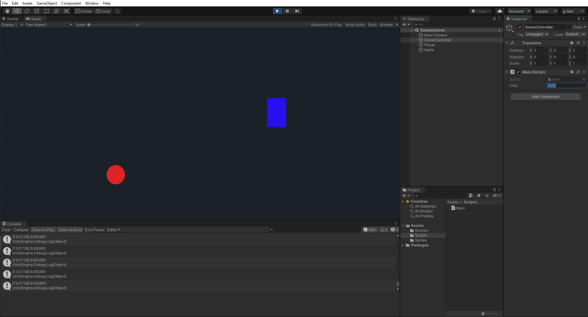

class: center, middle
.title[Creative Coding and Software Design 2]
  
.subtitle[Week 2: From Processing to Unity]
      
.date[Feb 2021] 
   
.note[Created with [Liminal](https://github.com/jonathanlilly/liminal) using [Remark.js](http://remarkjs.com/) + [Markdown](https://github.com/adam-p/markdown-here/wiki/Markdown-Cheatsheet) +  [KaTeX](https://katex.org)]

???

Author: Grigore Burloiu, UNATC
    
---
name: toc
class: left
# ★ Table of Contents ★     <!-- omit in toc -->

1. [Setting up](#setting-up)
2. [C# and Java](#c-and-java)
3. [Mini-game from scratch](#mini-game-from-scratch)
4. [Assignment](#assignment)

        
<!-- Comment out the next slide if you don't want the Table of Contents link -->         
---
layout: true  .toc[[★](#toc)]
        
---

name: setting-up
# Setting up

[Get Unity](https://unity3d.com/get-unity/download)

Visual Studio

- [Community](https://visualstudio.microsoft.com/vs/unity-tools/)
  - [officially recommended IDE](https://youtu.be/KH0nqTpOVuM)
  - [installation](https://youtu.be/nna58aKumJ8)
- [Code](https://code.visualstudio.com/docs/other/unity)
  - lightweight
  - [open source](https://github.com/microsoft/vscode)-based

other editors work too, e.g. [Sublime Text](http://wiki.unity3d.com/index.php/Using_Sublime_Text_as_a_script_editor)

---
name: c-and-java  
class: center
# C# and Java

---

## Unity and Processing

p5: write p5-flavour Java
- subset of a Java *applet* class 
- run by JVM

Unity: write C#
- API → C++
- compile to native machine code

---

name: mini-game-from-scratch
# Mini-game from scratch

<iframe src="https://openprocessing.org/sketch/998046/embed/" width="100%" height="400"></iframe>

---

## GameObjects and Sprites

create gameobjects
create sprites
place in screen

---

## Camera

move camera to 10 -5
.ViewportToWorldPoint(new Vector3(1, 1, camera.nearClipPlane));

---

class: center
## Play mode

---

class: center
## WebGL build

<iframe src="https://rvirmoors.github.io/webgl/p5-unity/" width="600" height="406"></iframe>

- [hosting on github.io](https://medium.com/@aboutin/host-unity-games-on-github-pages-for-free-2ed6b4d9c324)
- [large files on github](https://docs.github.com/en/github/managing-large-files/versioning-large-files)
- [hosting on itch.io](https://itch.io/docs/creators/html5)

---

## Unity-fying our code

https://docs.unity3d.com/ScriptReference/Vector2.Lerp.html
https://docs.unity3d.com/ScriptReference/Vector2.MoveTowards.html

https://docs.unity3d.com/Manual/CollidersOverview.html

---

name: assignment       
class: left
#  Assignment

Refactor the project using:
- GameObject-connected scripts
- Colliders 
- as many Unity-specific helpers as you find useful