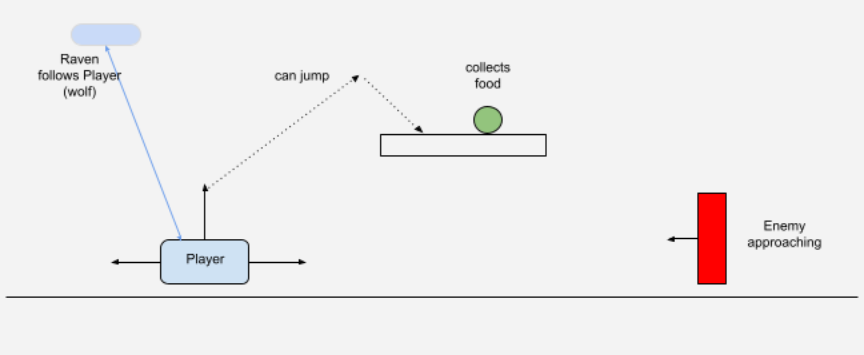
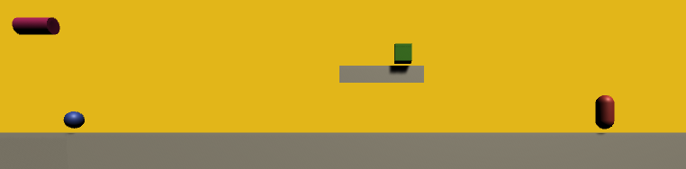
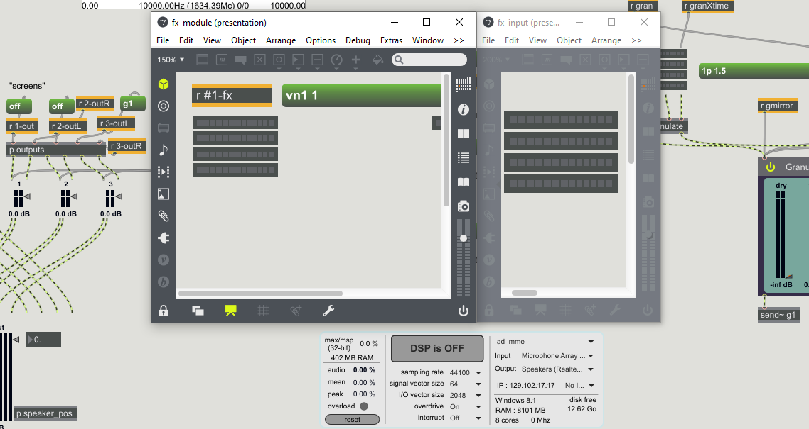

class: center, middle
.title[Creative Coding and Software Design / Game Development 2]
  
.subtitle[Week 4: Personal Project]
      
.date[Mar 2021] 
   
.note[Created with [Liminal](https://github.com/jonathanlilly/liminal) using [Remark.js](http://remarkjs.com/) + [Markdown](https://github.com/adam-p/markdown-here/wiki/Markdown-Cheatsheet) +  [KaTeX](https://katex.org)]

???

Author: Grigore Burloiu, UNATC
    
---
name: toc
class: left
# ★ Table of Contents ★     <!-- omit in toc -->

1. [Personal project labs](#personal-project-labs)
2. [Example design](#example-design)
3. [Interaction](#interaction)
4. [Mapping out the project](#mapping-out-the-project)
5. [Assignment](#assignment)

        
<!-- Comment out the next slide if you don't want the Table of Contents link -->         
---
layout: true  .toc[[★](#toc)]
        
---
name: personal-project-labs
# Personal project labs

[1. project plan](https://learn.unity.com/tutorial/lab-1-personal-project-plan)

[2. primitives](https://learn.unity.com/tutorial/lab-2-new-project-with-primitives)

[3. player control](https://learn.unity.com/tutorial/lab-3-player-control)

[our design doc](https://docs.google.com/document/d/1WGm_XWIbq0p8gobweIWCgX0udo4pBJFtTGfdcNukBGU/edit)

---
name: example-design  
class: center
# Example design

---
name: interaction
# Interaction

move left-right

constrain 
- to ends of plane? of camera-viewport?

jump

fire attackWave / projectile

---
name: mapping-out-the-project
# Mapping out the project

Useful tools:
- [Network Diagrams](https://graphicalnetworks.com/blog-logical-vs-physical-network-diagrams/) (logical / physical)
- [Flowcharts](https://www.visual-paradigm.com/tutorials/flowchart-tutorial/) (logical steps)
- [UML](https://medium.com/kidstronics/unity-point-click-adventuregame-09-a71fe94dd402) (OOP code)
  
- *(in order of necessity)*\*

--

Design paradigms:
- bottom-up
    - solving problems / building abstractions. experimentation. iterative growth.
- top-down
    - establishing structure. setting dependencies

---
class: center
## Example modular hierarchy
main > fx-module > fx-input

- https://github.com/RVirmoors/fred-arditti

---
class: center
## Example modular hierarchy
main > fx-module > fx-input

- abstractions
- encapsulation
- signal & message routing

---

name: assignment       
class: left
#  Assignment

create a new personal project sketch (can be a mini-game, or any interactive piece)

make a copy of the [design google doc](https://docs.google.com/document/d/1hrX0KVid_9bBb5rJSEEZmOxcXtm_qezbFbZMRDD9szU/copy) & fill it in

create a Unity sketch, recreating the main components with primitives & positioning the camera accordingly

(optional) - implement basic movement/interaction mechanics

submit:
- a link to your design google doc
- a VIDEO or IMAGE showing the Unity scene  (please don't upload the .unitypackage) 