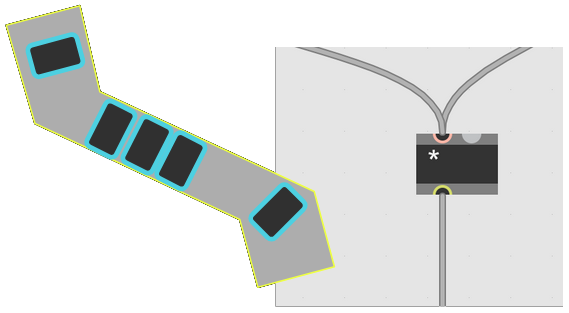
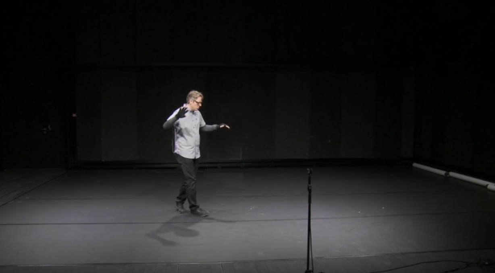

class: center, middle
.title[Creative Coding and Software Design 2]
<br/><br/>
.subtitle[Week 5: Data and signal flow]
<br/><br/><br/><br/><br/><br/>
.date[Mar 2021] 
<br/><br/><br/>
.note[Created with [Liminal](https://github.com/jonathanlilly/liminal) using [Remark.js](http://remarkjs.com/) + [Markdown](https://github.com/adam-p/markdown-here/wiki/Markdown-Cheatsheet) +  [KaTeX](https://katex.org)]

???

Author: Grigore Burloiu, UNATC
    
---
name: toc
class: left
# ★ Table of Contents ★     <!-- omit in toc -->

1. [Max/Pd objects](#maxpd-objects)
2. [Data and signals](#data-and-signals)
3. [Types and basic objects](#types-and-basic-objects)
4. [Examples](#examples)
5. [Assignment](#assignment)

        
<!-- Comment out the next slide if you don't want the Table of Contents link -->         
---
layout: true  .toc[[★](#toc)]
        
---
name: maxpd-objects
# Max/Pd objects

.left-column[Keyboard shortcuts:*
- **N**: new object
- **M**: new message object
- **B**: [bang]
- **T**: [toggle]
- **I**: [number] (int)**
- **F**: [float] (float)
- **C**: new comment
- **Ctrl+E** or **Ctrl+click**: edit on/off
- **Ctrl+M**: console (Max Window)
- **Alt+click**: open object's help
]

.right-column[]

<br/><br/><br/><br/><br/><br/><br/><br/><br/><br/><br/><br/>
*Pd: copy maxhotkey-plugin.tcl to ```/Documents/Pd/externals/``` to enable Max-like hotkeys

**Pd doesn't have an ```int``` type: all its numbers are ```float``` precision. Shift+drag on a number box to access its decimals.

---
## Object inlets: <span style="color:lightcoral">hot</span> and <span style="color:aqua">cold</span>

.left-column[
<span style="color:aqua">setting the internal state</span> of an object

setting the state and <span style="color:lightcoral">triggering output</span>
]

.right-column[]

--
<br/><br/><br/><br/><br/><br/><br/><br/>
Techniques:

| | | |
|:---|-|:---|
| basic flow | | <span style="color:lightcoral">hot</span> inlet → <span style="color:lightcoral">hot</span> inlet → ... |
| store data, use later | | <span style="color:aqua">cold</span> inlet → do something → <span style="color:lightcoral">hot</span> inlet |
| use <span style="color:lightcoral">hot</span> inlet as a cold one (<span style="color:aqua">no output</span>) | | "set $1" message |
| send to several inlets at once | | list → <span style="color:lightcoral">hot</span> inlet |

---
class: center
## Focus: the [message] object


| | | |
|:---|-|:---|
| <span style="opacity: 0.5">basic flow </span>| | <span style="opacity: 0.5"><span style="color:lightcoral">hot</span> inlet → <span style="color:lightcoral">hot</span> inlet → ... </span>|
| store data, use later | | <span style="color:aqua">cold</span> inlet → do something → <span style="color:lightcoral">hot</span> inlet |
| use <span style="color:lightcoral">hot</span> inlet as a cold one (<span style="color:aqua">no output</span>) | | "set $1" message |
| <span style="opacity: 0.5">send to several inlets at once</span> | | <span style="opacity: 0.5">list → <span style="color:lightcoral">hot</span> inlet</span> |

---
name: data-and-signals
# Data and signals

.left-column[
Max

"messages through a tube"

*atoms*


]

.right-column[
MSP

"water down a pipe"

*signals*


]

--

<br/><br/><br/><br/><br/><br/><br/><br/><br/><br/><br/><br/><br/>
What about Jitter?

---
name: types-and-basic-objects
# Types and basic objects

| Type | Container | Hotkey | Operations |
|---|---|-|:---|
|bang|bang|**B**|delay trigger|
|int|number|**I**| + - * / > pipe sel route ... |
|float|flonum|**F**| scale slide ... |
|symbol|message|**M**| coll "set " |
|list|message|**M**| pack/pak unpack zl |
|signal|number~| | cycle~ +~ *~ abs~ avg~ ... |
|matrix|jit.matrix| **J** | jit.op jit.fill ... | 

---
class:center
## Max type conversion table


- https://www.kadenze.com/courses/programming-max-structuring-interactive-software-for-digital-arts-i/resources/1777

---
name: examples
# Examples

A. [Simple patch: visualise a signal](#ex1)

B. [Sensor-based interfaces](#ex2)

C. [Hardware integration](#ex3)

D. [Software integration](#ex4)

E. [Live electronics](#ex5)

F. [Audiovisual](#ex6)

G. [Sonification](#ex7)

---
name: ex1
class: center
## example patch


---
name: ex2
class: center
## Leafcutter John
<iframe width="100%" height="500" src="https://www.youtube.com/embed/pUOkEbvO6c4?start=65" frameborder="0" allow="accelerometer; autoplay; clipboard-write; encrypted-media; gyroscope; picture-in-picture" allowfullscreen></iframe>

---
class: center
## David Wessel
<iframe width="100%" height="500" src="https://www.youtube.com/embed/q_mtCZqN0Ms?start=128" frameborder="0" allow="accelerometer; autoplay; clipboard-write; encrypted-media; gyroscope; picture-in-picture" allowfullscreen></iframe>

---
class: center
## Eduardo Miranda
<iframe width="100%" height="500" src="https://www.youtube.com/embed/GBPkl7YEiuE" frameborder="0" allow="accelerometer; autoplay; clipboard-write; encrypted-media; gyroscope; picture-in-picture" allowfullscreen></iframe>

[more](https://vimeo.com/163673832)

---
class: center
## jasch


[more](https://www.jasch.ch/island.html)

---
name: ex3
class: center
## Organelle
<iframe width="100%" height="500" src="https://www.youtube.com/embed/TW6FAxLFzLk?start=202" frameborder="0" allow="accelerometer; autoplay; clipboard-write; encrypted-media; gyroscope; picture-in-picture" allowfullscreen></iframe>

---
class: center
## Impractical Musical Devices
<iframe width="100%" height="500" src="https://www.youtube.com/embed/aquqZ6evJt0" frameborder="0" allow="accelerometer; autoplay; clipboard-write; encrypted-media; gyroscope; picture-in-picture" allowfullscreen></iframe>

[more](https://www.impracticaldevices.com/)

---
name: ex4
class: center
## Loop/stutter device
<iframe width="100%" height="500" src="https://www.youtube.com/embed/8ktXnfCnTAI" frameborder="0" allow="accelerometer; autoplay; clipboard-write; encrypted-media; gyroscope; picture-in-picture" allowfullscreen></iframe>

---
class: center
## Amazing Noises
<iframe width="100%" height="500" src="https://www.youtube.com/embed/pEWtwXXairM" frameborder="0" allow="accelerometer; autoplay; clipboard-write; encrypted-media; gyroscope; picture-in-picture" allowfullscreen></iframe>

---
class: center
## Generative drum machine
<iframe width="100%" height="500" src="https://www.youtube.com/embed/x-cpcOfo0_g" frameborder="0" allow="accelerometer; autoplay; clipboard-write; encrypted-media; gyroscope; picture-in-picture" allowfullscreen></iframe>

[more](https://www.congburn.co.uk/strokes)

---
class: center
## Procedural audio / Unity
<iframe width="100%" height="500" src="https://www.youtube.com/embed/yCiX9DdtWvw?start=218" frameborder="0" allow="accelerometer; autoplay; clipboard-write; encrypted-media; gyroscope; picture-in-picture" allowfullscreen></iframe>

[more](https://github.com/LibPdIntegration/LibPdIntegration) . [more](https://youtu.be/0xr4aL1C24E)

---
name: ex5
class: center
## Pierre Boulez: *Anthemes 2*
<iframe width="100%" height="500" src="https://www.youtube.com/embed/MzawnjOiccM?start=66" frameborder="0" allow="accelerometer; autoplay; clipboard-write; encrypted-media; gyroscope; picture-in-picture" allowfullscreen></iframe>

---
name: ex6
class: center
## Chi Po-Hao
<iframe width="100%" height="500" src="https://www.youtube.com/embed/Y0ZGJi0Q3Cc" frameborder="0" allow="accelerometer; autoplay; clipboard-write; encrypted-media; gyroscope; picture-in-picture" allowfullscreen></iframe>

[more](http://chipohao.com/projects/autogenous-noise/)

---
class: center
## Federico Foderaro
<iframe width="100%" height="500" src="https://www.youtube.com/embed/CSZm-z0zf4E" frameborder="0" allow="accelerometer; autoplay; clipboard-write; encrypted-media; gyroscope; picture-in-picture" allowfullscreen></iframe>

[more](https://www.federicofoderaro.com/)

---
name: ex7
class: center
## Maria Năstase
<iframe width="100%" height="500" src="https://www.youtube.com/embed/GoKjYS471Kk" frameborder="0" allow="accelerometer; autoplay; clipboard-write; encrypted-media; gyroscope; picture-in-picture" allowfullscreen></iframe>

---
class: center
## Tom Zicarelli
<iframe width="100%" height="500" src="https://www.youtube.com/embed/ZubuYrosT4Y" frameborder="0" allow="accelerometer; autoplay; clipboard-write; encrypted-media; gyroscope; picture-in-picture" allowfullscreen></iframe>

[more](https://github.com/tkzic/internet-sensors)


---
name: assignment       
class: left
#  Assignment

Tutorials 1-5: Hello, Bang, Numbers, Metro, Debugging

Ask (at least) one question:
- something you didn’t understand / were surprised by
- *(if you got everything)* something that might stump your peers

See also: [resources](https://rvirmoors.github.io/ccia/resources#max)