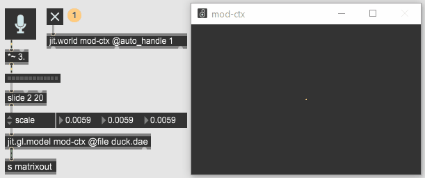

class: center, middle
.title[Creative Coding and Software Design 2]
  
.subtitle[Week 6: Control]
      
.date[Apr 2025]
   
.note[Created with [Liminal](https://github.com/jonathanlilly/liminal) using [Remark.js](http://remarkjs.com/) + [Markdown](https://github.com/adam-p/markdown-here/wiki/Markdown-Cheatsheet) +  [KaTeX](https://katex.org)]

???

Author: Grigore Burloiu, UNATC
    
---
name: toc
class: left
# ★ Table of Contents ★     <!-- omit in toc -->

1. [Lists](#lists)
2. [MSP basics](#msp-basics)
3. [Args, messages, attr](#args-messages-attr)
4. [Example: audio-reactive 3D model](#example-audio-reactive-3d-model)
5. [Assignment](#assignment)

        
<!-- Comment out the next slide if you don't want the Table of Contents link -->         
---
layout: true  .toc[[★](#toc)]
        
---
name: lists
# Lists

pack / pak / unpack

zl

prepend / append

messages: "text $1" ...

coll, route

---
class: center
## Tip: reset object

---
name: msp-basics
# MSP basics

number~ / snapshot~

cycle~ / saw~

phasor~

buffer~ 

play~ / groove~ / stutter~

---
name: args-messages-attr
# Args, messages, attr

[buffer~ mySound 10 2]

"set myOtherSound"

setting Attributes

- @ (in object box)
- inspector (**Ctrl+I**) 
- attrui (right-click on first inlet)
- by messages of the attr's name

---
name: example-audio-reactive-3d-model
class:center
# Example: audio-reactive 3D model

jit.gl.model

use signal amplitude to control the scale of a 3D model

---
name: assignment       
class: left
#  Assignment

Tutorials. See #21: controlling data flow

IN: int. OUT: that int, if it’s > 5.
- useful objects: trigger, gate, sel, >, if, …
- how many ways are there?

AND

use the mouse to sample from a sound buffer at different speeds & locations

Reading: https://www.duo.uio.no/bitstream/handle/10852/8996/1/G26-Nymoen.pdf