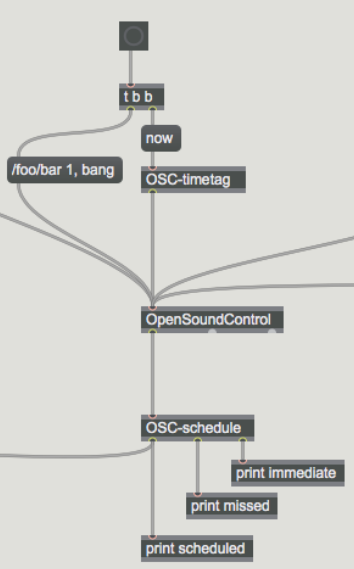
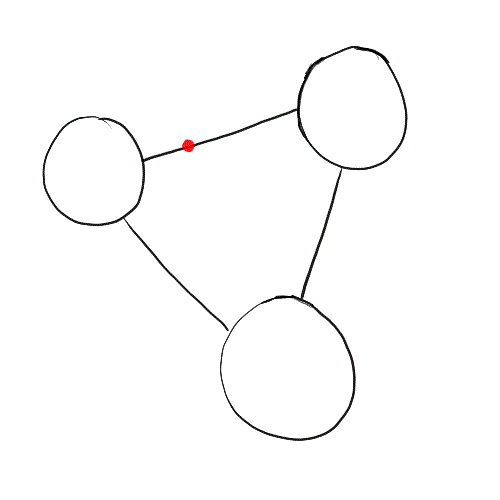
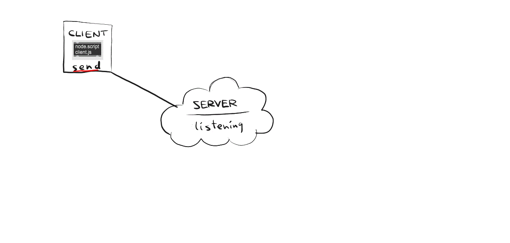
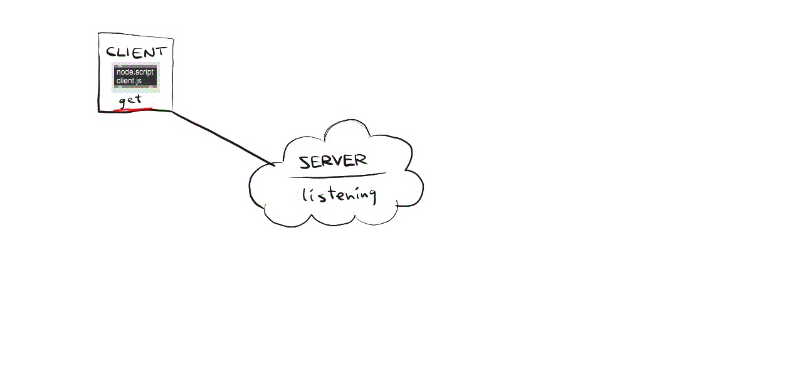

class: center, middle
.title[Creative Coding and Software Design 2]
<br/><br/>
.subtitle[Week 9: OSC and Node in Max]
<br/><br/><br/><br/><br/><br/>
.date[Apr 2021]
<br/><br/><br/>
.note[Created with [Liminal](https://github.com/jonathanlilly/liminal) using [Remark.js](http://remarkjs.com/) + [Markdown](https://github.com/adam-p/markdown-here/wiki/Markdown-Cheatsheet) +  [KaTeX](https://katex.org)]

???

Author: Grigore Burloiu, UNATC
    
---
name: toc
class: left
# ★ Table of Contents ★     <!-- omit in toc -->

1. [Review: OSC, Node.js](#review-osc-nodejs)
2. [Sensors to Max](#sensors-to-max)
3. [Node for Max](#node-for-max)
4. [Assignment](#assignment)

        
<!-- Comment out the next slide if you don't want the Table of Contents link -->         
---
layout: true  .toc[[★](#toc)]
        
---
class: center
name: review-osc-nodejs
# Review: OSC, Node.js


see [Sem 1 slides](https://docs.google.com/presentation/d/1ucgTnqj6zCoh-N_9cWOzHEqOd_foK3-EXSzQM8CN7rw/edit#slide=id.g4c218bab54_0_7)


---
name: sensors-to-max
# Sensors to Max

USB cable → [serial](https://github.com/jaimovier/SARCduino) // MIDI etc

WiFi / network → UDP // [OpenSoundControl](../resources#opensoundcontrol)

Bluetooth?

Web → server-client // Node.js (socket.io etc)

---

## OpenSoundControl in Max

.left-column[
sending
  - send OSC messages into inlet
  - bang inlet to send bundle and clear memory

receiving
  - get bundle in inlet
  - time tag: right outlet
  - messages: middle outlet
  - end of bundle: left

use [udpreceive] in “cnmat” mode to output OSC bundles

timing & scheduling: [OSC-timetag], [OSC-schedule]
]

.right-column[
    
    

- see also: [odot](https://github.com/CNMAT/CNMAT-odot)
- *...or just use [OSC-route]*]

---
name: basic-example-sonic-loop
## Basic example: sonic loop

.left-column[
https://en.wikipedia.org/wiki/Network_topology 

directed loop graph

each node triggers a sample in the next node

triggers are delayed 

]

.right-column[
    
    

- https://github.com/create-ensemble/feedback
]

--

<br/><br/><br/><br/><br/><br/><br/><br/><br/><br/><br/><br/><br/><br/>
social distancing... what now?

---
name: node-for-max
# Node for Max

[node.script]

```npm install```   ↔   "script npm install" 

- [Node for Max](https://cycling74.com/articles/node-for-max-intro-%E2%80%93-let%E2%80%99s-get-started) intro @ Cycling '74.
- https://github.com/Cycling74/n4m-examples
- https://github.com/Cycling74/n4m-community

---
class: center
## Ex 1: broadcast OSC



https://github.com/RVirmoors/osc3cho

---
class: center
## Ex 2: server-side state


node.js (server) + [socket.io](https://socket.io/docs/#Using-with-Express) (comms) + <br/>[heroku](https://devcenter.heroku.com/articles/getting-started-with-nodejs) (hosting) + Node for Max (client)

https://oscecho.herokuapp.com/

---
class: center
## Ex 3: browser-server-Max



[Google Cloud Storage free usage](https://cloud.google.com/storage/pricing#cloud-storage-always-free)

https://github.com/muaz-khan/RecordRTC

---
name: assignment       
class: left
#  Assignment

Use sensor(s) to control a Max patch.
- [jit.grab] / [adc~] / [udpreceive] (OSC) / [midiin] / [key] / [mousestate] / …

AND / OR

Start a web app project for collaborative interaction