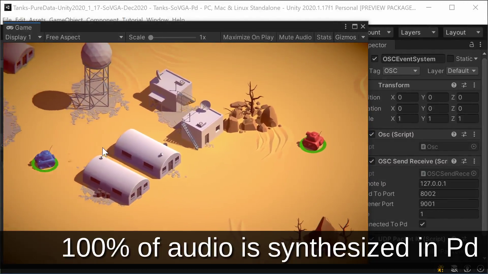
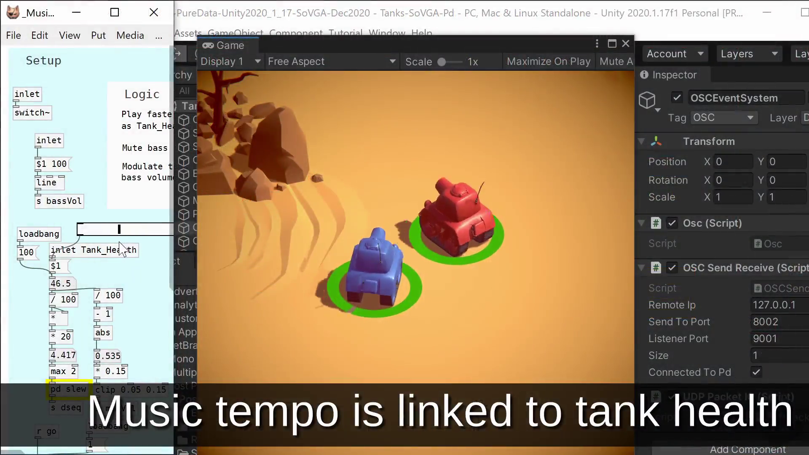
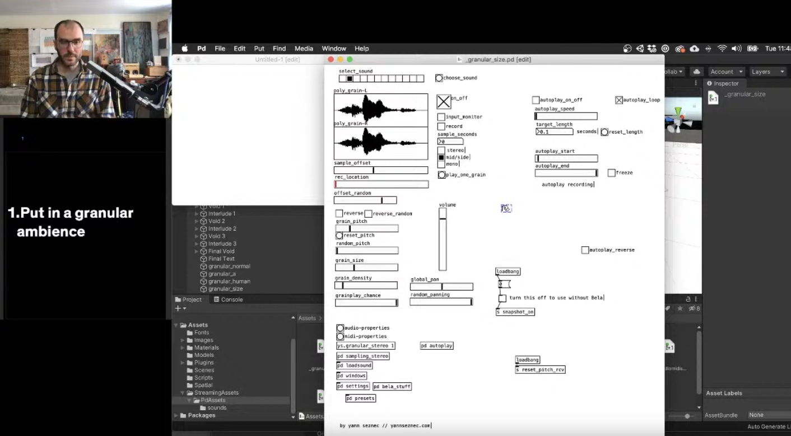

class: center, middle
.title[Creative Coding and Software Design 2]
  
.subtitle[Week 10: Procedural audio in Unity]
      
.date[Apr 2021]
   
.note[Created with [Liminal](https://github.com/jonathanlilly/liminal) using [Remark.js](http://remarkjs.com/) + [Markdown](https://github.com/adam-p/markdown-here/wiki/Markdown-Cheatsheet) +  [KaTeX](https://katex.org)]

???

Author: Grigore Burloiu, UNATC
    
---
name: toc
class: left
# ★ Table of Contents ★     <!-- omit in toc -->

1. [Procedural Audio](#procedural-audio)
2. [Options](#options)
3. [Example](#example)

        
<!-- Comment out the next slide if you don't want the Table of Contents link -->         
---
layout: true  .toc[[★](#toc)]

---
name: procedural-audio
# Procedural Audio

.right-column[
    
    
]

[what is procedural audio?](https://daracrawford.com/new-blog-3/what-is-procedural-audio) | Dara Crawford

[are we there yet?](https://www.gdcvault.com/play/1012645/Procedural-Audio-for-Video-Games) | Nicolas Fournel @ GDC

--

how?
- generative
- interactive

--
  - game event/data → audio
  
--
  - audio trigger/data → game action

--

what?
- sound fx
  - ambience
- music

---
## iMUSE

<iframe width="33%" height="33%" src="https://www.youtube.com/embed/AjtxK_WT784" title="YouTube video player" frameborder="0" allow="accelerometer; autoplay; clipboard-write; encrypted-media; gyroscope; picture-in-picture" allowfullscreen></iframe>
<iframe width="32%" height="33%" src="https://www.youtube.com/embed/7N41TEcjcvM" title="YouTube video player" frameborder="0" allow="accelerometer; autoplay; clipboard-write; encrypted-media; gyroscope; picture-in-picture" allowfullscreen></iframe>
<iframe width="33%" height="33%" src="https://www.youtube.com/embed/-XuClagw6IQ" title="YouTube video player" frameborder="0" allow="accelerometer; autoplay; clipboard-write; encrypted-media; gyroscope; picture-in-picture" allowfullscreen></iframe>

[iMUSE and interactive game soundtracks](http://www.kestrelpi.co.uk/blog/2014/6/27/imuse-and-interactive-game-soundtracks) / Peter Silk

---
name: options
# Options

in-game [audio](https://docs.unity3d.com/Manual/AudioOverview.html) [engine](https://learn.unity.com/search?k=%5B%22q%3AAudio%22%5D)

--

external software (comms via OSC)

---
# Options<!-- omit in toc -->

in-game [audio](https://docs.unity3d.com/Manual/AudioOverview.html) [engine](https://learn.unity.com/search?k=%5B%22q%3AAudio%22%5D)

external software (comms via OSC)

integrated / [middleware](https://videogameaudio.com/FullIndie-Apr2015/GameAudioMiddleware-FullIndie-SchoolOfVideoGameAudio-LPaul-Apr2015.pdf)

- [FMOD](https://www.fmod.com/) 
  
- [WWise](https://www.audiokinetic.com/products/wwise/)

--

- [Pd](https://puredata.info/) / [libpd](https://github.com/libpd/libpd)

   
https://school.videogameaudio.com

---
class: center
name: libpd-integration
## libpd integration

https://github.com/LibPdIntegration/

---
class: center
name: example
# Example

https://github.com/NiallMoody/black-and-secret-places