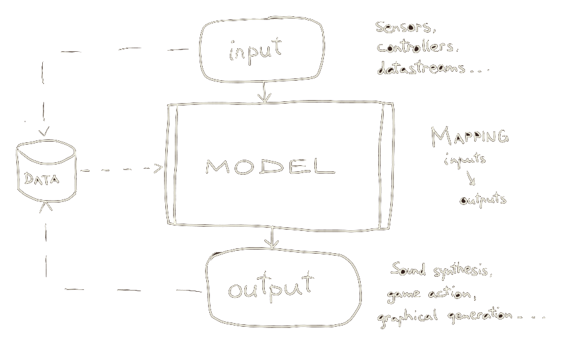

class: center, middle
.title[Creative Coding and Software Design 3]
  
.subtitle[Intro to Machine Learning for Interactive Arts]
      
.date[Oct 2025] 
   
.note[Created with [Liminal](https://github.com/jonathanlilly/liminal) using [Remark.js](http://remarkjs.com/) + [Markdown](https://github.com/adam-p/markdown-here/wiki/Markdown-Cheatsheet) +  [KaTeX](https://katex.org)]

???

Author: Grigore Burloiu, UNATC
    
---
name: toc
class: left
# ★ Table of Contents ★      <!-- omit in toc -->
      
1. [Semester overview](#semester-overview)
2. [AI ethics](#ai-ethics)
3. [Machine Learning](#machine-learning)
4. [What we cover](#what-we-cover)
5. [Interactive Machine Learning](#interactive-machine-learning)
6. [Links](#links)

        
<!-- Comment out the next slide if you don't want the Table of Contents link -->         
---
layout: true  .toc[[★](#toc)]
        
---
name: semester-overview  
class: left
# Semester overview

- 2h lab: new concepts in practice
- 1h lecture: theory, discussion

[Syllabus](https://itpma.notion.site/itpma/Creative-Coding-and-Software-Design-3-c18bb7e2da834cabb027a681abefec2c)

[Classroom](https://classroom.google.com/)

---
name: ai-ethics
# AI ethics

.left-column[
<iframe width="100%" height="300" src="https://www.youtube.com/embed/OhCzX0iLnOc" title="The danger of AI is weirder than you think | Janelle Shane" frameborder="0" allow="accelerometer; autoplay; clipboard-write; encrypted-media; gyroscope; picture-in-picture" allowfullscreen></iframe>
]

.right-column[

]

<iframe width="100%" height="200" src="https://www.youtube.com/embed/videoseries?list=PLnV8Pp3XepxXh1zs2j6MOBRBiMBkvt2X0" title="YouTube video player" frameborder="0" allow="accelerometer; autoplay; clipboard-write; encrypted-media; gyroscope; picture-in-picture" allowfullscreen></iframe>

---
## Building ML models

data |    ~  |   *measurements*
-|-|-
information  |  ~ |  data *interpreted* 
model |  ~  | information *mapped*

--

all the above are **fallible**: subject to *choices* and *noise*

       
- [Critical Perspectives on Computer Vision](https://slideslive.com/38923500/critical-perspectives-on-computer-vision) / Emily Denton
- [Whose ground truth? accounting for individual and collective identities underlying dataset annotation](https://arxiv.org/pdf/2112.04554.pdf)
- [Microsoft lays off AI ethics and society team](https://www.theverge.com/2023/3/13/23638823/microsoft-ethics-society-team-responsible-ai-layoffs)
- [Reddit strikes $60M deal allowing Google to train AI on user posts](https://www.baltimoresun.com/2024/02/22/reddit-strikes-60m-deal-allowing-google-to-train-ai-models-on-its-posts-unveils-ipo-plans/)
- [ChatGPT is bullshit](https://link.springer.com/article/10.1007/s10676-024-09775-5)
- [How much research is being written by LLMs?](https://hai.stanford.edu/news/how-much-research-being-written-large-language-models)

---
## Social cost

training large models
- crowdsourcing data
  - privacy
  - opt-in
- addressing bias
  - ChatGPT used [Kenyan workers](https://time.com/6247678/openai-chatgpt-kenya-workers/) for ["traumatizing" work](https://www.theguardian.com/technology/2023/aug/02/ai-chatbot-training-human-toll-content-moderator-meta-openai)

---
## Social cost

[replacing jobs](https://en.wikipedia.org/wiki/Technological_unemployment) 

--

---
## Social cost

“AI is under control of the writers, not under control of the studios. It’s not to be used as an automation technology. It’s complementary to humans.”
- Simon Johnson, MIT
---
## Social cost

feeding the achievement/burnout society

"The loss of the faculty of contemplation affects our relation to language. Dazed by the rush of information and communication we move away from **poetry** as the contemplation of language, and begin even to hate it. When language is nothing but work and the production of information, it loses its radiance. It becomes worn out and **keeps producing the same**."
- Byung-Chul Han, Vita Contemplativa

---
## Material footprint

Raspberry Pi 5 single-board computer: 6W

google search query = 5W for 3min = 0.25Wh

---
## Material footprint

gaming PC: 300W

---
## Material footprint

gaming PC: 300W

---
## Material footprint

deep learning rig: 2000W

---
## Material footprint

deep learning rig: 2000W

https://github.com/TimDettmers/carbonneutral

---
## Material footprint

training ChatGPT: 1064MWh

chatgpt inference: 260MWh / day or 9Wh / query 
- (vs 0.25Wh / google search)

.left-column[
[AI and its carbon footprint: How much water does ChatGPT consume?](https://lifestyle.livemint.com/news/big-story/ai-carbon-footprint-openai-chatgpt-water-google-microsoft-111697802189371.html)
]

.right-column[
[Power Hungry Processing: Watts Driving the Cost of AI Deployment?](https://arxiv.org/pdf/2311.16863.pdf)
]

- "between 2010 and 2018, data center energy usage has been fairly stable, accounting for around 1 to 2 percent of global consumption. ... things might be different for AI precisely because of the trend for companies to simply throw bigger models and more data at any task." [source](https://www.theverge.com/24066646/ai-electricity-energy-watts-generative-consumption)

---
## What does ethical AI look like?

is it even possible?

--

- low energy usage

--

- avoid bias

--

- respect data rights

--

- *don't replace [non-BS] human work*

--

examples?

--

- automatic tasks - stem separation (music), photogrammetry

--

- real-time / interactive inference (e.g. pose detection)

--

- [active divergence](https://arxiv.org/abs/2107.05599)

--

- interactive (machine) learning?

---
name: machine-learning
class: left
# Machine Learning

*learn* structure / functionality **from data**

--

AI?

--

terminology :(

---
class: center

---
## ML modern history

since the 2010s: AI ~ ML ~ (deep) artificial neural networks

- historically not the case!
- 2012: [deep NNs win ImageNet competition](https://en.wikipedia.org/wiki/AlexNet)
- 2013: [word2vec maps word associations](https://en.wikipedia.org/wiki/Word2vec)
- 2015-17: [superhuman performance in the game of Go](https://en.wikipedia.org/wiki/AlphaGo)

--

"we should have been using neural networks all along!"

--

WRONG! -[Tomas Mikolov](https://cs.nyu.edu/~welleck/episode25.html)

<iframe width="190" height="80" src="https://www.youtube.com/embed/Rc9e1WWWo5M" frameborder="0" allow="accelerometer; autoplay; clipboard-write; encrypted-media; gyroscope; picture-in-picture" allowfullscreen></iframe>

---

## ML for art

2009: [Wekinator](http://www.wekinator.org/)

- (from [fablab](https://fablab.ruc.dk/hand-gesture-recognition-using-handpose-osc-and-wekinator/))

---

## DL for art

2015: [DeepDream](https://www.tensorflow.org/tutorials/generative/deepdream)

[ML art](https://www.libreai.com/a-short-overview-on-ai-art/) is:
- a subset of *generative* art
- sometimes *interactive* (in training and/or execution)

---

## ML / DL myths

circa 2018

--

| **myth** (*you don't need*) |&nbsp;&nbsp; | **truth** (*you can*) |
|-------------------|-|-------|
| expensive computers |&nbsp;&nbsp; | use machines in the cloud for free |
| math and coding |&nbsp;&nbsp; | do a lot with user-friendly tools |
| lots of data |&nbsp;&nbsp; | start from pre-trained models |
| lots of time |&nbsp;&nbsp; | do inference in (almost) real time |

- (adapted from [course.fast.ai](https://course.fast.ai/#Is-this-course-for-me?))

---

## Getting into ML: two approaches

classic: bottom-up
- [A. Ng's MOOC](https://www.coursera.org/learn/machine-learning), classic textbooks
- (can lead to [burnout](https://www.reddit.com/r/MachineLearning/comments/73n9pm/d_confession_as_an_ai_researcher_seeking_advice/))

maker: top-down
- [R. Fiebrink’s MOOC](https://www.kadenze.com/courses/machine-learning-for-musicians-and-artists-v/) / [mimic](https://mimicproject.com/guides/kadenze)
- [fast.ai](https://course.fast.ai/) / [fastbook](https://github.com/fastai/fastbook)
- [ml4a](https://ml4a.github.io/classes/itp-F18/), [ml4web](https://github.com/yining1023/machine-learning-for-the-web), [dl4music](http://www.jordipons.me/apps/teaching-materials/) …

<iframe width="350" height="200" src="https://www.youtube.com/embed/qMIdUYL7YLQ?start=480" frameborder="0" allow="accelerometer; autoplay; clipboard-write; encrypted-media; gyroscope; picture-in-picture" allowfullscreen></iframe>

---
name: what-we-cover
# What we cover

| **interactive ML** |&nbsp;&nbsp; | **Deep Learning** |
|-------------------|-|-------|
| small models (few layers) |&nbsp;&nbsp; | big models (many layers) |
| fast training (local CPU) |&nbsp;&nbsp; | slow training (GPU / cloud) |
| analysis, action |&nbsp;&nbsp; | analysis, generation**  |

DL can also be part of an interactive system:
- almost* real-time inference 
- *transfer learning*

--

- *2022 update: faster-than-realtime inference [is](https://github.com/acids-ircam/nn_tilde) [common](https://github.com/ggerganov/whisper.cpp)

--

**GenAI, potential vs dangers - [Paul Trillo at ArsE'24](https://youtu.be/kKM0F33CCkc?t=4853)

---
name: interactive-machine-learning
# Interactive Machine Learning

human-in-the-loop (training and inference)

[Wekinator](https://twitter.com/search?q=wekinator), [InteractML](https://interactml.com/) (Rebecca Fiebrink, since 2008!)

[Wolf3D](https://twitter.com/stoj_io/status/840222647489318914) sound to action

[Poetry in Motion](https://rednoise.org/rita/gallery/PoetryInMotion/): movement to text generation

---

## Why use iML?

--

mapping / control design
- by example / modelling     (vs fixed rules)

--

dimensions
- 1 : 1   &nbsp;&nbsp;&nbsp;&nbsp;&nbsp;&nbsp;        1 : many   &nbsp;&nbsp;&nbsp;&nbsp;&nbsp;&nbsp;        many : 1   &nbsp;&nbsp;&nbsp;&nbsp;&nbsp;&nbsp;       many : many

--

workflow
- experimental, iterative

--

creating something truly *new*?
- [active divergence](https://arxiv.org/abs/2107.05599)

--

iML + GenAI: learning interaction
- [DeepMind Genie](https://sites.google.com/view/genie-2024/): Generative Interactive Environments

- <iframe width="190" height="80" src="https://www.youtube.com/embed/b3REaKYEW3k" frameborder="0" allow="accelerometer; autoplay; clipboard-write; encrypted-media; gyroscope; picture-in-picture" allowfullscreen></iframe>

- [MLST interview](https://www.youtube.com/watch?v=kbt0ZFoI2Hc)

---
name: links       
class: left
# Links

[Wekinator](http://www.wekinator.org/) 
- [FluCoMa](https://flucoma.org/)
- [ml.star](https://www.benjamindaysmith.com/#/ml-machine-learning-toolkit-in-max/)
- [MuBu for Max](https://forum.ircam.fr/projects/detail/mubu/)
- [IIL tools](https://iil.is/outputs#open-source)
- [scikit-learn](https://scikit-learn.org/stable/)

- [Groq](https://groq.com/)
- [fastai](https://docs.fast.ai/) / [PyTorch](https://pytorch.org/)
- [ml5](https://ml5js.org/) / [Tensorflow.js](https://teachablemachine.withgoogle.com/)
- [Runway](https://runwayml.com/)

[Google](https://github.com/dvschultz/ml-art-colabs) [Colab](https://ljvmiranda921.github.io/notebook/2021/08/11/vqgan-list/)

See more [resources](../resources#machine-learning).

---
## Follow

Twitter: [Andreas Refsgaard](https://twitter.com/AndreasRef), [Max Woolf](https://twitter.com/minimaxir), [vadim epstein](https://twitter.com/eps696), [Adverb](https://twitter.com/advadnoun), [Emily Short](https://twitter.com/emshort), [Chris Donahue](https://twitter.com/chrisdonahuey), [AK](https://twitter.com/ak92501), [Janelle Shane](https://twitter.com/JanelleCShane), [Rebecca Fiebrink](https://twitter.com/RebeccaFiebrink), [Parag K. Mital](https://twitter.com/pkmital), [Jesse Engel](https://twitter.com/jesseengel), [dadabots](https://twitter.com/dadabots), [Kyle McDonald](https://twitter.com/kcimc), [Memo Akten](https://twitter.com/memotv)...

Lectures/MOOCs: [Rebecca Fiebrink](https://www.kadenze.com/courses/machine-learning-for-musicians-and-artists/info), [Gene Kogan](https://ml4a.net/) [+](https://www.youtube.com/playlist?list=PLaN6Cxwpu9UKR2mPc39bZEJoyAoCwRw_q), [Yining Shi](https://github.com/yining1023/machine-learning-for-the-web), [Artificial Images](https://www.youtube.com/channel/UCaZuPdmZ380SFUMKHVsv_AA), [Daniel Shiffman](https://www.youtube.com/c/TheCodingTrain)