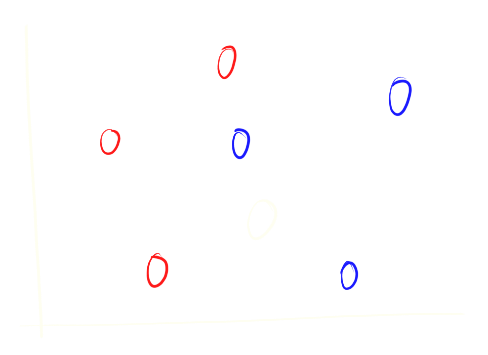

class: center, middle
.title[Creative Coding and Software Design 3]
  
.subtitle[Week 2: Classification]
      
.date[Oct 2021] 
   
.note[Created with [Liminal](https://github.com/jonathanlilly/liminal) using [Remark.js](http://remarkjs.com/) + [Markdown](https://github.com/adam-p/markdown-here/wiki/Markdown-Cheatsheet) +  [KaTeX](https://katex.org)]

???

Author: Grigore Burloiu, UNATC
    
---
name: toc
class: left
# ★ Table of Contents ★      <!-- omit in toc -->
      
1. [Types of ML](#types-of-ml)
2. [Supervised learning](#supervised-learning)
3. [Classification](#classification)
4. [kNN in python & sklearn](#knn-in-python--sklearn)
5. [Input data](#input-data)
6. [Wekinator example](#wekinator-example)

        
<!-- Comment out the next slide if you don't want the Table of Contents link -->         
---
layout: true  .toc[[★](#toc)]
        
---
name: types-of-ml  
class: left
# Types of ML

supervised (90% of this semester)
- based on user-labelled data

--

unsupervised (9%)
- finding underlying structure in data

--

reinforcement (?)
- desired actions based on feedback from the environment

---
name: supervised-learning
class: left
# Supervised learning

input-output pairs are learned together

input ~ *data*, output ~ *label* 

--

→ input+output ~ *labelled data*

---
## sup.ML tasks

.left-column[
    classification

]

--

.right-column[
    regression

]

--

          
temporal modelling
- classification/regression *over time*

---
name: classification
# Classification

assign a *label* to an input

- in: raw data and/or *features*
- out: label_1 OR label_2 OR ... label_n

---
## Decision stump

.right-column[

]

feature space

orthogonal split

human-readable

--

- where is the split?

--

- *train* the model and find out!

---

## Training error

loss ~ distance

has to be minimised

---

## Decision tree

orthogonal splits

human-readable

--

- how to train?

---

## Nearest neighbour

smallest distance

---
## k-nearest neighbour

k = parameter

k↗ ~ less *overfitting*

---
## k-nearest neighbour

k = parameter

k↗ ~ less *overfitting*

---
## k-nearest neighbour

k = parameter

k↗ ~ less *overfitting*

---
name: knn-in-python--sklearn
# kNN in python & sklearn

https://colab.research.google.com/ 

https://scikit-learn.org/stable/modules/neighbors.html

https://scikit-learn.org/stable/modules/generated/sklearn.neighbors.KNeighborsClassifier.html

https://scikit-learn.org/stable/auto_examples/neighbors/plot_classification.html

https://scikit-learn.org/stable/auto_examples/datasets/plot_iris_dataset.html 

---
name: input-data
# Input data

features ~ representations ~ dimensions

--

feature extraction → feature *vectors*

embedding features in a *feature space*

--

preprocessing (for kNN)

- normalization
- eliminate irrelevant input data
- eliminate / reduce redundant features: 
    - *feature selection*
    - *latent space / dimensionality* reduction

---
## Interactive / real-time input

time series data

[examples @ Wekinator](http://www.wekinator.org/examples/#Pick_Choose_Inputs)

--

processing

- preprocessing: smooth/filter, rectify, window, env fol, min/max ...
- spectral: FFT, MFCC ...
- statistical features: mean, stddev, higher moments (skew, kurtosis) ...
- Max
    - objects: [peakamp~], [zerox~], [slide], [onebang]
    - packages: zsa, mubu, flucoma
- [weki Input Helper](http://www.wekinator.org/input-helper/)
- see also [R Fiebrink's MOOC](https://www.kadenze.com/courses/machine-learning-for-musicians-and-artists-v/sessions/sensors-and-features-generating-useful-inputs-for-machine-learning)

---
## Video data

multi-plane time series data

[examples @ Wekinator](http://www.wekinator.org/examples/#VideoWebcam)

OpenCV / [oF](https://openframeworks.cc/documentation/ofxOpenCv/), [p5](https://github.com/atduskgreg/opencv-processing)
- [optical flow](https://docs.opencv.org/3.4/d4/dee/tutorial_optical_flow.html) etc

pixel value change / difference

regions

---
name: wekinator-example
# Wekinator example

[image classification : sound](https://github.com/RVirmoors/cc1/blob/master/ml/classification.maxpat)

---
## Wekinator: new project

1. listening port
   
2. number of inputs 
   - (features: MFCCs, pixel brightness, x,y,z coords etc.)
   
3. number of outputs 
   - (how many things are we controlling?)
   
4. outputs type
   - classifier, continuous (regression), DTW (temporal)
   
5. target IP:port

---
## Wekinator: usage

1. set desired output value(s)
   
2. Start recording inputs ... stop
   
3. again 1.-2. for all desired in-out combinations
   
4. Train: the ML model
   
5. Run: now inputs directly control the outputs
