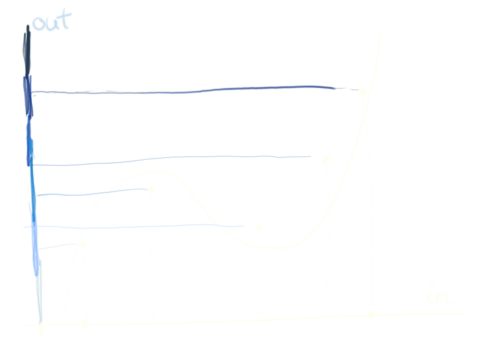
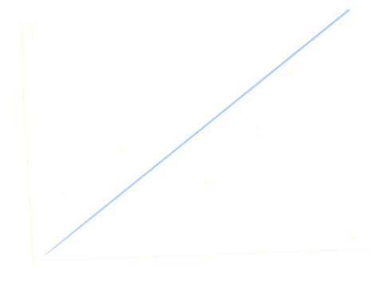

class: center, middle
.title[Creative Coding and Software Design 3]
  
.subtitle[Week 3: Regression. Neural networks]
      
.date[Oct 2024] 
   
.note[Created with [Liminal](https://github.com/jonathanlilly/liminal) using [Remark.js](http://remarkjs.com/) + [Markdown](https://github.com/adam-p/markdown-here/wiki/Markdown-Cheatsheet) + [KaTeX](https://katex.org)]

???

Author: Grigore Burloiu, UNATC
    
---
name: toc
class: left
# ★ Table of Contents ★      <!-- omit in toc -->
      
1. [Supervised learning](#supervised-learning)
2. [Regression](#regression)
3. [Linear regression](#linear-regression)
4. [Polynomial regression](#polynomial-regression)
5. [Neurons](#neurons)
6. [Artificial neural networks](#artificial-neural-networks)
7. [Example: synthesis params](#example-synthesis-params)

        
<!-- Comment out the next slide if you don't want the Table of Contents link -->         
---
layout: true  .toc[[★](#toc)]

---
name: supervised-learning
class: left
# Supervised learning

input-output pairs are learned together

input ~ *data*, output ~ *label* 

--

→ input+output ~ *labelled data*

---
## sup.ML tasks

.left-column[
    classification

]

--

.right-column[
    regression

]

--

          
temporal modelling
- classification/regression *over time*

---
name: classification
## Classification

assign a *label* to an input

- in: raw data and/or *features*
- out: label_1 OR label_2 OR ... label_n
  

---
name: regression
# Regression

assign a *value* to an input

- in: raw data and/or *features*
- out: continuous $f(input)$

.left-column[

]

--

.right-column[

]

---
## Example
.right-column[

]

subject 1 
  - eats **2 apples / day**, 
  - → has 1 child

subject 2 
  - eats **6 apples / day**, 
  - → has 2 children

--

subject X
  - eats **4 apples / day**,
  - → how many kids? Why?

---
name: linear-regression
# Linear regression

- input: $x$
- output: $y$

--
.right-column[

]

$f(x) = y = a x + b$

--

     
more general: 

$f(x) = y = a_1 x_1 + a_2 x_2 + ... + a_n x_n + b$, 
- where inputs: $\\\{ x_1, x_2, ..., x_n \\\}$

--

how good is this fit?

---
## Error

quadratic sum of *error bars* (distances to line)
.right-column[

]
--

           

what else can a line* do?

--

- * *(or n-dimensional hyperplane)*

---
name: polynomial-regression
# Polynomial regression

$f(x) = y = a_0 + a_1 x + a_2 x^2 + a_3 x^3 + ...$

---
name: neurons
# Neurons

.left-column[
inputs: $x_n$

weights: $w_{n,j}$
]

.right-column[
transfer function: $\Sigma$

activation function: $\geq T$

output ~ activation: $y$
]

---
## The perceptron

.left-column[
$w_1 x_1 + ... + w_n x_n \geq T$
]

--

.right-column[

$T$ ~ $w_0$

$w_0 + w_1 x_1 + ... + w_n x_n \geq 0$
]

--

    

training = find out weights $\\\{ w_0, w_1, ..., w_n \\\}$

---
## Training a neural net

minimise loss!

loss ~ error

--

sum of errors over the observed dataset

$\epsilon = \sum\limits\_i (y\_{desired,i} - y\_{result,i} )^2  $

--

$\epsilon = \sum\limits_i (y_i - \hat{y}_i )^2$ , for every datapoint $i$

--

minimise $\epsilon$ through *gradient descent*
- step size
- no. of epochs

--

use **random subset of datapoints** = *stochastic* gradient descent (SGD)
- instead of entire dataset at each step

---
## Still linear regression :(

$a_1 x_1 + a_2 x_2 + ... + a_n x_n + b = y$

$w_0 + w_1 x_1 + ... + w_n x_n \geq 0$

--

the answer is to use *nonlinear activation functions*

the modern artificial neuron: ReLU (Hahnloser et al, 2000)

.left-column[

]

--

.right-column[

]

---
class: center
## :)

---
name: artificial-neural-networks
# Artificial neural networks

composite nonlinear functions

---
class: center
## Layers

more layers capture more complexity

--

- but [how much nonlinearity do you really need?](https://discourse.flucoma.org/t/video-for-my-students-about-mlp-and-autoencoder/888/5)

---
class: center
## Weights

adjusted during *training*

---
class: center
## Activations

[demo: forward pass](https://ml4a.github.io/demos/simple_forward_pass/)

--

what defines a latent space in this neural net?

---
## Basic ANN architecture design

.left-column[
input layer size,

output layer size,

number of hidden layers,

hidden layer size(s)
]
.right-column[

]

--

            

use cases:
- binary classification
- multiple classes
- regression

---
class: center
## Choosing no. of layers

---
class: center
## Choosing an architecture

---
name: example-synthesis-params
class: center
# Example: synthesis params

ml.star Max package

[similar example](https://f003.backblazeb2.com/file/learnassets/examples/teaching-material/regressor-process.pdf) [using](https://learn.flucoma.org/examples/regressor-video-demo.maxpat) FluCoMa