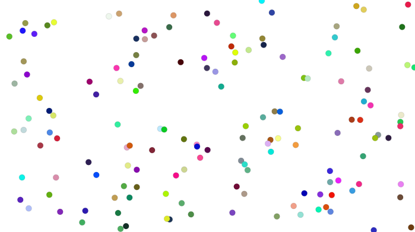
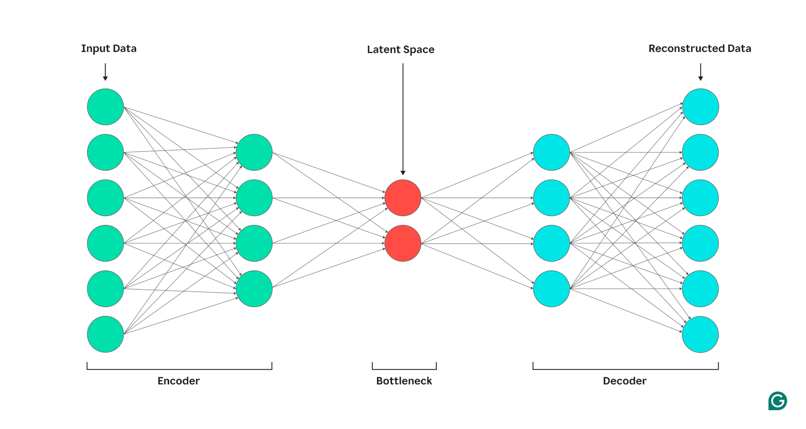
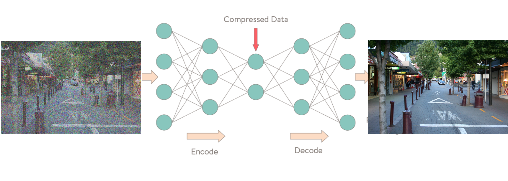

class: center, middle
.title[Creative Coding and Software Design 3]
  
.subtitle[Unsupervised learning]
      
.date[Oct 2025] 
   
.note[Created with [Liminal](https://github.com/jonathanlilly/liminal) using [Remark.js](http://remarkjs.com/) + [Markdown](https://github.com/adam-p/markdown-here/wiki/Markdown-Cheatsheet) + [KaTeX](https://katex.org)]

???

Author: Grigore Burloiu, UNATC
    
---
name: toc
class: left
# ★ Table of Contents ★      <!-- omit in toc -->
      
1. [Unsupervised learning](#unsupervised-learning)
2. [Practical example](#practical-example)
3. [Autoencoders](#autoencoders)
4. [Links - FluCoMa](#links---flucoma)
5. [Assignment](#assignment)

        
<!-- Comment out the next slide if you don't want the Table of Contents link -->         
---
layout: true  .toc[[★](#toc)]

---
name: unsupervised-learning
# Unsupervised learning

.right-column[

- input: R G B colour
- output: X/Y position
]

.left-column[
group unstructured data
- or arrange along e.g. [a grid](https://learn.flucoma.org/reference/grid/)

find patterns in a dataset

**no** labels 
- (to use as a guide)
]

--

Two main operations:

- [clustering](https://learn.flucoma.org/reference/kmeans/)
- [dimensionality reduction](https://learn.flucoma.org/reference/umap/)

---
name: practical-example
# Practical example

<iframe width="100%" height="400px" src="https://www.youtube.com/embed/-VVdF1s7AZ4" title="YouTube video player" frameborder="0" allow="accelerometer; autoplay; clipboard-write; encrypted-media; gyroscope; picture-in-picture" allowfullscreen></iframe>

exercise: write down the processes being depicted

---
## UMAP in action

<iframe width="100%" height="500px" src="https://www.youtube.com/embed/jdF4sW1aVDE" title="YouTube video player" frameborder="0" allow="accelerometer; autoplay; clipboard-write; encrypted-media; gyroscope; picture-in-picture" allowfullscreen></iframe>

---

## Video tutorials

<iframe width="100%" height="500px" src="https://www.youtube.com/embed/4dsX5uRips8?list=PLLzzOXU4pTgJNv3XL_DRQO4N9xXc0pJEu" title="Building a 2D Corpus Explorer (Part 1)" frameborder="0" allow="accelerometer; autoplay; clipboard-write; encrypted-media; gyroscope; picture-in-picture" allowfullscreen></iframe>

- see also: [self-organising maps](https://medium.com/@abhinavr8/self-organizing-maps-ff5853a118d4) ([ml.star](https://cycling74.com/articles/content-you-need-ml%C2%B7star), [MASOM](https://github.com/ktatar/MASOM))
  
---

# Autoencoders

- [Autoencoders chapter](https://www.deeplearningbook.org/contents/autoencoders.html) in the Deep Learning book

---

## Why AE?

--

1. train network end-to-end with `inputs=labels`
2. "cut off" network in the middle, at the bottleneck
3. sample from the latent space
   - (like you would from a MLP Regressor)

--

What are the use cases for this?

What pros/cons versus the standard MLP Regression technique?

--

- soon: [VAEs, GANs, et al](https://arxiv.org/pdf/2103.04922.pdf)!

---

name: links---flucoma
# Links - FluCoMa

[FluCoMa Learn](https://learn.flucoma.org/) platform

[teaching / learning guide](https://github.com/flucoma/flucoma-for-pedagogues/blob/main/flucoma-for-pedagogues.pdf) 

[Data Knot](https://rodrigoconstanzo.com/2025/10/data-knot-machine-learning-tools-for-low-latency-real-time-performance/) performance system by R Constanzo (previously SP-tools)
- [GitHub repo](https://github.com/rconstanzo/data-knot)

---
name: assignment
# Assignment

take your regression pipeline and adapt it into an autoencoder

which mapping works better? why?

  

- further reading: [Latent Mappings: Generating Open-Ended Expressive Mappings Using Variational Autoencoders](https://nime.org/proc/nime21_66/) (Murray-Browne & Tigas, 2021)