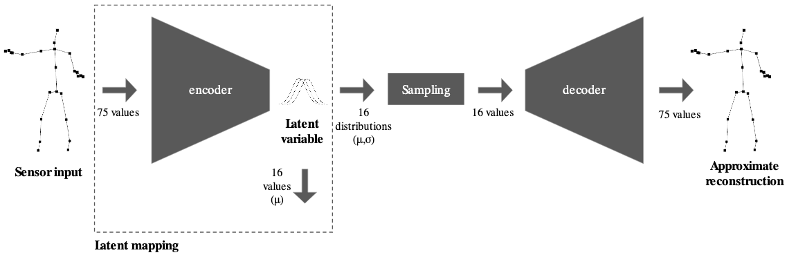

class: center, middle
.title[Creative Coding and Software Design 3]
  
.subtitle[PyTorch and VAEs]
      
.date[Nov 2025] 
   
.note[Created with [Liminal](https://github.com/jonathanlilly/liminal) using [Remark.js](http://remarkjs.com/) + [Markdown](https://github.com/adam-p/markdown-here/wiki/Markdown-Cheatsheet) +  [KaTeX](https://katex.org)]

???

Author: Grigore Burloiu, UNATC
    
---
name: toc
class: left
# ★ Table of Contents ★      <!-- omit in toc -->
      
1. [Variational Autoencoders](#variational-autoencoders)
2. [Training](#training)
3. [PyTorch implementation](#pytorch-implementation)
4. [RAVE](#rave)

        
<!-- Comment out the next slide if you don't want the Table of Contents link -->         
---
layout: true  .toc[[★](#toc)]

---
name: variational-autoencoders
# Variational Autoencoders

recap [autoencoders](03-06-unsupervised#autoencoders)

--

--

- "variational" due to the **sampling layer**
- `z` latent variable
- Normal distribution ↔ `(mean, average)`

---
name: training
# Training

gradient descent

--

*stochastic* g. d. = not over the whole batch/dataset, but random *minibatches*
- https://github.com/fastai/course-v3/blob/master/nbs/dl1/lesson2-sgd.ipynb

if training fails:
- check your data: redundant, noisy?
- check params: learning rate & no. of epochs
- check your data!!! do you have enough? is it representative?
- get more data, just in case :)

  
- classic karpathy torch [training tips](https://twitter.com/karpathy/status/1299921324333170689)

---
name: pytorch-implementation
# PyTorch implementation

[official tutorials](https://docs.pytorch.org/tutorials/)

see my VAE torch vids on classroom
1. get data
2. define model
3. train model
4. run inference
- code [on github](https://github.com/RVirmoors/latent-mappings-vae/tree/main)

--

training fails to optimise loss. why?

---
name: rave
# RAVE

.left-column[
train a model on your own sounds

transform (style transfer) / generate material in real time

manipulate latent dimensions during performance
- mapped to other inputs (multimodal)
- coming from other performers?

 
- [vst plugin](https://forum.ircam.fr/projects/detail/rave-vst/)
]

.right-column[
<iframe width="100%" height="250" src="https://www.youtube.com/embed/dMZs04TzxUI" title="YouTube video player" frameborder="0" allow="accelerometer; autoplay; clipboard-write; encrypted-media; gyroscope; picture-in-picture" allowfullscreen></iframe>
<iframe width="100%" height="250" src="https://www.youtube.com/embed/HC0L5ZH21kw?start=370" title="YouTube video player" frameborder="0" allow="accelerometer; autoplay; clipboard-write; encrypted-media; gyroscope; picture-in-picture" allowfullscreen></iframe>
]

---
## Training a RAVE model

get models: [IRCAM](https://acids-ircam.github.io/rave_models_download), [IIL](https://iil.is/news/ravemodels)

--

[official training tutorial](https://forum.ircam.fr/article/detail/training-rave-models-on-custom-data/) @ IRCAM

<iframe width="100%" height="350" src="https://www.youtube.com/embed/MlbkSMLoWBk" title="YouTube video player" frameborder="0" allow="accelerometer; autoplay; clipboard-write; encrypted-media; gyroscope; picture-in-picture" allowfullscreen></iframe>

- [Neural Synthesis with RAVE](https://www.theseus.fi/handle/10024/868480): A Practical Guide on how to Integrate Neural Synthesis inside your Music Production
- [hands-on guide](https://github.com/acids-ircam/RAVE/discussions/300) @github. Training a model takes *days*.