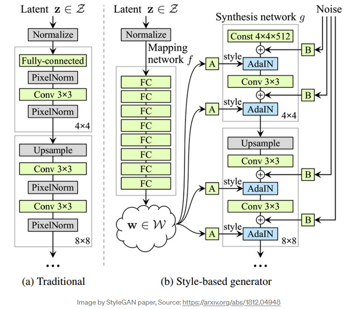

class: center, middle
.title[Creative Coding and Software Design 3]
  
.subtitle[GANs - inference]
      
.date[Dec 2022] 
   
.note[Created with [Liminal](https://github.com/jonathanlilly/liminal) using [Remark.js](http://remarkjs.com/) + [Markdown](https://github.com/adam-p/markdown-here/wiki/Markdown-Cheatsheet) +  [KaTeX](https://katex.org)]

???

Author: Grigore Burloiu, UNATC
    
---
name: toc
class: left
# ★ Table of Contents ★      <!-- omit in toc -->
      
1. [Generating images in Colab](#generating-images-in-colab)
2. [Navigating the latent space](#navigating-the-latent-space)
3. [Projection](#projection)
4. [Feature vectors](#feature-vectors)
5. [Real-time inference](#real-time-inference)

        
<!-- Comment out the next slide if you don't want the Table of Contents link -->         
---
layout: true  .toc[[★](#toc)]

---
name: generating-images-in-colab
# Generating images in Colab

.right-column[
<iframe width="100%" height="230" src="https://www.youtube.com/embed/FUwSBU5TrT4" title="YouTube video player" frameborder="0" allow="accelerometer; autoplay; clipboard-write; encrypted-media; gyroscope; picture-in-picture" allowfullscreen></iframe>
]

inference 

generation 

sampling 

test/validation

--

[gen_images.py](https://github.com/PDillis/stylegan3-fun)

- other options: [ml-art-colabs](https://github.com/dvschultz/ml-art-colabs), [big list of generative tools](https://docs.google.com/document/d/1N57oAF7j9SuHcy5zg2VZWhttLwR_uEldeMr-VKzlVIQ/edit)
- make [your own](https://colab.research.google.com/drive/13kcjg_qgrXA9e5OPRw2-o3_m40sxz9Ol?usp=sharing) [colab](https://colab.research.google.com/github/dvschultz/stylegan2-training/blob/main/StyleGAN2_ADA_AudioReactive_Pitch.ipynb)!

---

name: navigating-the-latent-space
# Navigating the latent space

[gen_images.py](https://github.com/PDillis/stylegan3-fun) parameters

|trained network| *pickle* file (`.pkl`, `.pt`) |
|-|-|
|seed| number: 0, 1, 2, 3 ... |
|truncation| float: 0, 0.8, **1**, 1.5 ... |
|latent vector | vector of 512 floats |

--

an output image is determined by:
- a pickle, a seed and a truncation

&nbsp;&nbsp;&nbsp;&nbsp;&nbsp;&nbsp;OR

- a pickle and a latent vector

---

## seed

.right-column[
<iframe width="100%" height="230" src="https://www.youtube.com/embed/vEetoBuHj8g" title="YouTube video player" frameborder="0" allow="accelerometer; autoplay; clipboard-write; encrypted-media; gyroscope; picture-in-picture" allowfullscreen></iframe>
]

latent space: 512 dimensions

one seed ↔ one 512D vector

--

*z* space

--

*w* space: [less entangled](https://towardsdatascience.com/analyzing-how-stylegan-works-style-incorporation-in-high-quality-image-generation-80a29227075b)

---

## truncation

.right-column[
<iframe width="100%" height="230" src="https://www.youtube.com/embed/Yk7DCLH97z0" title="YouTube video player" frameborder="0" allow="accelerometer; autoplay; clipboard-write; encrypted-media; gyroscope; picture-in-picture" allowfullscreen></iframe>
<iframe width="50%" height="230" src="https://www.youtube.com/embed/T-ATofqmoUY" title="YouTube video player" frameborder="0" allow="accelerometer; autoplay; clipboard-write; encrypted-media; gyroscope; picture-in-picture" allowfullscreen></iframe><iframe width="50%" height="230" src="https://www.youtube.com/embed/C1RW2RbY7f0" title="YouTube video player" frameborder="0" allow="accelerometer; autoplay; clipboard-write; encrypted-media; gyroscope; picture-in-picture" allowfullscreen></iframe>
]

*ψ* (psi)

- [Sampling and Truncation](https://www.coursera.org/lecture/build-better-generative-adversarial-networks-gans/sampling-and-truncation-mWsy1) @ Coursera / deeplearning.ai

--

|0| no variation |
|-|-|
| low | hi fidelity, lo variation |
| 1 | standard / no truncation |
| more | lo fidelity, hi variation |

--

- truncation is a *trick* / shortcut

---
name: projection
# Projection
<iframe width="100%" height="250" src="https://www.youtube.com/embed/lYoIn1aL37s?start=382" title="StyleGAN2 inspiration and techniques" frameborder="0" allow="accelerometer; autoplay; clipboard-write; encrypted-media; gyroscope; picture-in-picture" allowfullscreen></iframe>

--

<iframe width="100%" height="250" src="https://www.youtube.com/embed/uUguphZs7nE" title="stylegan projection" frameborder="0" allow="accelerometer; autoplay; clipboard-write; encrypted-media; gyroscope; picture-in-picture" allowfullscreen></iframe>

---
name: feature-vectors
# Feature vectors

.right-column[
<iframe width="100%" height="230" src="https://www.youtube.com/embed/jdTICDa_eAI" title="YouTube video player" frameborder="0" allow="accelerometer; autoplay; clipboard-write; encrypted-media; gyroscope; picture-in-picture" allowfullscreen></iframe>
<iframe width="50%" height="230" src="https://www.youtube.com/embed/iWFt7bFCIiI" title="YouTube video player" frameborder="0" allow="accelerometer; autoplay; clipboard-write; encrypted-media; gyroscope; picture-in-picture" allowfullscreen></iframe><iframe width="50%" height="230" src="https://www.youtube.com/embed/5XX4uy9Mk9I" title="YouTube video player" frameborder="0" allow="accelerometer; autoplay; clipboard-write; encrypted-media; gyroscope; picture-in-picture" allowfullscreen></iframe>
]

latent vector space: *W* and *Z*

--

feature vector space: 
- dimensions = visible features

--

finding feature vectors: open research question
- [GANSpace](https://github.com/harskish/ganspace): Discovering Interpretable GAN Controls

- [SG2 vectors](https://rolux.org/media/stylegan2/vectors/) / [Robert](https://twitter.com/robertluxemburg/status/1207087801344372736) [Luxemburg](https://hostb.org/NCM)

---
name: real-time-inference
# Real-time inference

make your own script

use [Spout](https://github.com/marenz2569/Spout-for-Python)* to send textures from your Python code
- *or [Syphon](https://github.com/njazz/syphonpy) on OSX

use [OSC](https://python-osc.readthedocs.io/en/latest/server.html) or Spout to send control data to your script
- don't forget that *z* should be sampled from a **normal** (gaussian) distribution

--

[my](../gans-interactive-inference) [guides](https://rvirmoors.github.io/2021/01/04/realtime-stylegan/)

- inspired by Vasily Betin's [ML LEGO](https://derivative.ca/community-post/tutorial/ml-lego/62675)

--

further work:
- integrate your Python code [into TD](https://matthewragan.com/2019/08/14/touchdesigner-python-and-the-subprocess-module/)
- avoid passing pixel data [via CPU](https://discuss.pytorch.org/t/drawing-gpu-tensors-to-screen-with-pycuda-glumpy-updating-depracted-code/132665)