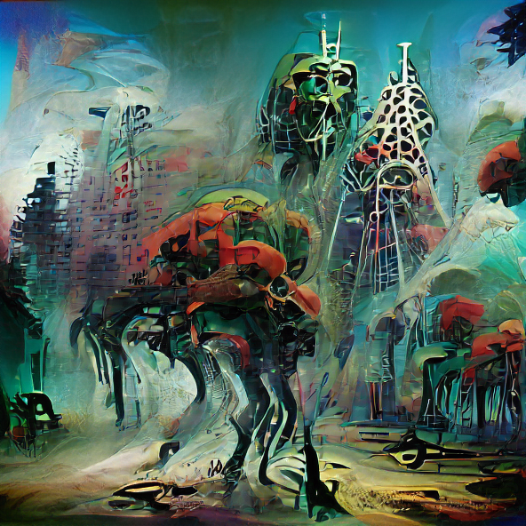

class: center, middle
.title[Creative Coding and Software Design 3]
  
.subtitle[Week 10: RNN&co - text]
      
.date[Jan 2022] 
   
.note[Created with [Liminal](https://github.com/jonathanlilly/liminal) using [Remark.js](http://remarkjs.com/) + [Markdown](https://github.com/adam-p/markdown-here/wiki/Markdown-Cheatsheet) +  [KaTeX](https://katex.org)]

???

Author: Grigore Burloiu, UNATC
    
---
name: toc
class: left
# ★ Table of Contents ★      <!-- omit in toc -->
      
1. [NLP models](#nlp-models)
2. [Generative text \& art](#generative-text--art)
3. [Recurrent Neural Networks](#recurrent-neural-networks)
4. [Example](#example)
5. [Links](#links)

        
<!-- Comment out the next slide if you don't want the Table of Contents link -->         
---
layout: true  .toc[[★](#toc)]

---
name: nlp-models
# NLP models

2018: Generative Pretrained Transformer (OpenAI GPT)

2019: [GPT-2](https://www.openai.com/blog/gpt-2-1-5b-release/)

- [Hugging Face](https://huggingface.co/gpt2/) [+](https://huggingface.co/distilgpt2) [+](https://colab.research.google.com/github/jalammar/jalammar.github.io/blob/master/notebooks/Simple_Transformer_Language_Model.ipynb)
- [Max Woolf](https://github.com/minimaxir/aitextgen) [+](https://minimaxir.com/2019/09/howto-gpt2/)
- [Talk to Transformer](https://talktotransformer.com)

2020: [GPT-3](https://openai.com/api/)

- https://dailynous.com/2020/07/30/philosophers-gpt-3/ [+](http://henryshevlin.com/wp-content/uploads/2020/07/PratchettT.pdf) [+](https://gist.github.com/minimaxir/f4998c20f2520ad5969b03c9590f16ce)
- [Tempering Expectations](https://minimaxir.com/2020/07/gpt3-expectations/) (Max Woolf)
- code gen: [2020](https://twitter.com/sharifshameem/status/1284095222939451393), [2021](https://copilot.github.com/) [+](https://www.openai.com/blog/openai-codex)

2021: [CLIP](https://openai.com/blog/clip/) (OpenAI)

---
name: generative-text--art
# Generative text & art

[Project December](https://projectdecember.net/) (Jason Rohrer)

[AI Dungeon](https://play.aidungeon.io)

- [GPT2 Adventure](https://colab.research.google.com/drive/1khUaPex-gyk1wXXLuqcopiWmHmcKl4UP) (colab) [+](https://quicktotheratcave.tumblr.com/post/187432425523/shall-we-play-a-game)

[Co-authoring with GPT-2](https://emshort.blog/2021/07/18/the-uncanny-deck-co-authoring-with-gpt-2/) (Emily Short)

[Wordcraft](https://www.youtube.com/watch?v=9p4mfA0Fyd8) (Google)

---
class: center
## Text to image: CLIP+VQGAN

---
class: center
## Text to image: CLIP+VQGAN

---

## Text to image: CLIP+VQGAN

[How to Generate Customized AI Art Using VQGAN and CLIP](https://minimaxir.com/2021/08/vqgan-clip/) (Max Woolf)

[The art of asking nicely](https://www.aiweirdness.com/the-art-of-asking-nicely/) (Janelle Shane)

[List of VQGAN+CLIP Implementations](https://ljvmiranda921.github.io/notebook/2021/08/11/vqgan-list/) (Lj Miranda)

---
class: center
## Text to image

[PixelDraw](https://twitter.com/dribnet/status/1427613617973653505) (dribnet)

---
class: center
## Text to image

[DALL-E mini](https://huggingface.co/spaces/flax-community/dalle-mini) (Dayma et al)

---
class: center
## Text to image

<iframe src="https://player.vimeo.com/video/573533102?h=a5d2891108&color=ffffff&portrait=0" style="position:absolute;top:0;left:0;width:100%;height:100%;" frameborder="0" allow="autoplay; fullscreen; picture-in-picture" allowfullscreen></iframe>

[Aphantasia](https://github.com/eps696/aphantasia) (Vadim Epstein)

---
name: recurrent-neural-networks
# Recurrent Neural Networks

.left-column[
RNN =
- (normal feed-forward) NN
- `+` **history**
]

.right-column[
<iframe width="100%" height="110" src="https://www.youtube.com/embed/WjnwWeGjZcM?start=3952" title="YouTube video player" frameborder="0" allow="accelerometer; autoplay; clipboard-write; encrypted-media; gyroscope; picture-in-picture" allowfullscreen></iframe>
]

- [A.I. scream for ice cream](https://www.aiweirdness.com/ai-scream-for-ice-cream-18-05-11/)
- [April Fool’s pranks written by neural network](https://www.aiweirdness.com/april-fools-pranks-written-by-neural-18-03-28/)

---
## LSTM

- RNN
- '+` long-term dependency

--

preprocessing text: tokenization & embedding
- [character-level RNN tutorial](https://pytorch.org/tutorials/intermediate/char_rnn_classification_tutorial) (PyTorch)
- [fast.ai NLP course](https://github.com/fastai/course-nlp)
- [Hugging Face course](https://huggingface.co/course)

---
## Sequence to sequence

[seq2seq tutorials](https://github.com/bentrevett/pytorch-seq2seq)
- starting from a "basic" multi-layer LSTM encoder+decoder

--

[Attention](https://jalammar.github.io/visualizing-neural-machine-translation-mechanics-of-seq2seq-models-with-attention/) = seq2seq + more context

[Transformer](https://jalammar.github.io/illustrated-transformer/): a specific seq2seq+attention model architecture

<iframe width="100%" height="300" src="https://www.youtube.com/embed/-QH8fRhqFHM" title="YouTube video player" frameborder="0" allow="accelerometer; autoplay; clipboard-write; encrypted-media; gyroscope; picture-in-picture" allowfullscreen></iframe>

- [karpathy/minGPT](https://github.com/karpathy/minGPT) (learn about / train GPT from scratch)

---
name: example
# Example

fiction-based chatbot (w.i.p)

.left-column[
    [github repo](https://github.com/RVirmoors/fiction-chatbot)

[colab notebook](https://colab.research.google.com/drive/1OXl3YFRosEvOd2DfybLOneTkr-OhtFC_?usp=sharing)

]

.right-column[
    
]

---
name: links  
class: left
# Links

dataset ethics: https://twitter.com/Abebab/status/1445723482231173120 arxiv.org/abs/2110.01963 
https://youtu.be/OhCzX0iLnOc

clip-vqgan: https://imgur.com/a/SnSIQRu https://github.com/sadnow/360Diffusion/blob/main/Upscaling_UltraQuick_CLIP_Guided_Diffusion_HQ_256x256_and_512x512.ipynb https://www.lesswrong.com/posts/toYwxxAHEpsf8mkn9/experimentation-with-ai-generated-images-vqgan-clip-or https://twitter.com/98_0634741763/status/1414442147877695488 

text games: https://versificator.itch.io/gruescript

LLMs - [open source vs commercial service](https://pub.towardsai.net/the-difference-between-open-source-models-and-commercial-ai-ml-apis-7c930cefaed8)

See more [resources](../resources).

