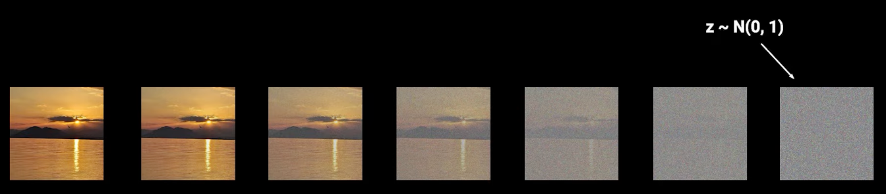
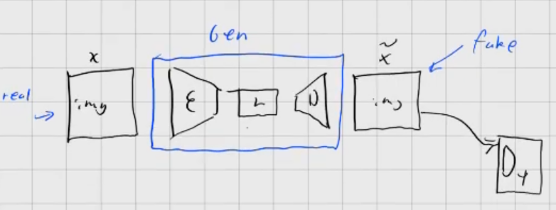
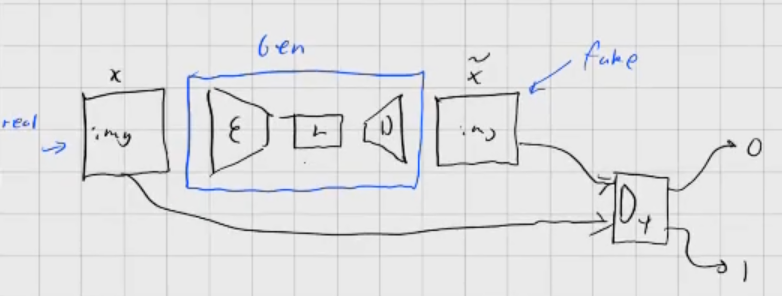

class: center, middle
.title[Creative Coding and Software Design 3]
  
.subtitle[Week 12: Diffusion]
      
.date[Jan 2025] 
   
.note[Created with [Liminal](https://github.com/jonathanlilly/liminal) using [Remark.js](http://remarkjs.com/) + [Markdown](https://github.com/adam-p/markdown-here/wiki/Markdown-Cheatsheet) +  [KaTeX](https://katex.org)]

???

Author: Grigore Burloiu, UNATC
    
---
name: toc
class: left
# ★ Table of Contents ★      <!-- omit in toc -->
      
1. [Classic text to image](#classic-text-to-image)
2. [More classic text to image](#more-classic-text-to-image)
3. [Diffusion](#diffusion)
4. [Finetuning diffusion models](#finetuning-diffusion-models)
5. [Diffusion in real time](#diffusion-in-real-time)

        
<!-- Comment out the next slide if you don't want the Table of Contents link -->         
---
layout: true  .toc[[★](#toc)]
        
---
name: introduction  
class: left
# Classic text to image

---
class: center
## CLIP+VQGAN

---
## CLIP+VQGAN links

[How to Generate Customized AI Art Using VQGAN and CLIP](https://minimaxir.com/2021/08/vqgan-clip/) (Max Woolf)

[The art of asking nicely](https://www.aiweirdness.com/the-art-of-asking-nicely/) (Janelle Shane)

[List of VQGAN+CLIP Implementations](https://ljvmiranda921.github.io/notebook/2021/08/11/vqgan-list/) (Lj Miranda)

---
class: center
# More classic text to image

[PixelDraw](https://twitter.com/dribnet/status/1427613617973653505) / [pixray](https://github.com/pixray/pixray) (Tom White)

---
class: center
## Classic text(s) to video

<iframe src="https://player.vimeo.com/video/573533102?h=a5d2891108&color=ffffff&portrait=0" style="position:absolute;top:0;left:0;width:100%;height:100%;" frameborder="0" allow="autoplay; fullscreen; picture-in-picture" allowfullscreen></iframe>

[Aphantasia](https://github.com/eps696/aphantasia) (Vadim Epstein)

---

name: diffusion       
class: left
# Diffusion

Recap
- autoencoders
  - [U-Net](https://github.com/drscotthawley/DLAIE/blob/ca5903c61d419e598ff3ee247c39295e0ae5a706/Lessons/11_Autoencoders_UNets_Skips_ResNets.ipynb)
  - [Diffusion Transformer](https://arxiv.org/abs/2212.09748)
- GANs
- RNNs

--

Papers
- [Denoising Diffusion Probabilistic Models](https://arxiv.org/abs/2006.11239) (Ho et al, 2020)
- [High-Resolution Image Synthesis with Latent Diffusion Models](https://arxiv.org/abs/2112.10752) (Rombach et al, 2022)

Video tutorials
- [paper explanation](https://youtu.be/HoKDTa5jHvg)
- [implementation](https://youtu.be/TBCRlnwJtZU)
- [latent diffusion](https://youtu.be/J87hffSMB60?t=393) [.](https://youtu.be/rC34475rEnw)

Web tutorial
- [What are Diffusion Models](https://lilianweng.github.io/posts/2021-07-11-diffusion-models/), Lilian Weng 2021

---
## Intuition

forward process

- add noise (from a **known** normal distribution)

--

reverse process
- remove the noise step by step
- neural net
  - input = current step
  - prediction = noise (to be removed from current step)

---
## Latent Diffusion

- popularised by Stable Diffusion 1

apply diffusion not to the image directly, but on a (learned) latent representation of the image
- why?

---
## Latent Diffusion

- popularised by Stable Diffusion 1

--

next: [flow matching](https://youtu.be/rC34475rEnw) ([Stable Diffusion 3](https://stability.ai/news/stable-diffusion-3), [FLUX.1](https://blackforestlabs.ai/announcing-black-forest-labs/))
- a generalisation of diffusion
- flowing from noise (known normal distribution) to a target distribution (approximated from dataset)

---
name: finetuning-diffusion-models
# Finetuning diffusion models

- what are [LoRA](https://youtu.be/IIy3YwsXtTE?t=456)s @ intro to AI video, civitai 2024
  - faster, smaller than modifying a base model
  - applied onto a base model
  - [Low-rank adaptation for fast text-to-image diffusion fine-tuning](https://github.com/cloneofsimo/lora) (Ryu, 2023)

https://github.com/bghira/SimpleTuner
- [SD3 finetuning tutorial](https://stabilityai.notion.site/Stable-Diffusion-3-Medium-Fine-tuning-Tutorial-17f90df74bce4c62a295849f0dc8fb7e) (stability.ai)

- [huggingface diffusers](https://huggingface.co/docs/diffusers/v0.32.1/training/text2image)

existing finetuned SD models: [civitai](https://civitai.com/models), [huggingface](https://huggingface.co/models?library=diffusers)

explore LoRAs with [huggingface spaces](https://huggingface.co/spaces/multimodalart/flux-lora-the-explorer)

---
name: diffusion-in-real-time
# Diffusion in real time

https://github.com/cumulo-autumn/StreamDiffusion

https://github.com/radames/Real-Time-Latent-Consistency-Model

https://github.com/IDKiro/sdxs