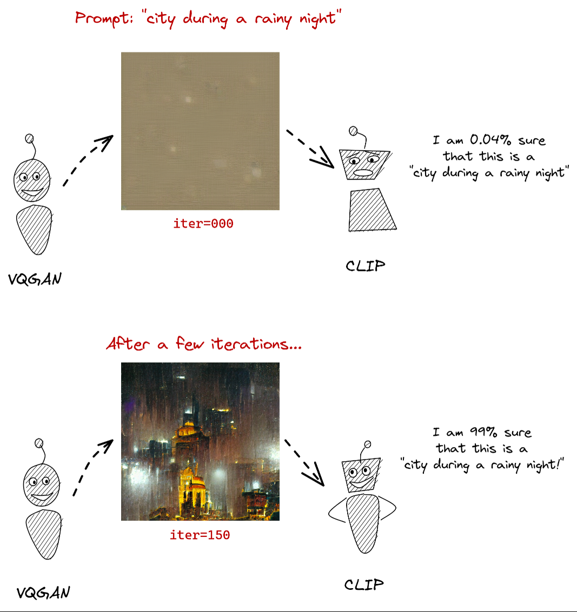
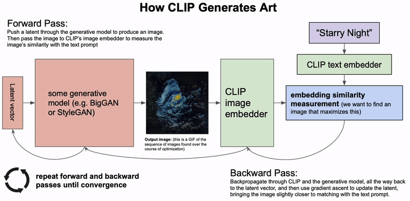
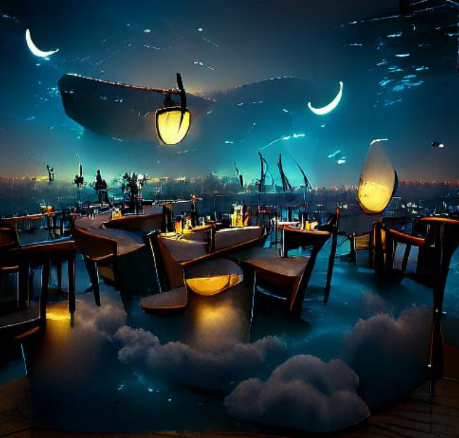
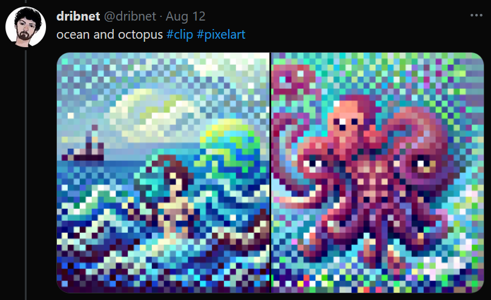

class: center, middle
.title[Creative Coding and Software Design 3]
  
.subtitle[Week 12: Diffusion]
      
.date[Jan 2025] 
   
.note[Created with [Liminal](https://github.com/jonathanlilly/liminal) using [Remark.js](http://remarkjs.com/) + [Markdown](https://github.com/adam-p/markdown-here/wiki/Markdown-Cheatsheet) +  [KaTeX](https://katex.org)]

???

Author: Grigore Burloiu, UNATC
    
---
name: toc
class: left
# ★ Table of Contents ★      <!-- omit in toc -->
      
1. [Classic text to image: CLIP+VQGAN](#classic-text-to-image-clipvqgan)
2. [More classic text to image](#more-classic-text-to-image)
3. [Diffusion](#diffusion)

        
<!-- Comment out the next slide if you don't want the Table of Contents link -->         
---
layout: true  .toc[[★](#toc)]
        
---
name: introduction  
class: left
# Classic text to image: CLIP+VQGAN

---
class: center
## CLIP+VQGAN

---
## CLIP+VQGAN links

[How to Generate Customized AI Art Using VQGAN and CLIP](https://minimaxir.com/2021/08/vqgan-clip/) (Max Woolf)

[The art of asking nicely](https://www.aiweirdness.com/the-art-of-asking-nicely/) (Janelle Shane)

[List of VQGAN+CLIP Implementations](https://ljvmiranda921.github.io/notebook/2021/08/11/vqgan-list/) (Lj Miranda)

---
class: center
# More classic text to image

[PixelDraw](https://twitter.com/dribnet/status/1427613617973653505) (dribnet)

---
class: center
## Text to image

[DALL-E mini](https://huggingface.co/spaces/flax-community/dalle-mini) (Dayma et al)

---
class: center
## Text to image

<iframe src="https://player.vimeo.com/video/573533102?h=a5d2891108&color=ffffff&portrait=0" style="position:absolute;top:0;left:0;width:100%;height:100%;" frameborder="0" allow="autoplay; fullscreen; picture-in-picture" allowfullscreen></iframe>

[Aphantasia](https://github.com/eps696/aphantasia) (Vadim Epstein)

---

name: diffusion       
class: left
# Diffusion

Recap
- autoencoders
  - see also: [U-Net](https://github.com/drscotthawley/DLAIE/blob/ca5903c61d419e598ff3ee247c39295e0ae5a706/Lessons/11_Autoencoders_UNets_Skips_ResNets.ipynb)
- RNNs

Papers
- [Denoising Diffusion Probabilistic Models](https://arxiv.org/abs/2006.11239) (Ho et al, 2020)
- [High-Resolution Image Synthesis with Latent Diffusion Models](https://arxiv.org/abs/2112.10752) (Rombach et al, 2022)

Video tutorials
- [paper explanation](https://youtu.be/HoKDTa5jHvg)
- [implementation](https://youtu.be/TBCRlnwJtZU)

Webpage tutorial
- [What are Diffusion Models](https://lilianweng.github.io/posts/2021-07-11-diffusion-models/), Lilian Weng 2021