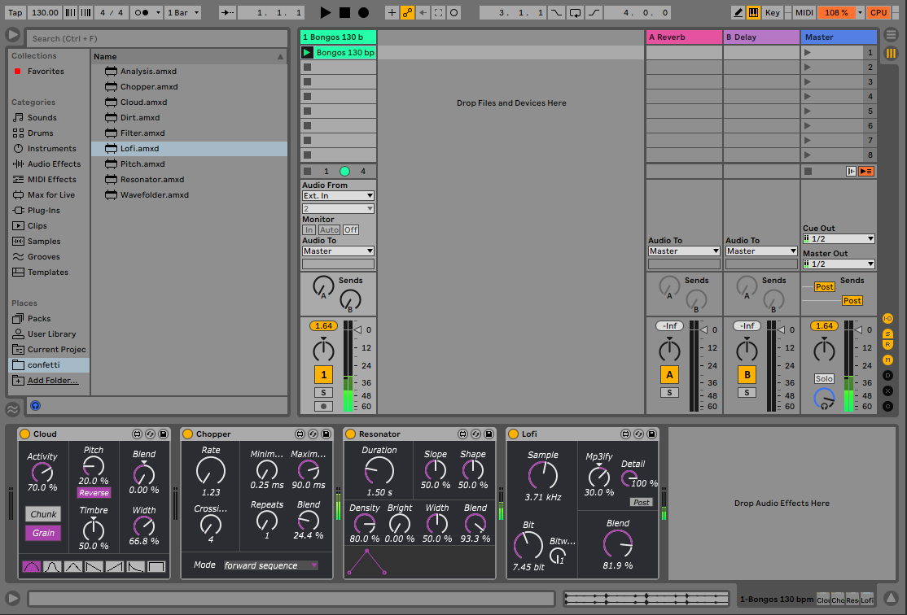

class: center, middle
.title[Interactive Music Systems]
  
.subtitle[Interactive devices]
      
.date[Nov 2022] 
   
.note[Created with [Liminal](https://github.com/jonathanlilly/liminal) using [Remark.js](http://remarkjs.com/) + [Markdown](https://github.com/adam-p/markdown-here/wiki/Markdown-Cheatsheet) + [KaTeX](https://katex.org)]

???

Author: Grigore Burloiu, UNATC
    
---
name: toc
class: left
# ★ Table of Contents ★     <!-- omit in toc -->

1. [Review](#review)
2. [Example: dance sonification](#example-dance-sonification)
3. [Example: live electronics](#example-live-electronics)
4. [Using M4L for interaction](#using-m4l-for-interaction)

        
<!-- Comment out the next slide if you don't want the Table of Contents link -->         
---
layout: true  .toc[[★](#toc)]
        
---
name: review
# Review

Tools
- [Max](02-01-max-unity-intro)
- [Ableton Live](04-03-m4l-api#ableton-live)
- [HCI and OSC](01-07-osc)

--

.right-column[
<iframe width="100%" height="300" src="https://www.youtube.com/embed/qmJrMAcPxhw?start=1690" title="YouTube video player" frameborder="0" allow="accelerometer; autoplay; clipboard-write; encrypted-media; gyroscope; picture-in-picture" allowfullscreen></iframe>
]
Technique
- mapping and control
- sound / sonification design
- IMS: analysis + reaction

---
class: center
name: example-dance-sonification
# Example: dance sonification

https://github.com/RVirmoors/deltaScapes

???

- we would have more time in the practical lab session.
- scenes, tracks
- oschook -> A -> map
- bpatcher MapButton.maxpat
- live.dial -> sig~ -> MapButton.maxpat
- meter~ -> sig~ -> MapButton.maxpat

---

## This project uses M4L for:

Live devices: mapping, triggering, audio output

[Live API](https://docs.cycling74.com/max8/vignettes/live_api): control DAW parameters

---
## Discussion

"strata" of sonification
- generative
- allusive
- curatorial (auditory display)

([Milad Mardakheh](https://learn.flucoma.org/explore/mardakheh/))

--

read more: [The Sonification Handbook](https://sonification.de/handbook/)

---
class: center
name: example-live-electronics
# Example: live electronics

https://github.com/rconstanzo/confetti

???

- Rodrigo C = excellent artist and developer of hardware & software instruments
- 2 reasons: immediately useful + RC gives back to community, tools not just free but easily understandable, learnable, extendable by general public
- Max: _confetti overview

---

## This project uses M4L for:

Live devices: audio effects & analysis

[amxd] objects in Max

---

## Discussion

When to stay in Live?

(as opposed to just using Max)

--

- timeline
- scenes

--

...and when NOT?

- multichannel (not impossible)
- free improv[?](https://llllllll.co/t/app-the-party-van/247/589)

---
name: using-m4l-for-interaction       
class: left
#  Using M4L for interaction

various options:

- devices in Live: audio effect, instrument, MIDI effect
- DAW control via the Live API
- embedding devices in Max

      

Reading: 
- https://rodrigoconstanzo.com/2015/06/cut-glove/
- https://docs.cycling74.com/max8/vignettes/max_for_live_topic