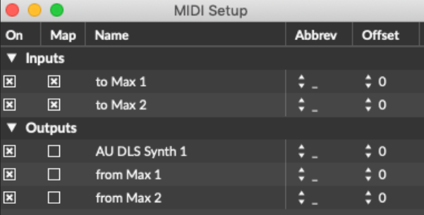
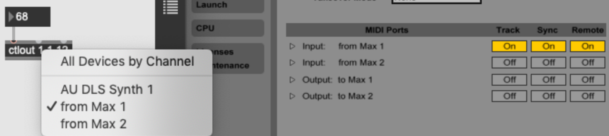

class: center, middle
.title[Interactive Music Systems]
  
.subtitle[The Max for Live API]
      
.date[Oct 2025] 
   
.note[Created with [Liminal](https://github.com/jonathanlilly/liminal) using [Remark.js](http://remarkjs.com/) + [Markdown](https://github.com/adam-p/markdown-here/wiki/Markdown-Cheatsheet) + [KaTeX](https://katex.org)]

???

Author: Grigore Burloiu, UNATC
    
---
name: toc
class: left
# ★ Table of Contents ★     <!-- omit in toc -->

1. [Review](#review)
2. [Controlling Ableton](#controlling-ableton)
3. [The Live API](#the-live-api)
4. [Example](#example)
5. [Assignment](#assignment)

        
<!-- Comment out the next slide if you don't want the Table of Contents link -->         
---
layout: true  .toc[[★](#toc)]
        
---
name: review
# Review

Tools
- [Max](02-01-max-unity-intro)
- [Ableton Live](04-02-interactive-devices#ableton-live)
- [HCI and OSC](01-07-osc)

--

.right-column[
<iframe width="100%" height="300" src="https://www.youtube.com/embed/qmJrMAcPxhw?start=1690" title="YouTube video player" frameborder="0" allow="accelerometer; autoplay; clipboard-write; encrypted-media; gyroscope; picture-in-picture" allowfullscreen></iframe>
]
Technique
- mapping and control
- sound / sonification design
- IMS: analysis + reaction

---
name: controlling-ableton
# Controlling Ableton

via MIDI

.left-column[

]

.right-column[ 

]

---
## Max & Live integration

Live handles audio+MIDI in & out to M4L devices

[timing](https://docs.cycling74.com/max8/vignettes/live_timing): Max transport is led by Live   

Max values can be Live [parameters](https://docs.cycling74.com/max8/vignettes/live_parameters) (for automation, presets etc)

factory M4L [abstractions](https://docs.cycling74.com/max8/vignettes/live_abstractions) 

more: 
- https://docs.cycling74.com/max8/vignettes/doclive
- https://docs.cycling74.com/max8/vignettes/live_limitations 

---
name: the-live-api
# The Live API

[control Live from Max](https://docs.cycling74.com/max8/vignettes/live_api_overview): transport, tracks, clips, ...

- [Live API + JS](https://docs.cycling74.com/max8/vignettes/jsliveapi)
- find `live.path` using the [Live Object Model](https://docs.cycling74.com/max8/vignettes/live_object_model)

--
- ... or simply use the [M4L API abstractions](https://docs.cycling74.com/max8/vignettes/live_apiabstractions)

---
# Example

2 scenes: `listen`, `play`

- ☐ - `listen` = learns a Markov chain (notes+durations)
- ☒ - `play` = generates notes using Markov chain

--

switch between scenes when musician stays silent for n beats

--

is this an IMS?

---
## see also

<iframe width="100%" height="500" src="https://www.youtube.com/embed/yW8PkIl4tDE" title="C'est pour ça - [Extract] "Generative improvisation #1"" frameborder="0" allow="accelerometer; autoplay; clipboard-write; encrypted-media; gyroscope; picture-in-picture" allowfullscreen></iframe>

---
name: assignment
# Assignment

modify the `m4l-jam` project (or create a new one) which implements, at least:
- a `listen` scene and a `jam` scene
- switching between them based on machine listening and/or playing