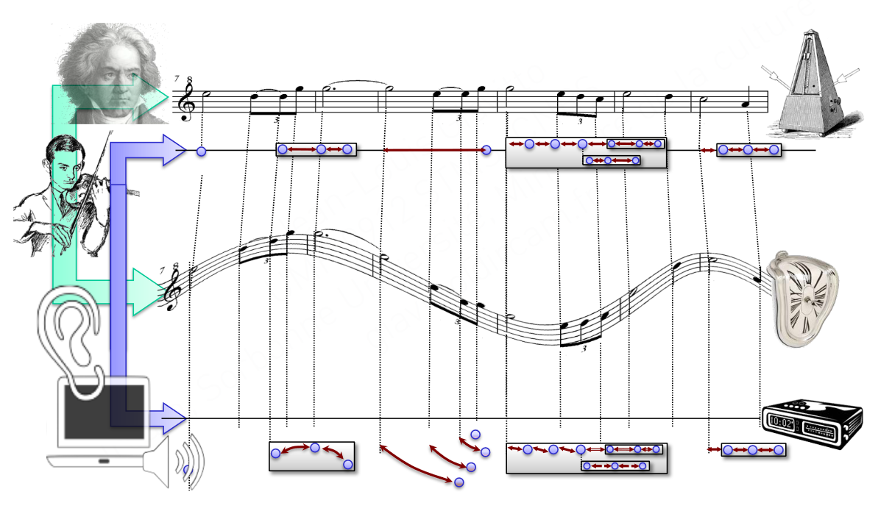
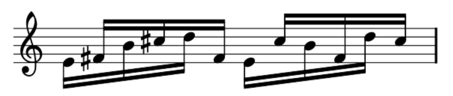
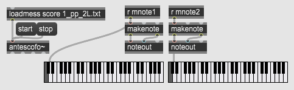
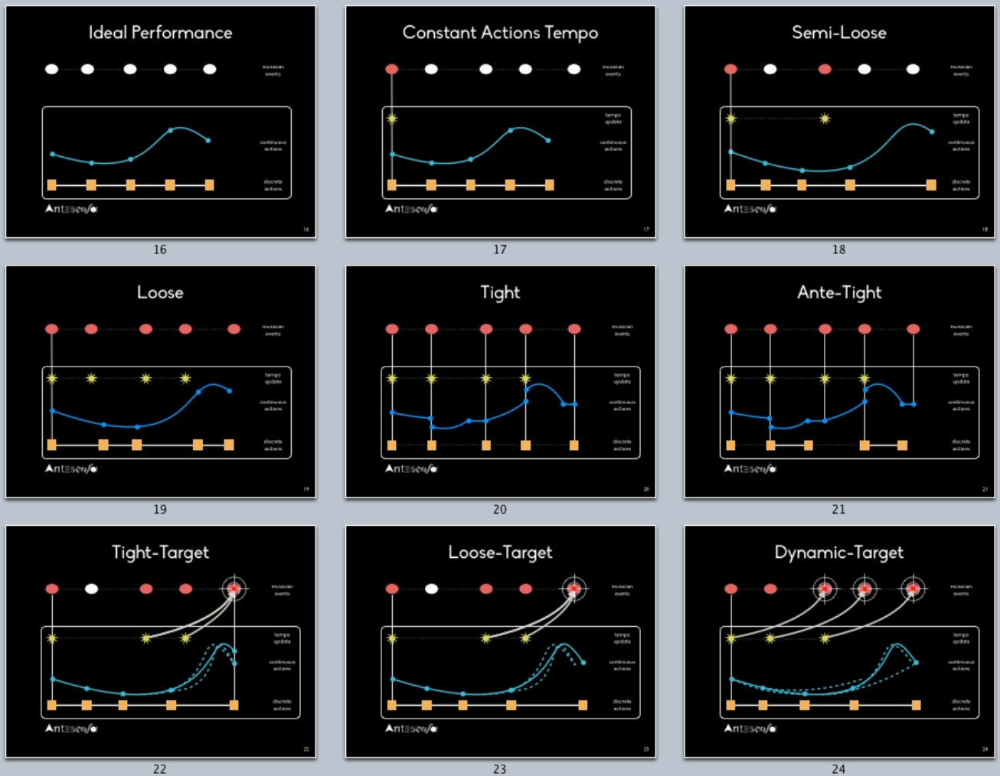

class: center, middle
.title[Interactive Music Systems]
<br/><br/>
.subtitle[More Antescofo]
<br/><br/><br/><br/><br/><br/>
.date[Nov 2022] 
<br/><br/><br/>
.note[Created with [Liminal](https://github.com/jonathanlilly/liminal) using [Remark.js](http://remarkjs.com/) + [Markdown](https://github.com/adam-p/markdown-here/wiki/Markdown-Cheatsheet) +  [KaTeX](https://katex.org)]

???

Author: Grigore Burloiu, UNATC
    
---
name: toc
class: left
# ★ Table of Contents ★      <!-- omit in toc -->
      
1. [Compound actions](#compound-actions)
2. [Tracking non-audio events](#tracking-non-audio-events)
3. [Example: *Piano Phase*](#example-piano-phase)
4. [Time in Antescofo](#time-in-antescofo)
5. [Assignment](#assignment)

        
<!-- Comment out the next slide if you don't want the Table of Contents link -->         
---
layout: true  .toc[[★](#toc)]

---

<br/><br/>

[](https://www.hesge.ch/hem/sites/default/files/contributions/presentation_jean-louis_giavitto_colloque_gesture-capture-notation_2019.pdf)
        
---
name: compound-actions
# Compound actions

[Action groups](https://support.ircam.fr/docs/Antescofo/manuals/Reference/compound_group/): `GROUP`

.left-column[
```antescofo
NOTE C3 1
Group G1 {
  ...
}
Group G2 {  …  }
0.5 Group G3 {  …  }
0.5 Group G4 {  …  }
NOTE C4 1
```
]

--

.right-column[

]

---
## Compound actions

[Looped action groups](https://support.ircam.fr/docs/Antescofo/manuals/Reference/compound_loop/): `LOOP`

.left-column[
```antescofo
NOTE C3 2/3
$period := 1
Loop L $period { 
   $period := 0.5
   … L … 
}
NOTE C4 1
```
]

--


---
name: tracking-non-audio-events
# Tracking non-audio events

non-audio events: `EVENT`

--

defining external variables: `setvar`

[observing the variable](https://support.ircam.fr/docs/Antescofo/manuals/Reference/compound_whenever/): `whenever`


---
name: example-piano-phase
class: center
# Example: *Piano Phase*


<iframe width="95%" height="250" src="https://www.youtube.com/embed/57TuvksMR70" title="Steve Reich - Piano Phase - Visualization" frameborder="0" allow="accelerometer; autoplay; clipboard-write; encrypted-media; gyroscope; picture-in-picture" allowfullscreen></iframe>`*`

- `*` missing the "acceleration" segments. See also [other performances](https://www.youtube.com/results?search_query=reich+piano+phase).

---
## The rules of *Piano Phase*



for `n_p = 12...18` periods:
- play simultaneously
  
for `n_d = 4...16` periods: 
- accelerate phase (displace) one of the pianos by one 16th note
  
resync

all the above x12

---
## Implementing *Piano Phase*

1. autonomous
2. tempo-dynamic
3. live accompaniment (warped pre-recording)
4. live accompaniment (warped live recording)



---

name: time-in-antescofo  
class: left
#  Time in Antescofo

[](https://support.ircam.fr/docs/Antescofo/manuals/Reference/5-synchro/)

---
## Concurrency

every action = its own (implicit) thread

actions run in parallel, each with its *start time* and *duration*

---
## Synchronisation strategies

`@loose` - uses the detected tempo [default]

`@tight` - uses event information

`@target` - in-between: dynamically use an anticipated event

`@tempo` - uses a user-defined tempo value

`@sync` - tracks a user-defined (`@tempovar`) tempo variable

[Reference: sync strategies](http://support.ircam.fr/docs/Antescofo/manuals/Reference/time_synchro/)  
[Antescofo model of time](https://hal.archives-ouvertes.fr/hal-01638115/document) paper

---
## Synchronisation strategies


---
## Sync in *Piano Phase*

v3 - `@tempo`

v4 - `@target`

v4bis - `@target + @sync & @tempovar`

---

name: assignment       
class: left
#  Assignment

Exercises **2** and **4** of Piano Phase

OR

Create a [Sound Portrait](http://www.soundportraits.info/)
- mp3: 10-20 minutes podcast w/ interviews, clips, your own voice?
- doc: short bio text
- youtube link(s)