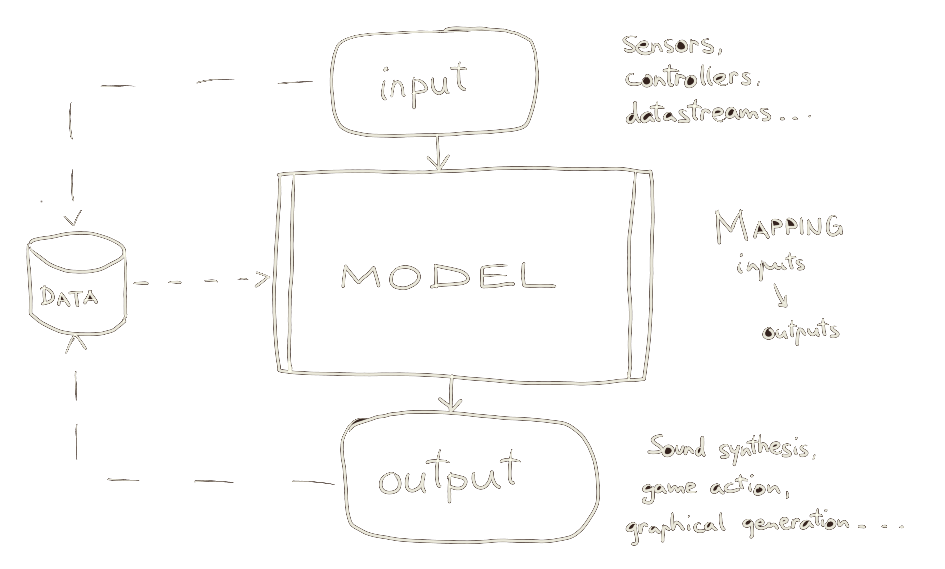

class: center, middle
.title[Interactivity Design 1]
  
.subtitle[Intro to Interactivity Design]
      
.date[Oct 2026] 
   
.note[Created with [Liminal](https://github.com/jonathanlilly/liminal) using [Remark.js](http://remarkjs.com/) + [Markdown](https://github.com/adam-p/markdown-here/wiki/Markdown-Cheatsheet) +  [KaTeX](https://katex.org)]

???

Author: Grigore Burloiu, UNATC
    
---
name: toc
class: left
# ★ Table of Contents ★      <!-- omit in toc -->
      
1. [Semester overview](#semester-overview)
2. [Metaphor Circus](#metaphor-circus)
3. [Inputs and outputs](#inputs-and-outputs)
4. [Interactive Machine Learning](#interactive-machine-learning)

        
<!-- Comment out the next slide if you don't want the Table of Contents link -->         
---
layout: true  .toc[[★](#toc)]
        
---
name: semester-overview  
class: left
# Semester overview

a general (ITPMA+others) class for 

&nbsp;&nbsp;&nbsp;code-less creation 

&nbsp;&nbsp;&nbsp;&nbsp;&nbsp;&nbsp;of interactive art

--

alternating
- 2h lecture: theory, discussion
- 2h lab: new concepts in practice

Syllabus coming soon 
- (for now see Classroom)

[Classroom](https://classroom.google.com/)

---
name: metaphor-zoo
class: left
# Metaphor Circus

the dancing bear

stochastic parrots

the uncanny valley

the mechanical Turk

the jagged frontier

the ghost in the machine

the bitter lesson

---
name: inputs-and-outputs
class: left
# Inputs and outputs

.left-column[
  in:

]

.right-column[
  out:
]

---
## Inputs and outputs

.left-column[
  in:
- button
- microphone
- webcam
- proximity sensor
- movement sensor
- pose
- gesture
- online data (weather, news etc)
- ...
]

.right-column[
  out:
- parametric video projection
- audio/video clip playback
- music control
- lights
- physical (motors, actuators)
- ...
]

--

            

where are the inputs *coming from*?

what are the outputs *affecting*?

---
## From in to out: logic

---
## From in to out: layers

[flowcharting](https://www.visual-paradigm.com/tutorials/flowchart-tutorial/)

[state machines](https://en.wikipedia.org/wiki/Finite-state_machine)

---
## From in to out: triggering

---
## From in to out: mapping

---
name: interactive-machine-learning
# Interactive Machine Learning

*learn* structure / functionality **from data**

human-in-the-loop (training and inference)

- [Wolf3D](https://twitter.com/stoj_io/status/840222647489318914) sound to action
- [Poetry in Motion](https://rednoise.org/rita/gallery/PoetryInMotion/): movement to text generation

---

## Why use iML?

--

mapping / control design
- by example / modelling     (vs fixed rules)

--

dimensions
- 1 : 1   &nbsp;&nbsp;&nbsp;&nbsp;&nbsp;&nbsp;        1 : many   &nbsp;&nbsp;&nbsp;&nbsp;&nbsp;&nbsp;        many : 1   &nbsp;&nbsp;&nbsp;&nbsp;&nbsp;&nbsp;       many : many

--

workflow
- experimental, iterative

--

creating something truly *new*?
- [active divergence](https://arxiv.org/abs/2107.05599)

---
## Follow

Twitter: [Andreas Refsgaard](https://twitter.com/AndreasRef), [Max Woolf](https://twitter.com/minimaxir), [vadim epstein](https://twitter.com/eps696), [Adverb](https://twitter.com/advadnoun), [Emily Short](https://twitter.com/emshort), [Chris Donahue](https://twitter.com/chrisdonahuey), [AK](https://twitter.com/ak92501), [Janelle Shane](https://twitter.com/JanelleCShane), [Rebecca Fiebrink](https://twitter.com/RebeccaFiebrink), [Parag K. Mital](https://twitter.com/pkmital), [Jesse Engel](https://twitter.com/jesseengel), [dadabots](https://twitter.com/dadabots), [Kyle McDonald](https://twitter.com/kcimc), [Memo Akten](https://twitter.com/memotv)...

Lectures/MOOCs: [Rebecca Fiebrink](https://www.kadenze.com/courses/machine-learning-for-musicians-and-artists/info), [Gene Kogan](https://ml4a.net/) [+](https://www.youtube.com/playlist?list=PLaN6Cxwpu9UKR2mPc39bZEJoyAoCwRw_q), [Yining Shi](https://github.com/yining1023/machine-learning-for-the-web), [Artificial Images](https://www.youtube.com/channel/UCaZuPdmZ380SFUMKHVsv_AA), [Daniel Shiffman](https://www.youtube.com/c/TheCodingTrain)