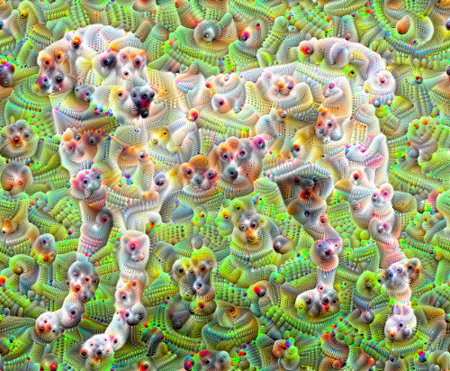

class: center, middle
.title[AI in Arts: practice and ethics]
  
.subtitle[[bit.ly/londoAI](https://bit.ly/londoAI)
 
  SERALA // Londohome
 grigore.burloiu@unatc.ro]
    
.date[Feb 2024]
   
.note[Created with [Liminal](https://github.com/jonathanlilly/liminal) using [Remark.js](http://remarkjs.com/) + [Markdown](https://github.com/adam-p/markdown-here/wiki/Markdown-Cheatsheet) +  [KaTeX](https://katex.org)]

???

Author: Grigore Burloiu, UNATC
    
---
name: toc
class: left
# ★ Table of Contents ★      <!-- omit in toc -->
      
1. [Definitions](#definitions)
2. [AI ethics](#ai-ethics)
3. [The Players](#the-players)
4. [AI Art in practice](#ai-art-in-practice)
5. [Reflections](#reflections)
6. [References](#references)

        
<!-- Comment out the next slide if you don't want the Table of Contents link -->         
---
layout: true  .toc[[★](#toc)]

---
name: definitions
# Definitions

--

Machine Learning ~ Deep Learning ~ Artificial Intelligence

--

"AI art" is not just art made with the help of AI.

--

--

[AI art](https://www.libreai.com/a-short-overview-on-ai-art/) is:
- a subset of *generative* art
- sometimes *interactive* (in training and/or execution)

---
## What does an AI model *do?*

mapping
- inputs → outputs

--

generation
- prompt → continuation

---
## Mapping example

<iframe src="https://player.vimeo.com/video/19980514?h=c5cdf1479c" style="position:absolute;top:0;left:0;width:100%;height:100%;" frameborder="0" allow="autoplay; fullscreen; picture-in-picture" allowfullscreen></iframe>

---
## Generation vs mapping

technically:
- input = history
- output = future

we're mapping the present state / recent memory / recorded history

onto a future continuation

--

ethically?

---
name: ai-ethics
# AI ethics

.left-column[
<iframe width="100%" height="300" src="https://www.youtube.com/embed/OhCzX0iLnOc" title="The danger of AI is weirder than you think | Janelle Shane" frameborder="0" allow="accelerometer; autoplay; clipboard-write; encrypted-media; gyroscope; picture-in-picture" allowfullscreen></iframe>
]

.right-column[

]

<iframe width="100%" height="200" src="https://www.youtube.com/embed/videoseries?list=PLnV8Pp3XepxXh1zs2j6MOBRBiMBkvt2X0" title="YouTube video player" frameborder="0" allow="accelerometer; autoplay; clipboard-write; encrypted-media; gyroscope; picture-in-picture" allowfullscreen></iframe>

---
## Building ML models

data |    ~  |   *measurements*
-|-|-
information  |  ~ |  data *interpreted* 
model |  ~  | information *mapped*

--

all the above are **fallible**: subject to *choices* and *noise*
- [Critical Perspectives on Computer Vision](https://slideslive.com/38923500/critical-perspectives-on-computer-vision) / Emily Denton
- ___ more links
 
---
## Types of knowledge in ML models

domain knowledge
- *appears in* algorithm design
- *comes from* preprocessed features, model architecture, output postprocessing

--

inferred knowledge
- *appears in* dataset choice
- *comes from* learning from data

--

inherited knowledge
- transfer learning 

---

## Types of bias in ML models

domain bias
- *appears in* alogrithm design
- *comes from* preprocessed features, model architecture, output postprocessing

inferred bias
- *appears in* dataset choice
- *comes from* learning from data

inherited bias
- transfer learning

---
## Material footprint

___ energy cost comparison

---
## Social cost

___ training 

https://en.wikipedia.org/wiki/ChatGPT#Training

___ replacing jobs 
- ismir job ad gen.ai 
- mastering - prf fb goosman reply 
- background muzak gen.ai 

---
name: the-players
# The Players

Google
- [Google Brain](https://en.wikipedia.org/wiki/Google_Brain) (2011) & [DeepMind](https://en.wikipedia.org/wiki/Google_DeepMind) (2014) - GAN, Transformer, ...
- 2015: [TensorFlow](https://en.wikipedia.org/wiki/TensorFlow)
- 2015: [DeepDream](https://www.tensorflow.org/tutorials/generative/deepdream)

- 2016: [Magenta](https://magenta.tensorflow.org/)
- 2017: [Colab](https://colab.google/): [interactive code](https://en.wikipedia.org/wiki/Project_Jupyter) + cloud GPUs + free

---
## The Players

Facebook / Meta AI
- 2016: [PyTorch](https://en.wikipedia.org/wiki/PyTorch) alternative to TensorFlow
- 2023: [LLaMA](https://en.wikipedia.org/wiki/LLaMA) alternative to GPT*

--

NVIDIA
- CUDA - parallel programming on GPUs
- 2019: [StyleGAN](https://thisxdoesnotexist.com/)

---
## The Players

[OpenAI](https://openai.com/research/overview)
- 2018: [Generative Pretrained Transformer](https://openai.com/research/language-unsupervised) (GPT)
- 2020: [Jukebox](https://openai.com/research/jukebox)
  - [criticism](https://twitter.com/jesseengel/status/1256314503903318017?s=20) (Jesse Engel / Magenta)
- 2021: [DALL-E](https://openai.com/research/dall-e)
- 2022: [ChatGPT](https://en.wikipedia.org/wiki/ChatGPT)

---
## open source

artists as tool builders

billionaire companies built on open source - ACSL 

[lawyers&hackers](https://www.artistsandhackers.org/lawyers-hackers) @m23

https://discord.com/channels/1071587740384235571/1071875501406310500/1209506723220688927

https://github.com/MihaiTraista/bassoon-keyslaps-corpus

---
class: center
name: ai-art-in-practice
# AI Art in practice

https://youtu.be/t4FbknvszHU

---
## posenet

- applied on me vs public 
- trained on ??
- ethics gait posture 

---
mapping: DDSP demo

---
generation: RAVE demo

---
inbetween = modelling time: rolypoly~ demo video

---
clustermatch guitar - mic demo

https://youtu.be/9Vu6tNmTRQY

---

## StyleGAN - truncation

<iframe width="100%" height="250" src="https://www.youtube.com/embed/Yk7DCLH97z0" title="YouTube video player" frameborder="0" allow="accelerometer; autoplay; clipboard-write; encrypted-media; gyroscope; picture-in-picture" allowfullscreen></iframe>
</iframe><iframe width="100%" height="300" src="https://www.youtube.com/embed/C1RW2RbY7f0" title="YouTube video player" frameborder="0" allow="accelerometer; autoplay; clipboard-write; encrypted-media; gyroscope; picture-in-picture" allowfullscreen></iframe>

---
## Generate video

<iframe width="100%" height="300" src="https://www.youtube.com/embed/ryNtckMT49M" title="Pooky Park" frameborder="0" allow="accelerometer; autoplay; clipboard-write; encrypted-media; gyroscope; picture-in-picture" allowfullscreen></iframe>

--

[RunwayML](https://runwayml.com) . [Pika](https://pika.art/)

--

OpenAI "hold my beer": [Sora](https://openai.com/sora)

--

<iframe width="100%" height="150" src="https://www.youtube.com/embed/-MUEXGaxFDA?start=1697" title="AI is rotten" frameborder="0" allow="accelerometer; autoplay; clipboard-write; encrypted-media; gyroscope; picture-in-picture" allowfullscreen></iframe>

---
name: reflections
# Reflections

ethics is a continuum - where/how to draw the line? 

ethics is multidimensional 
- ___pe rand, 2 axe, 3 axe etc... 
- multe dimensiuni = ethics ML model sa ne zica ce e etic si ce nu - necesar pt alignment, general AI

AXE
- tool - instrument (extensie/dialog/struggle) - partener (cocreativity)
https://youtu.be/LWT99riOWeQ
"unde se afla subiectul/dorintele care permit muzica interesanta?"

- mapping - generation

- superhumanness? (ex. curing cancer?)

- analog - digital
  - ML analog? biocomputing?

---

https://terribleminds.com/ramble/2024/01/10/just-say-no-to-artificial-intelligence-in-your-creative-pursuits-please-jfc-wtaf/

allison parrish: art is the only ethical use of AI ___source??

---

<iframe width="100%" height="500" src="https://www.youtube.com/embed/iGJcF4bLKd4" title="AI is rotten" frameborder="0" allow="accelerometer; autoplay; clipboard-write; encrypted-media; gyroscope; picture-in-picture" allowfullscreen></iframe>

---
name: references
# References

---
class: center, middle
## Thank you!

  [bit.ly/londoAI](https://bit.ly/londoAI)
 
  grigore.burloiu@unatc.ro
 [itpma.notion.site](https://itpma.notion.site)
 [rvirmoors.github.io](https://rvirmoors.github.io)