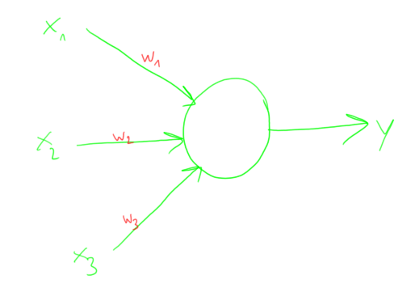
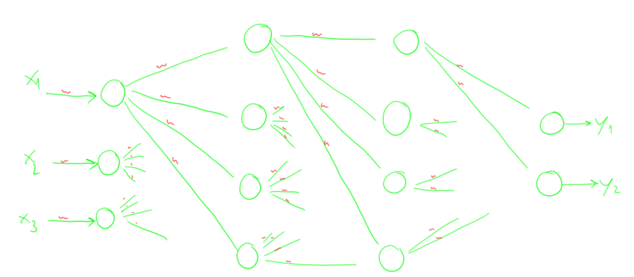
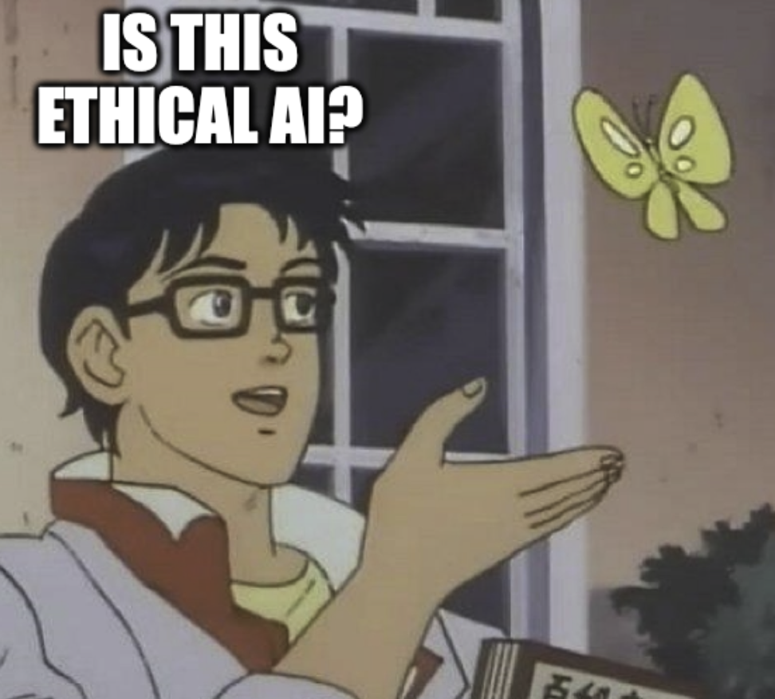

class: center, middle
.title[Introduction to AI Art]
        
.subtitle[AI in ART PRACTICES and RESEARCH // UNATC
 grigore.burloiu@unatc.ro]
 [bit.ly/aiart2024](https://bit.ly/aiart2024)
   
.date[Mar 2024]
   
.note[Created with [Liminal](https://github.com/jonathanlilly/liminal) using [Remark.js](http://remarkjs.com/) + [Markdown](https://github.com/adam-p/markdown-here/wiki/Markdown-Cheatsheet) +  [KaTeX](https://katex.org)]

???

Author: Grigore Burloiu, UNATC
        
<!-- Comment out the next slide if you don't want the Table of Contents link -->         
---
layout: true  .toc[[★](#toc)]

---
## AI & me

--

teaching / UNATC
- [Interactive Technologies for Performing and Media Arts](https://itpma.notion.site/) (ITPMA) M.A.
- [semester course](https://www.notion.so/itpma/Creative-Coding-and-Software-Design-3-c18bb7e2da834cabb027a681abefec2c) on Machine Learning for interactive arts
- [workshops](https://youtu.be/t4FbknvszHU) etc

--

ITPMA alumni & students presenting at this conference:
- Dorin Cucicov, Alina Rizescu, Maria Nastase, Emil Dragan, 
- Diana Chiru, Andrada Baleanu, Lorena Cocora

---
name: toc
class: left
# ★ Table of Contents ★      <!-- omit in toc -->
      
1. [Definitions](#definitions)
2. [AI ethics](#ai-ethics)
3. [The Players](#the-players)
4. [AI Art in practice](#ai-art-in-practice)
5. [Reflections](#reflections)

---
name: definitions
# Definitions

Machine Learning ~ Deep Learning ~ [Artificial Intelligence](https://en.wikipedia.org/wiki/Mechanical_Turk)

--

"AI art" is not just art made with the help of AI.

--

--

[AI art](https://www.libreai.com/art-ai/a-short-overview-on-ai-art/) is

- a subset of [*generative* art](https://en.wikipedia.org/wiki/Generative_art)
- sometimes [*interactive*](https://en.wikipedia.org/wiki/Interactive_art) (in training and/or execution)

   
- [AI and the social construction of creativity](https://journals.sagepub.com/doi/10.1177/13548565231187730)
- [AI and the Arts: How Machine Learning is Changing Creative Work](https://www.oii.ox.ac.uk/news-events/reports/ai-the-arts/)

---
## deep learning history

since the 2010s: AI ~ ML ~ (deep) artificial neural networks

- historically not the case!
- 2012: [deep NNs win ImageNet competition](https://en.wikipedia.org/wiki/AlexNet)
- 2013: [word2vec maps word associations](https://en.wikipedia.org/wiki/Word2vec)
- 2015-17: [deep RL: superhuman performance in the game of Go](https://en.wikipedia.org/wiki/AlphaGo)

 
- 

---

## What *are* neural networks, then?

<blockquote class="twitter-tweet">
My nearly-2-year old has started talking about inputs and outputs after 3 days of reading Neural Networks for Babies at bedtime. Best part is he pronounces it &quot;outpoops&quot; following a convo with his other mom about how humans input food and output poop.
&mdash; Rebecca Fiebrink (@RebeccaFiebrink) <a href="https://twitter.com/RebeccaFiebrink/status/1427695916841152516?ref_src=twsrc%5Etfw">August 17, 2021</a></blockquote> 

 
- 

---

## What *are* neural networks, then?

a neuron implements a function

- $output = F (inputs)$

---

## What *are* neural networks, then?

a neural network implements a *more complicated* function
- $outputs = F (inputs)$

--

What, in practice, is such a complicated function?

---

## Machine Learning means...

.left-column[

]

.right-column[

]
                
...discovering / defining / *modelling* a latent space.

how?

--

**Learning** = by example & iteratively

---
## What does an AI model *do?*

mapping
- inputs → outputs

--

generation
- prompt → continuation

---
## Mapping examples

<iframe src="https://player.vimeo.com/video/19980514?h=c5cdf1479c" style="position:absolute;top:0;left:0;width:100%;height:100%;" frameborder="0" allow="autoplay; fullscreen; picture-in-picture" allowfullscreen></iframe>

--

<iframe width="100%" height="300" src="https://www.youtube.com/embed/9Vu6tNmTRQY" title="Rodrigo Constanzo" frameborder="0" allow="accelerometer; autoplay; clipboard-write; encrypted-media; gyroscope; picture-in-picture" allowfullscreen></iframe>

---
## Generation vs mapping

technically:
- input = history
- output = future

 

we're mapping 
- the present state / recent memory / recorded history

onto 
- a future continuation

  

--

ethically?

---
name: ai-ethics
# AI ethics

.left-column[
<iframe width="100%" height="300" src="https://www.youtube.com/embed/OhCzX0iLnOc" title="The danger of AI is weirder than you think | Janelle Shane" frameborder="0" allow="accelerometer; autoplay; clipboard-write; encrypted-media; gyroscope; picture-in-picture" allowfullscreen></iframe>
]

.right-column[

]

<iframe width="100%" height="200" src="https://www.youtube.com/embed/videoseries?list=PLnV8Pp3XepxXh1zs2j6MOBRBiMBkvt2X0" title="YouTube video player" frameborder="0" allow="accelerometer; autoplay; clipboard-write; encrypted-media; gyroscope; picture-in-picture" allowfullscreen></iframe>

---
## Building ML models

data |    ~  |   *measurements*
-|-|-
information  |  ~ |  data *interpreted* 
model |  ~  | information *mapped*

--

all the above are **fallible**: subject to *choices* and *noise*

       
- [Critical Perspectives on Computer Vision](https://slideslive.com/38923500/critical-perspectives-on-computer-vision) / Emily Denton
- [Whose ground truth? accounting for individual and collective identities underlying dataset annotation](https://arxiv.org/pdf/2112.04554.pdf)
- [Microsoft lays off AI ethics and society team](https://www.theverge.com/2023/3/13/23638823/microsoft-ethics-society-team-responsible-ai-layoffs)
- [Reddit strikes $60M deal allowing Google to train AI on user posts](https://www.baltimoresun.com/2024/02/22/reddit-strikes-60m-deal-allowing-google-to-train-ai-models-on-its-posts-unveils-ipo-plans/)

 
---
## Types of knowledge in ML models

domain knowledge
- *appears in* algorithm design
- *comes from* 
  - preprocessed features, model architecture, output postprocessing

--

inferred knowledge
- *appears in* dataset choice
- *comes from* learning from data

--

inherited knowledge
- transfer learning 

---

## Types of bias in ML models

domain bias
- *appears in* alogrithm design
- *comes from* 
  - preprocessed features, model architecture, output postprocessing

inferred bias
- *appears in* dataset choice
- *comes from* learning from data

inherited bias
- transfer learning

---
## Social cost

training large models
- crowdsourcing data
  - privacy
  - opt-in
- addressing bias
  - ChatGPT used [Kenyan workers](https://time.com/6247678/openai-chatgpt-kenya-workers/) for ["traumatizing" work](https://www.theguardian.com/technology/2023/aug/02/ai-chatbot-training-human-toll-content-moderator-meta-openai)

---
## Social cost

[replacing jobs](https://en.wikipedia.org/wiki/Technological_unemployment) 

--

---
## Social cost

“AI is under control of the writers, not under control of the studios. It’s not to be used as an automation technology. It’s complementary to humans.”
- Simon Johnson, MIT
---
## Social cost

feeding the achievement/burnout society

"The loss of the faculty of contemplation affects our relation to language. Dazed by the rush of information and communication we move away from **poetry** as the contemplation of language, and begin even to hate it. When language is nothing but work and the production of information, it loses its radiance. It becomes worn out and **keeps producing the same**."
- Byung-Chul Han, Vita Contemplativa

---
## Material footprint

training ChatGPT: 1064MWh

chatgpt inference: 260MWh / day or 9Wh / query 
- (vs 0.25Wh / google search)

.left-column[
[AI and its carbon footprint: How much water does ChatGPT consume?](https://lifestyle.livemint.com/news/big-story/ai-carbon-footprint-openai-chatgpt-water-google-microsoft-111697802189371.html)
]

.right-column[
[Power Hungry Processing: Watts Driving the Cost of AI Deployment?](https://arxiv.org/pdf/2311.16863.pdf)
]

- "between 2010 and 2018, data center energy usage has been fairly stable, accounting for around 1 to 2 percent of global consumption. ... things might be different for AI precisely because of the trend for companies to simply throw bigger models and more data at any task." [source](https://www.theverge.com/24066646/ai-electricity-energy-watts-generative-consumption)

---
## open source

--

does not guarantee transparency or fairness → [Explainable AI](https://christophm.github.io/interpretable-ml-book/)

--

artists as tool builders

--

billionaire companies built on open source → [ACSL](https://anticapitalist.software/) 
- [artists&hackers](https://www.artistsandhackers.org/lawyers-hackers) podcast @m23

--

[Google: Open Source AI Will Outcompete Google And OpenAI](https://hackaday.com/2023/05/05/leaked-internal-google-document-claims-open-source-ai-will-outcompete-google-and-openai/)

---
name: the-players
# The Players

Google
- [Google Brain](https://en.wikipedia.org/wiki/Google_Brain) (2011) & [DeepMind](https://en.wikipedia.org/wiki/Google_DeepMind) (2014) - GAN, Transformer, ...
- 2015: [TensorFlow](https://en.wikipedia.org/wiki/TensorFlow)
- 2015: [DeepDream](https://www.tensorflow.org/tutorials/generative/deepdream)

- 2016: [Magenta](https://magenta.tensorflow.org/) / DDSP <audio controls src="../attachments/londoAI/dem.mp3" style="height: 20px;"></audio>
- 2017: [Colab](https://colab.google/): [interactive code](https://en.wikipedia.org/wiki/Project_Jupyter) + cloud GPUs + free

---
## The Players

Facebook / Meta AI
- 2016: [PyTorch](https://en.wikipedia.org/wiki/PyTorch) alternative to TensorFlow
- 2023: [LLaMA](https://en.wikipedia.org/wiki/LLaMA) alternative to GPT*

--

NVIDIA
- CUDA - parallel programming on GPUs
- 2019: [StyleGAN](https://thisxdoesnotexist.com/)

---
## The Players

[OpenAI](https://openai.com/research/overview)
- 2018: [Generative Pretrained Transformer](https://openai.com/research/language-unsupervised) (GPT)
- 2020: [Jukebox](https://openai.com/research/jukebox)
  - [criticism](https://twitter.com/jesseengel/status/1256314503903318017?s=20) (Jesse Engel / Magenta)
- 2021: [DALL-E](https://openai.com/research/dall-e)
- 2022: [ChatGPT](https://en.wikipedia.org/wiki/ChatGPT)

---
class: center
name: ai-art-in-practice
# AI Art in practice

---
## Pose estimation

<iframe width="50%" height="282" src="https://www.youtube.com/embed/dMZs04TzxUI" title="ircam RAVE" frameborder="0" allow="accelerometer; autoplay; clipboard-write; encrypted-media; gyroscope; picture-in-picture" allowfullscreen></iframe>

--

<iframe width="100%" height="200" src="https://www.youtube.com/embed/Nim80x4S9y0" title="ochi" frameborder="0" allow="accelerometer; autoplay; clipboard-write; encrypted-media; gyroscope; picture-in-picture" allowfullscreen></iframe>

--

.left-column[
["anonymous and   privacy-preserving"](https://github.com/google-coral/project-posenet)
]

--

.right-column[
gait surveillance
]

---
## Voice In My Head

[Kyle McDonald](https://kylemcdonald.net/) & [Lauren Lee McCarthy](https://lauren-mccarthy.com/)

--

(self-)surveillance

[shared subjectivity](https://youtu.be/LWT99riOWeQ)

"algorithmic living"

data ethics

---
## Generating video

<iframe width="100%" height="300" src="https://www.youtube.com/embed/ryNtckMT49M" title="Pooky Park" frameborder="0" allow="accelerometer; autoplay; clipboard-write; encrypted-media; gyroscope; picture-in-picture" allowfullscreen></iframe>

--

[RunwayML](https://runwayml.com) . [Pika](https://pika.art/)

--

OpenAI "hold my beer": [Sora](https://openai.com/sora)

   
- [TKSST: How to spot AI-generated videos](https://thekidshouldseethis.com/post/openai-sora-identifying-ai-videos)
- ["AfD-Verbot" deepfake](https://politicalbeauty.de/)

---
## AI in the videogames industry

<iframe width="100%" height="300" src="https://www.youtube.com/embed/j3LW5no-5Ao" title="ai games" frameborder="0" allow="accelerometer; autoplay; clipboard-write; encrypted-media; gyroscope; picture-in-picture" allowfullscreen></iframe>

---
name: reflections
# Reflections

.right-column[
  
]

--

train your eye for AI

--

consider the balance of power

--

  

ethics is a continuum
- where & how to draw the line?

        
- [Just Say No to Artificial Intelligence In Your Creative Pursuits](https://terribleminds.com/ramble/2024/01/10/just-say-no-to-artificial-intelligence-in-your-creative-pursuits-please-jfc-wtaf/#comment-1678765)
- [Active Divergence with Generative Deep Learning](https://arxiv.org/pdf/2107.05599.pdf)

---
class: center
## ethics is multidimensional 

---
class: center
## ethics is multidimensional 

---
class: center
## ethics is multidimensional

---
class: center
## ethics is multidimensional 

---
class: center
## ethics is multidimensional 

---
class: center
## ethics is multidimensional 

---
class: center
## a job for machine ethics :)

---
class: center, middle
## Thank you!

 [bit.ly/aiart2024](https://bit.ly/aiart2024)
 
 grigore.burloiu@unatc.ro
 [itpma.notion.site](https://itpma.notion.site)
 [rvirmoors.github.io](https://rvirmoors.github.io)