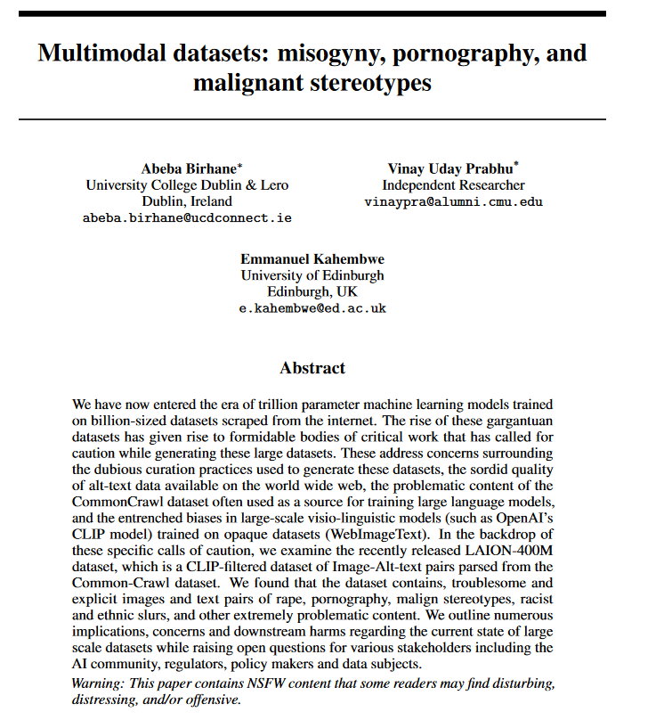

class: center, middle
.title[Using Deep Learning to generate dialogue text]
  
.subtitle[[bit.ly/chat-nova](https://bit.ly/chat-nova)
 Workshop @ CINETic / NOVA
  grigore.burloiu@unatc.ro
 rvirmoors.github.io]
      
.date[Dec 2022]
   
.note[Created with [Liminal](https://github.com/jonathanlilly/liminal) using [Remark.js](http://remarkjs.com/) + [Markdown](https://github.com/adam-p/markdown-here/wiki/Markdown-Cheatsheet) +  [KaTeX](https://katex.org)]

???

Author: Grigore Burloiu, UNATC
    
---
name: toc
class: left
# ★ Table of Contents ★      <!-- omit in toc -->
      
1. [Preamble: ethics](#preamble-ethics)
2. [NLP models / OpenAI](#nlp-models--openai)
3. [Generative text \& art](#generative-text--art)
4. [A chatbot using GPT-2](#a-chatbot-using-gpt-2)

        
<!-- Comment out the next slide if you don't want the Table of Contents link -->         
---
layout: true  .toc[[★](#toc)]

---
name: preamble-ethics
# Preamble: ethics

.left-column[
<iframe width="100%" height="300" src="https://www.youtube.com/embed/OhCzX0iLnOc" title="The danger of AI is weirder than you think | Janelle Shane" frameborder="0" allow="accelerometer; autoplay; clipboard-write; encrypted-media; gyroscope; picture-in-picture" allowfullscreen></iframe>
]

.right-column[

]

<iframe width="100%" height="200" src="https://www.youtube.com/embed/videoseries?list=PLnV8Pp3XepxXh1zs2j6MOBRBiMBkvt2X0" title="YouTube video player" frameborder="0" allow="accelerometer; autoplay; clipboard-write; encrypted-media; gyroscope; picture-in-picture" allowfullscreen></iframe>

---
## Building ML models

data |    ~  |   *measurements*
-|-|-
information  |  ~ |  data *interpreted* 
model |  ~  | information *mapped*

--

all the above are **fallible**: subject to *choices* and *noise*
- [Critical Perspectives on Computer Vision](https://slideslive.com/38923500/critical-perspectives-on-computer-vision) / Emily Denton
- [OpenAI Chatbot spits out biased musings](https://twitter.com/daveyalba/status/1600892019878268928) / Davey Alba
  - [my attempt](../attachments/chatgpt-ethics.png)
 
---
## Types of knowledge in ML models

domain knowledge
- *appears in* alogrithm design
- *comes from* preprocessed features, model architecture, output postprocessing

--

inferred knowledge
- *appears in* dataset choice
- *comes from* learning from data

--

inherited knowledge: transfer learning 

---

## Types of bias in ML models

domain bias
- *appears in* alogrithm design
- *comes from* preprocessed features, model architecture, output postprocessing

inferred bias
- *appears in* dataset choice
- *comes from* learning from data

inherited bias: transfer learning 

---
name: nlp-models--openai
# NLP models / OpenAI

2018: Generative Pretrained Transformer (OpenAI GPT)

2019: [GPT-2](https://www.openai.com/blog/gpt-2-1-5b-release/)

- [Hugging Face](https://huggingface.co/gpt2/) [+](https://huggingface.co/distilgpt2) [+](https://colab.research.google.com/github/jalammar/jalammar.github.io/blob/master/notebooks/Simple_Transformer_Language_Model.ipynb)
- [Max Woolf](https://github.com/minimaxir/aitextgen) [+](https://minimaxir.com/2019/09/howto-gpt2/)
- [Talk to Transformer](https://talktotransformer.com)

2020: [GPT-3](https://openai.com/api/)

- https://dailynous.com/2020/07/30/philosophers-gpt-3/ [+](http://henryshevlin.com/wp-content/uploads/2020/07/PratchettT.pdf) [+](https://gist.github.com/minimaxir/f4998c20f2520ad5969b03c9590f16ce)
- [Tempering Expectations](https://minimaxir.com/2020/07/gpt3-expectations/) (Max Woolf)
- code gen: [2020](https://twitter.com/sharifshameem/status/1284095222939451393), [2021](https://copilot.github.com/) [+](https://www.openai.com/blog/openai-codex)

2021: [CLIP](https://openai.com/blog/clip/)

2022: [ChatGPT](https://chat.openai.com/chat) / GPT-3.5

---
name: generative-text--art
# Generative text & art

[Project December](https://projectdecember.net/) (Jason Rohrer)

[AI Dungeon](https://play.aidungeon.io)

- [GPT2 Adventure](https://colab.research.google.com/drive/1khUaPex-gyk1wXXLuqcopiWmHmcKl4UP) (colab) [+](https://quicktotheratcave.tumblr.com/post/187432425523/shall-we-play-a-game)

[Co-authoring with GPT-2](https://emshort.blog/2021/07/18/the-uncanny-deck-co-authoring-with-gpt-2/) (Emily Short)

[Wordcraft](https://www.youtube.com/watch?v=9p4mfA0Fyd8) (Google)

See more [resources](../resources).

---
name: a-chatbot-using-gpt-2
# A chatbot using GPT-2

1. use [Google Colab](https://colab.research.google.com) to train / test
2. use [Huggingface](https://github.com/huggingface/transformers/tree/main/examples/pytorch/language-modeling)[*](https://huggingface.co/models?pipeline_tag=text-generation&sort=downloads) or [aitextgen](https://docs.aitextgen.io/) libraries
3. download your model and run it locally

- all the code is available [here](https://github.com/RVirmoors/fiction-chatbot)

--

"knowledge" in a language model
- "the language" ~ pre-training (e.g. GPT-2, NeoGPT, BERT...)
- "background" ~ fine-tuning / transfer learning
- "context" ~ prompting
