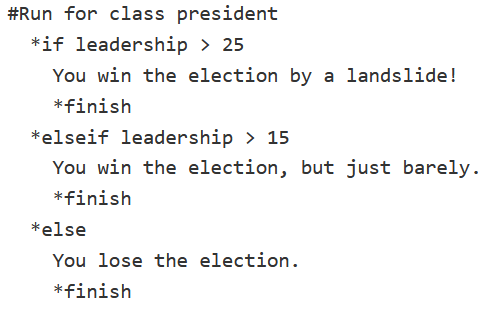
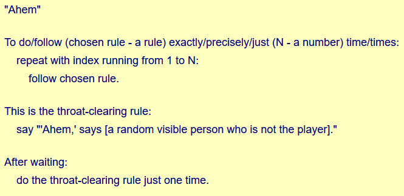

class: center, middle
.title[Introduction to Ink]
<br/><br/>
.subtitle[[bit.ly/intro-ink]()
<br/><br/>grigore.burloiu@unatc.ro
<br/>rvirmoors.github.io]
<br/><br/><br/><br/><br/><br/>
.date[Nov 2021] 
<br/><br/><br/>
.note[Created with [Liminal](https://github.com/jonathanlilly/liminal) using [Remark.js](http://remarkjs.com/) + [Markdown](https://github.com/adam-p/markdown-here/wiki/Markdown-Cheatsheet) +  [KaTeX](https://katex.org)]

???

Author: Grigore Burloiu, UNATC
    
---
name: toc
class: left
# ★ Table of Contents ★      <!-- omit in toc -->
      
1. [About Ink](#about-ink)
2. [Concepts](#concepts)
3. [Ink techniques](#ink-techniques)
4. [Storylets](#storylets)
5. [Going forward](#going-forward)

        
<!-- Comment out the next slide if you don't want the Table of Contents link -->         
---
layout: true  .toc[[★](#toc)]

---
name: about-ink  
class: left
# About Ink

*[a narrative scripting language for games](https://www.inklestudios.com/ink/)*

open source

created and maintained by [Inkle Studios](https://www.inklestudios.com/)

can be integrated into
- [standalone](https://www.inklestudios.com/overboard/) games,
- [browser](https://ig.ft.com/uber-game/) games,
- or pure interactive [text](https://rvirmoors.github.io/ink/learning-ink/index.html) using [Inky](https://github.com/inkle/inky/releases)

---

## Alternatives to Ink

[Ren'Py](https://www.renpy.org/) | choice |  | [Twine](https://twinery.org/) | choice | 
-|-|-|-|-
[Texture](https://texturewriter.com/) | choice |  
[ChoiceScript](https://www.choiceofgames.com/make-your-own-games/choicescript-intro/) | choice |  |[Inform](http://inform7.com/index.html) | parser | 

<br/><br/>

- ["Another Interactive Fiction Engine List"](https://docs.google.com/spreadsheets/d/1-B1yKIateTpwTdRNT9W_ZjDzC6XnFpHXrcZ4nr_x7LQ/edit#gid=0)

---
name: concepts
# Concepts

Ink-specific

general programming

---
## Ink terms

*knots*
- `=== london ===`

--

*diverts*
- `-> london`

--

choices
```
+ [Go to London.] -> london
+ We went to Berlin. -> berlin
```
- `+` is permanent
- `*` disappears once chosen

--

*glue*
- `<>`


---
## Programming concepts

`// comments`

--

program state ~ variables

--

variable types
- boolean &nbsp;&nbsp;&nbsp; `true / false`
- numbers
- text ~ *strings*

--


assigning a value &nbsp;&nbsp;&nbsp;`=`

--

conditionals &nbsp;&nbsp;&nbsp; `if` &nbsp;&nbsp;&nbsp; `else`

--

logical operators
- `not`
- `and`
- `or`

--

math &nbsp;&nbsp;&nbsp; `+ - * /` ...


---
name: ink-techniques
# Ink techniques

conditional content

using variables

*weaving*

---
## Conditionals

in the text
```
{ london:
    I had already been to London.
}
```

--

in choices
```
+ {london} [Go to Berlin.] -> berlin
+ {not london} [Go to London.] -> london
```

--

complex conditions
```
* {london and berlin} I've been everywhere! -> END
```

--

- `london` and `berlin` are implicit variables,
  - being *incremented* every time you visit the respective knot
  
```
{ london == 1:
    I had only been to London once, and was looking forward to return.
}
```

---
## User variables

define & assign
```
VAR player_name = "Stan"
VAR mood = 1
```

--

use in text
```
"People call me {player_name}."
```

--

modify
```
=== change_name ===
    ~ player_name = "John Paul II"
    ~ mood++
The archbishop declared: "From now on, you shall be {player_name}."
```

--

conditionals (if/else)
```
{ mood > 0:
    I was feeling pretty good that day.
- else:
    I wasn't happy about how things were going.
}
```

---
name: storylets
# Storylets

*filtered-card-deck* / *quality-based* / *resource narratives*

- *My story is made of pieces of content. How do I choose which piece to show the player next?*

--

&nbsp;
- **Content**
- **Prerequisites**, when the content can play
- **Effect on state** of the world, after the content has been played

Example: *"The princess escapes the tower."*

---
## Storylets


- **Content**: The princess escapes the tower.
- **Prerequisites**: 
  - tower is in story; princess is in story; princess is in the tower
- **Effect on state**: 
  - Tower is no longer in the story; princess is no longer in the tower

--

&nbsp;
- **Content**: The princess escapes the tower.
- **Prerequisites**: 
  - `tower == true and`
  - `princess == true and`
  - `princess_in_tower == true`
- **Effect on state**: 
  - `tower = false;`
  - `princess_in_tower = false`

--

&nbsp;
- [Storylets: You Want Them](https://emshort.blog/2019/11/29/storylets-you-want-them/) (Emily Short)
- [Workshop on storylet-based narrative design](https://www.youtube.com/watch?v=0zDXcVc5zv0) (Emily Short)

---
## Storylets in Ink

[basic example](https://gist.github.com/JoshuaGrams/073e02468a5fe3addb8cdbfdc6f199d3) - Joshua Grams

--

```
VAR princess_in_tower = false

-> storylets

== storylets ==
+ {not tower} [Go to tower.] 
  -> tower
+ {tower and princess_in_tower} [Look up at the window.] 
  -> princess_escapes

== tower ==
~ princess_in_tower = true
You decide to visit the forbidden tower. -> storylets

== princess_escapes ==
~ princess_in_tower = false
You lock eyes with the princess and she runs to you. -> END
```

--

[Ink extension](https://elliotherriman.itch.io/ink-storylets) - Elliot Herriman

---
name: going-forward
# Going forward

1. Write, mess around! Use what you've seen so far.
2. Read the guides linked on the next slide. See chapter on [weaving](https://github.com/inkle/ink/blob/master/Documentation/WritingWithInk.md#part-2-weave).
3. Play some IF games. IFComp is a good place to start.
4. (re)Write your game.

--

<br/><br/><br/><br/><br/><br/>
not a linear sequence!

---
## Links

[Writing web-based interactive fiction with ink](https://www.inklestudios.com/ink/web-tutorial/) beginner guide

[Writing with Ink](https://github.com/inkle/ink/blob/master/Documentation/WritingWithInk.md) full guide

[Unofficial Cookbook](https://videlais.github.io/Unofficial-Ink-Cookbook/) by [Dan Cox](https://videlais.com/ink-tutorials/)

[Owlbook](https://github.com/Liance/Ink-Owlbook) tips and tricks

--

[Emily Short](https://emshort.blog/)'s Interactive Storytelling

[Standard Patterns in Choice-Based Games](https://heterogenoustasks.wordpress.com/2015/01/26/standard-patterns-in-choice-based-games/) - Sam Kabo Ashwell

[Paul Nelson](https://thestoryelement.wordpress.com/category/interactive-storytelling/)

[IFComp](https://ifcomp.org/)

[50 Years of Text Games](https://if50.substack.com/) - Aaron A. Reed


---
class: center
## Thanks!


<br/><br/><br/><br/>
See you in a month!

<br/><br/><br/><br/><br/><br/>
grigore.burloiu@unatc.ro