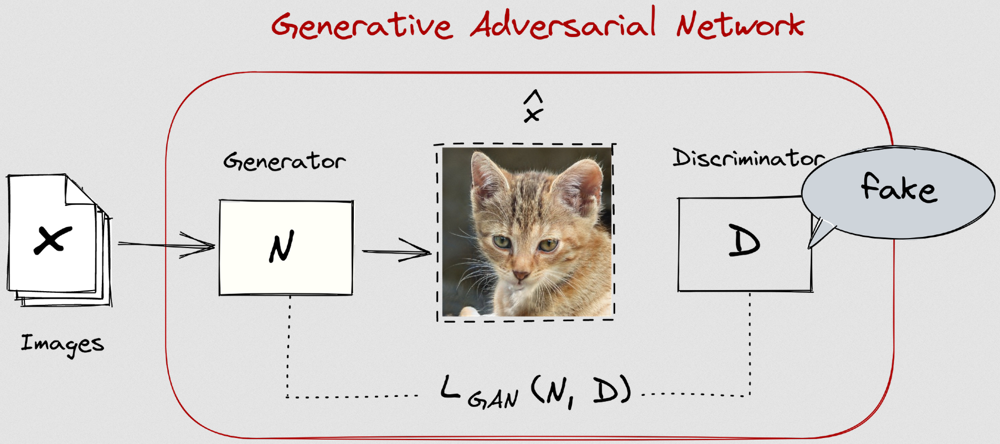
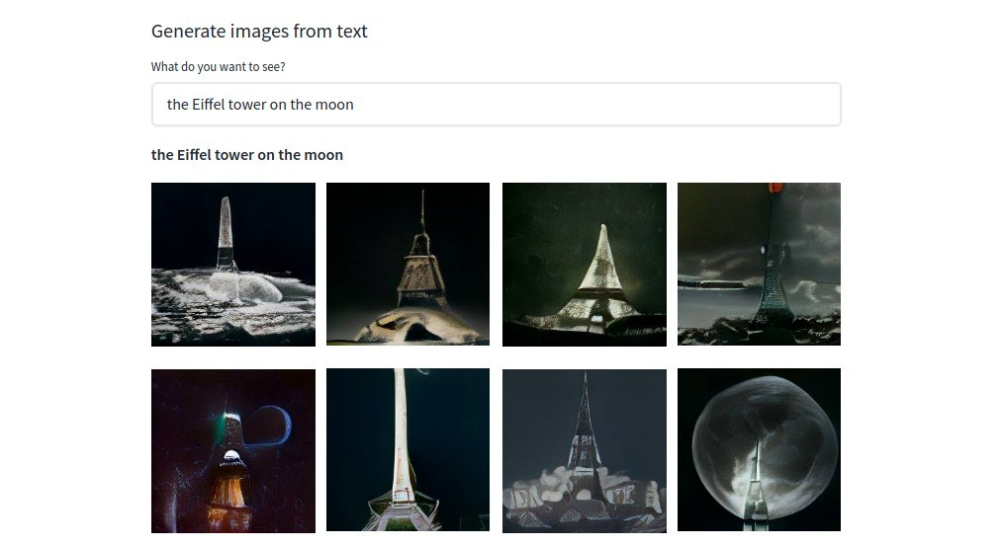

class: center, middle
.title[Intro to Machine Learning for Digital Arts]
  
.subtitle[Workshop @ CINETic / NOVA
  grigore.burloiu@unatc.ro
 rvirmoors.github.io]
      
.date[Aug 2021] 
   
.note[Created with [Liminal](https://github.com/jonathanlilly/liminal) using [Remark.js](http://remarkjs.com/) + [Markdown](https://github.com/adam-p/markdown-here/wiki/Markdown-Cheatsheet) +  [KaTeX](https://katex.org)]

???

Author: Grigore Burloiu, UNATC
    
---
name: toc
class: left
# ★ Table of Contents ★      <!-- omit in toc -->
      
1. [ML background](#ml-background)
2. [Interactive ML demo](#interactive-ml-demo)
3. [Artistic uses of DL](#artistic-uses-of-dl)
4. [Interactive DL demo](#interactive-dl-demo)

        
<!-- Comment out the next slide if you don't want the Table of Contents link -->         
---
layout: true  .toc[[★](#toc)]

---

## Workshop prep

[Wekinator](http://www.wekinator.org/), [Processing](https://processing.org/download)

[ITPMA](https://itpma.notion.site/Interactive-Technologies-for-Performing-and-Media-Arts-MA-cd956fc088f242638d627561f9d65a61)

--

---
name: ml-background  
class: left
# ML background

since the 2010s: AI ~ ML ~ artificial neural networks

- historically not the case!
- 2012: [deep NNs win ImageNet competition](https://en.wikipedia.org/wiki/AlexNet)
- 2013: [word2vec maps word associations](https://en.wikipedia.org/wiki/Word2vec)
- 2015-17: [deep RL: superhuman performance in the game of Go](https://en.wikipedia.org/wiki/AlphaGo)

--

"we should have been using neural networks all along!"

--

WRONG! / [Tomas Mikolov](https://cs.nyu.edu/~welleck/episode25.html)

<iframe width="190" height="80" src="https://www.youtube.com/embed/Rc9e1WWWo5M" frameborder="0" allow="accelerometer; autoplay; clipboard-write; encrypted-media; gyroscope; picture-in-picture" allowfullscreen></iframe>

--

terminology :(

---

## ML for art

- 2015: [DeepDream](https://www.tensorflow.org/tutorials/generative/deepdream)

[ML art](https://www.libreai.com/a-short-overview-on-ai-art/) is:
- a subset of *generative* art
- sometimes *interactive* (in training and/or execution)

[ethical questions](https://www.youtube.com/watch?v=NMYTALX9kEw)

---

## ML / DL myths

| **myth** (*you don't need*) |&nbsp;&nbsp; | **truth** (*you can*) |
|-------------------|-|-------|
| expensive computers |&nbsp;&nbsp; | use machines in the cloud for free |
| math and coding |&nbsp;&nbsp; | do a lot with user-friendly tools |
| lots of data |&nbsp;&nbsp; | start from pre-trained models |
| lots of time |&nbsp;&nbsp; | do inference in (almost) real time |

(adapted from [course.fast.ai](https://course.fast.ai/#Is-this-course-for-me?))

---

## What *are* neural networks, then?

<blockquote class="twitter-tweet">
My nearly-2-year old has started talking about inputs and outputs after 3 days of reading Neural Networks for Babies at bedtime. Best part is he pronounces it &quot;outpoops&quot; following a convo with his other mom about how humans input food and output poop.
&mdash; Rebecca Fiebrink (@RebeccaFiebrink) <a href="https://twitter.com/RebeccaFiebrink/status/1427695916841152516?ref_src=twsrc%5Etfw">August 17, 2021</a></blockquote> 

---

## What *are* neural networks, then?

a neuron implements a function

- $output = F (inputs)$

---

## What *are* neural networks, then?

a neural network implements a *more complicated* function
- $outputs = F (inputs)$

--

What, in practice, is such a complicated function?

---

## Machine Learning means:

.left-column[

]

.right-column[

]
              
Discovering / defining / modelling a latent space.

How?

--

**Learning**: iteratively & by example.

---

## Interactive Machine Learning

human-in-the-loop

[Wekinator](https://twitter.com/search?q=wekinator) and [Sound Control](http://soundcontrolsoftware.com/) (Rebecca Fiebrink, since 2008!)

[Wolf3D](https://twitter.com/stoj_io/status/840222647489318914) sound to action

[Poetry in Motion](https://rednoise.org/rita/gallery/PoetryInMotion/): movement to text generation

---
name: interactive-ml-demo       
class: center
#  Interactive ML demo

https://github.com/RVirmoors/deltaScapes

---

name: artistic-uses-of-dl       
class: left
# Artistic uses of DL

text

music

image

---

## Symbolic sequences: text

2018: [Generative Pretrained Transformer](https://openai.com/research/language-unsupervised) (OpenAI GPT)

2019: [GPT-2](https://www.openai.com/blog/gpt-2-1-5b-release/)

- [Hugging Face](https://huggingface.co/gpt2/) [+](https://huggingface.co/distilgpt2) [+](https://colab.research.google.com/github/jalammar/jalammar.github.io/blob/master/notebooks/Simple_Transformer_Language_Model.ipynb)
- [Max Woolf](https://github.com/minimaxir/aitextgen) [+](https://minimaxir.com/2019/09/howto-gpt2/)
- [Talk to Transformer](https://talktotransformer.com)

2020: [GPT-3](https://beta.openai.com/)

- https://dailynous.com/2020/07/30/philosophers-gpt-3/ [+](http://henryshevlin.com/wp-content/uploads/2020/07/PratchettT.pdf) [+](https://gist.github.com/minimaxir/f4998c20f2520ad5969b03c9590f16ce)
- [Tempering Expectations](https://minimaxir.com/2020/07/gpt3-expectations/) (Max Woolf)
- code gen: [2020](https://twitter.com/sharifshameem/status/1284095222939451393), [2021](https://copilot.github.com/) [+](https://www.openai.com/blog/openai-codex)

---

## Generative text in art

[Project December](https://projectdecember.net/) (Jason Rohrer)

[AI Dungeon](https://play.aidungeon.io)

- [GPT2 Adventure](https://colab.research.google.com/drive/1khUaPex-gyk1wXXLuqcopiWmHmcKl4UP) (colab) [+](https://quicktotheratcave.tumblr.com/post/187432425523/shall-we-play-a-game)

[Co-authoring with GPT-2](https://emshort.blog/2021/07/18/the-uncanny-deck-co-authoring-with-gpt-2/) (Emily Short)

[Wordcraft](https://www.youtube.com/watch?v=9p4mfA0Fyd8) (Google)

---

## Symbolic time series: music

[An Introduction to Creative Artificial Intelligence for Music](https://kivanctatar.com/blog) (Kıvanç Tatar)

[Frost Songs: Using AI to Generate Music from Poems](https://towardsdatascience.com/frost-songs-using-ai-to-generate-melodies-from-poems-636d26685f0a) (Robert Gonsalves)

[Magenta @ Google Brain](https://magenta.tensorflow.org/)

[AI Song Contest](https://www.aisongcontest.com/)

---

## Generating audio

[WaveGAN](https://github.com/chrisdonahue/wavegan)
- [colab](https://colab.research.google.com/drive/1e9o2NB2GDDjadptGr3rwQwTcw-IrFOnm) [+](https://drive.google.com/drive/folders/1gpG1SYGLqyJLaGTVo54Q8FCG4DSmhqDE)

[SampleRNN](https://arxiv.org/abs/1612.07837)
- [colab](https://colab.research.google.com/gist/relativeflux/10573e9e1b10b1ff45e3a00099259741/prism-samplernn.ipynb) [+](https://www.datafied.world/create-audio-music-using-ai-94)

<iframe width="320" height="200" src="https://www.youtube.com/embed/yoQ5nDHFxVI" title="YouTube video player" frameborder="0" allow="accelerometer; autoplay; clipboard-write; encrypted-media; gyroscope; picture-in-picture" allowfullscreen></iframe>

<iframe width="320" height="200" src="https://www.youtube.com/embed/2xMhRwxXJTc" title="YouTube video player" frameborder="0" allow="accelerometer; autoplay; clipboard-write; encrypted-media; gyroscope; picture-in-picture" allowfullscreen></iframe>

---

## Generating audio from lyrics/artist prompt

[OpenAI Jukebox](https://openai.com/blog/jukebox/)

[criticism](https://twitter.com/jesseengel/status/1256314503903318017?s=20) (Jesse Engel / Magenta)

<iframe width="320" height="200" src="https://www.youtube.com/embed/5wn3htQl4JA" title="YouTube video player" frameborder="0" allow="accelerometer; autoplay; clipboard-write; encrypted-media; gyroscope; picture-in-picture" allowfullscreen></iframe>

- https://github.com/p-lambda/jukemir

---

class: center
## Text + live sound: LyricJam

<iframe src="https://player.vimeo.com/video/577368436?h=be0a1e14b8&byline=0" style="position:absolute;top:0;left:0;width:100%;height:100%;" frameborder="0" allow="autoplay; fullscreen; picture-in-picture" allowfullscreen></iframe>

[lyricjam.ai](https://lyricjam.ai/)

---

## Image

style transfer: [Fast Style Transfer](https://yining1023.github.io/fast_style_transfer_in_ML5) (Yining Shi)

generation: [StyleGAN2-ADA](https://github.com/eps696/stylegan2ada) (Vadim Epstein via NVIDIA)

style transfer: [StarGAN2](https://github.com/eps696/stargan2) (Vadim Epstein via Clova AI)

---
class: center
## Text to image: CLIP+VQGAN

---
class: center
## Text to image: CLIP+VQGAN

---

## Text to image: CLIP+VQGAN

[How to Generate Customized AI Art Using VQGAN and CLIP](https://minimaxir.com/2021/08/vqgan-clip/) (Max Woolf)

[The art of asking nicely](https://www.aiweirdness.com/the-art-of-asking-nicely/) (Janelle Shane)

[List of VQGAN+CLIP Implementations](https://ljvmiranda921.github.io/notebook/2021/08/11/vqgan-list/) (Lj Miranda)

---
class: center
## Text to image

[PixelDraw](https://twitter.com/dribnet/status/1427613617973653505) (dribnet)

---
class: center
## Text to image

[DALL-E mini](https://huggingface.co/spaces/flax-community/dalle-mini) (Dayma et al)

---
class: center
## Text to image

<iframe src="https://player.vimeo.com/video/573533102?h=a5d2891108&color=ffffff&portrait=0" style="position:absolute;top:0;left:0;width:100%;height:100%;" frameborder="0" allow="autoplay; fullscreen; picture-in-picture" allowfullscreen></iframe>

[Aphantasia](https://github.com/eps696/aphantasia) (Vadim Epstein)

---

name: interactive-dl-demo       
class: left
#  Interactive DL demo

https://rvirmoors.github.io/2021/01/04/realtime-stylegan/

<blockquote class="twitter-tweet">
poorly trained <a href="https://twitter.com/hashtag/stylegan2ada?src=hash&amp;ref_src=twsrc%5Etfw">#stylegan2ada</a> almost-<a href="https://twitter.com/hashtag/realtime?src=hash&amp;ref_src=twsrc%5Etfw">#realtime</a> via <a href="https://twitter.com/hashtag/wekinator?src=hash&amp;ref_src=twsrc%5Etfw">#wekinator</a> yay <a href="https://t.co/uvTiiCrGFB">pic.twitter.com/uvTiiCrGFB</a>
&mdash; grig (@growlerpig) <a href="https://twitter.com/growlerpig/status/1340764869109424131?ref_src=twsrc%5Etfw">December 20, 2020</a></blockquote>  

---

## Links

Twitter: [Adverb](https://twitter.com/advadnoun), [Max Woolf](https://twitter.com/minimaxir), [vadim epstein](https://twitter.com/eps696), [Emily Short](https://twitter.com/emshort), [Chris Donahue](https://twitter.com/chrisdonahuey), [AK](https://twitter.com/ak92501), [Janelle Shane](https://twitter.com/JanelleCShane), [Rebecca Fiebrink](https://twitter.com/RebeccaFiebrink), [Parag K. Mital](https://twitter.com/pkmital), [Jesse Engel](https://twitter.com/jesseengel), [dadabots](https://twitter.com/dadabots), [Kyle McDonald](https://twitter.com/kcimc), [Memo Akten](https://twitter.com/memotv)...

Lectures/MOOCs: [Rebecca Fiebrink](https://www.kadenze.com/courses/machine-learning-for-musicians-and-artists/info), [Gene Kogan](https://ml4a.net/) [+](https://www.youtube.com/playlist?list=PLaN6Cxwpu9UKR2mPc39bZEJoyAoCwRw_q), [Yining Shi](https://github.com/yining1023/machine-learning-for-the-web), [Artificial Images](https://www.youtube.com/channel/UCaZuPdmZ380SFUMKHVsv_AA), [Daniel Shiffman](https://www.youtube.com/c/TheCodingTrain)

Other tools: [ml5js](https://ml5js.org/), [RunwayML](https://runwayml.com/ml-lab/)

[NeurIPS workshops: ML for Creativity and Design](https://neurips2020creativity.github.io/)

[AI Music Creativity](https://aimusiccreativity.org/)

More creative coding [resources](../resources)