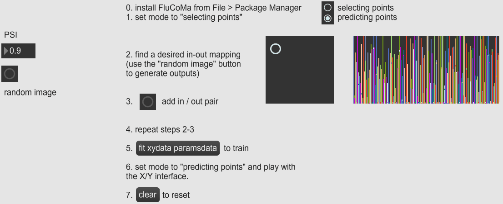

class: center, middle
.title[Real-time interaction with StyleGAN]
<br/><br/>
.subtitle[[bit.ly/gan-nova](https://bit.ly/gan-nova)
<br/>Workshop @ CINETic / NOVA
<br/><br/>grigore.burloiu@unatc.ro
<br/>rvirmoors.github.io]
<br/><br/><br/><br/><br/><br/>
.date[Dec 2022]
<br/><br/><br/>
.note[Created with [Liminal](https://github.com/jonathanlilly/liminal) using [Remark.js](http://remarkjs.com/) + [Markdown](https://github.com/adam-p/markdown-here/wiki/Markdown-Cheatsheet) +  [KaTeX](https://katex.org)]

???

Author: Grigore Burloiu, UNATC
    
---
name: toc
class: left
# ★ Table of Contents ★      <!-- omit in toc -->
      
1. [Preamble: ethics](#preamble-ethics)
2. [Generating images](#generating-images)
3. [Navigating the latent space](#navigating-the-latent-space)
4. [Projection](#projection)
5. [Real-time inference](#real-time-inference)

        
<!-- Comment out the next slide if you don't want the Table of Contents link -->         
---
layout: true  .toc[[★](#toc)]

---
name: preamble-ethics
# Preamble: ethics

.left-column[
<iframe width="100%" height="300" src="https://www.youtube.com/embed/OhCzX0iLnOc" title="The danger of AI is weirder than you think | Janelle Shane" frameborder="0" allow="accelerometer; autoplay; clipboard-write; encrypted-media; gyroscope; picture-in-picture" allowfullscreen></iframe>
]

.right-column[
[](https://twitter.com/Abebab/status/1445723482231173120)
]

<iframe width="100%" height="200" src="https://www.youtube.com/embed/videoseries?list=PLnV8Pp3XepxXh1zs2j6MOBRBiMBkvt2X0" title="YouTube video player" frameborder="0" allow="accelerometer; autoplay; clipboard-write; encrypted-media; gyroscope; picture-in-picture" allowfullscreen></iframe>


---
## Building ML models

data |    ~  |   *measurements*
-|-|-
information  |  ~ |  data *interpreted* 
model |  ~  | information *mapped*

--

all the above are **fallible**: subject to *choices* and *noise*
- [Critical Perspectives on Computer Vision](https://slideslive.com/38923500/critical-perspectives-on-computer-vision) / Emily Denton
- [OpenAI Chatbot spits out biased musings](https://twitter.com/daveyalba/status/1600892019878268928) / Davey Alba
  - [my attempt](../attachments/chatgpt-ethics.png)
 
---
## Types of knowledge in ML models

domain knowledge
- *appears in* alogrithm design
- *comes from* preprocessed features, model architecture, output postprocessing

--

inferred knowledge
- *appears in* dataset choice
- *comes from* learning from data

--

inherited knowledge: transfer learning 

---

## Types of bias in ML models

domain bias
- *appears in* alogrithm design
- *comes from* preprocessed features, model architecture, output postprocessing

inferred bias
- *appears in* dataset choice
- *comes from* learning from data

inherited bias: transfer learning 

---
name: generating-images
# Generating images

.right-column[
<iframe width="100%" height="230" src="https://www.youtube.com/embed/FUwSBU5TrT4" title="YouTube video player" frameborder="0" allow="accelerometer; autoplay; clipboard-write; encrypted-media; gyroscope; picture-in-picture" allowfullscreen></iframe>
]

inference 

generation 

sampling 

test/validation

--

[gen_images.py](https://github.com/PDillis/stylegan3-fun)

- other options: [ml-art-colabs](https://github.com/dvschultz/ml-art-colabs), [big list of generative tools](https://docs.google.com/document/d/1N57oAF7j9SuHcy5zg2VZWhttLwR_uEldeMr-VKzlVIQ/edit)
- make [your own](https://colab.research.google.com/drive/13kcjg_qgrXA9e5OPRw2-o3_m40sxz9Ol?usp=sharing) [colab](https://colab.research.google.com/github/dvschultz/stylegan2-training/blob/main/StyleGAN2_ADA_AudioReactive_Pitch.ipynb)!

---

name: navigating-the-latent-space
# Navigating the latent space

[gen_images.py](https://github.com/PDillis/stylegan3-fun) parameters

|trained network| *pickle* file (`.pkl`, `.pt`) |
|-|-|
|seed| number: 0, 1, 2, 3 ... |
|truncation| float: 0, 0.8, **1**, 1.5 ... |
|latent vector | vector of 512 floats |

--

an output image is determined by:
- a pickle, a seed and a truncation

&nbsp;&nbsp;&nbsp;&nbsp;&nbsp;&nbsp;OR

- a pickle and a latent vector

---

## seed

.right-column[
<iframe width="100%" height="230" src="https://www.youtube.com/embed/vEetoBuHj8g" title="YouTube video player" frameborder="0" allow="accelerometer; autoplay; clipboard-write; encrypted-media; gyroscope; picture-in-picture" allowfullscreen></iframe>
]

latent space: 512 dimensions

one seed ↔ one 512D vector

--

*z* space

---

## truncation

.right-column[
<iframe width="100%" height="230" src="https://www.youtube.com/embed/Yk7DCLH97z0" title="YouTube video player" frameborder="0" allow="accelerometer; autoplay; clipboard-write; encrypted-media; gyroscope; picture-in-picture" allowfullscreen></iframe>
<iframe width="50%" height="230" src="https://www.youtube.com/embed/T-ATofqmoUY" title="YouTube video player" frameborder="0" allow="accelerometer; autoplay; clipboard-write; encrypted-media; gyroscope; picture-in-picture" allowfullscreen></iframe><iframe width="50%" height="230" src="https://www.youtube.com/embed/C1RW2RbY7f0" title="YouTube video player" frameborder="0" allow="accelerometer; autoplay; clipboard-write; encrypted-media; gyroscope; picture-in-picture" allowfullscreen></iframe>
]

*ψ* (psi)

- [Sampling and Truncation](https://www.coursera.org/lecture/build-better-generative-adversarial-networks-gans/sampling-and-truncation-mWsy1) @ Coursera / deeplearning.ai

--

|0| no variation |
|-|-|
| low | hi fidelity, lo variation |
| 1 | standard / no truncation |
| more | lo fidelity, hi variation |

--

- truncation is a *trick* / shortcut

---
name: projection
# Projection
<iframe width="100%" height="250" src="https://www.youtube.com/embed/lYoIn1aL37s?start=382" title="StyleGAN2 inspiration and techniques" frameborder="0" allow="accelerometer; autoplay; clipboard-write; encrypted-media; gyroscope; picture-in-picture" allowfullscreen></iframe>

--

<iframe width="100%" height="250" src="https://www.youtube.com/embed/uUguphZs7nE" title="stylegan projection" frameborder="0" allow="accelerometer; autoplay; clipboard-write; encrypted-media; gyroscope; picture-in-picture" allowfullscreen></iframe>

---
name: real-time-inference
# Real-time inference

write our own script

use [Spout](https://github.com/marenz2569/Spout-for-Python)* to send textures from your Python code
- *or [Syphon](https://github.com/njazz/syphonpy) on OSX?

use [OSC](https://python-osc.readthedocs.io/en/latest/server.html) or Spout to send control data to your script
- don't forget that *z* should be sampled from a **normal** (gaussian) distribution

---
class: center
## Local setup

<iframe width="100%" height="500" src="https://www.youtube.com/embed/eB6bffEz5Fk" title="stylegan setup" frameborder="0" allow="accelerometer; autoplay; clipboard-write; encrypted-media; gyroscope; picture-in-picture" allowfullscreen></iframe>
[instructions](https://github.com/RVirmoors/cc1/blob/master/ml/stylegan3/startup.txt)

---
## Program structure

```python
import sys
sys.path.append('stylegan3-fun')


def setup():
    print("Loaded model")

def update():
    print("Get control input (OSC)")
    print("Generate image")
    print("Send img as texture (Spout)")


if __name__ == "__main__":
    setup()
    while True:
        update()

```

---
## Spout boilerplate

- copy `Library` and `SpoutSDK` from [Spout](https://github.com/marenz2569/Spout-for-Python) into your folder
- `> pip install pygame pyopengl`

```python
from Library.Spout import Spout


def setup():
    global spout

    spout = Spout(silent = False, width = 512, height = 512)
    # create sender
    spout.createSender('output')


def update():
    global spout

    # check on close window
    spout.check()
    # spout.send(data)
```

- use any Spout host (Max, TouchDesigner, OBS...) to monitor the `output` stream

---
## OSC boilerplate
- `> pip install python-osc`

```python
from pythonosc.dispatcher import Dispatcher
from pythonosc.osc_server import BlockingOSCUDPServer
psi = 1
z = np.zeros((1, 512))

def getPsiOSC(address, *args):
    global psi
    psi = args[0]
    print("GOT PSI", psi)

def getZOSC(address, *args):
    global z
    z = np.array(args).reshape(1, 512)    
    # z = torch.from_numpy(z).to(device)

dispatcher = Dispatcher()
dispatcher.map("/psi", getPsiOSC)
dispatcher.map("/z", getZOSC)
server = BlockingOSCUDPServer(("127.0.0.1", 5006), dispatcher)

def update():
    # ...
    server.handle_request() # get new OSC
```

---
class: center
## SG3-specific code

```python
def update():
    # ...
    img = G(z, label, truncation_psi = psi, noise_mode = 'random')
    img = (img.permute(0, 2, 3, 1) * 127.5 + 128).clamp(0, 255).to(torch.uint8)

    data = img[0].cpu().numpy()
```

- [my code](https://github.com/RVirmoors/cc1/blob/master/ml/stylegan3/gan.py)

--
## Sending control data



- [my Max patch](https://github.com/RVirmoors/cc1/blob/master/ml/stylegan3/input.maxpat)

---
## References

[my](../gans-interactive-inference) [guides](https://rvirmoors.github.io/2021/01/04/realtime-stylegan/)

- inspired by Vasily Betin's [ML LEGO](https://derivative.ca/community-post/tutorial/ml-lego/62675)

--

further work:
- integrate your Python code [into TD](https://matthewragan.com/2019/08/14/touchdesigner-python-and-the-subprocess-module/)
- avoid passing pixel data [via CPU](https://discuss.pytorch.org/t/drawing-gpu-tensors-to-screen-with-pycuda-glumpy-updating-depracted-code/132665)