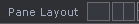

# TouchDesigner and Python<!-- omit in toc -->

A practical introduction to processing data and logic in TD using Python.

[Setting up](#setting-up) . [Running a script: `text`](#running-a-script-text) . [Triggering a script: `panelexec`](#triggering-a-script-panelexec) . [Encoding state: `table` and `datexec`](#encoding-state-table-and-datexec) . [Reacting to signals: `chopexec`](#reacting-to-signals-chopexec) . [Background actions: `execute`](#background-actions-execute)

## Setting up

Our plan for this session is to get started with Python inside TouchDesigner. We're going to run Python scripts inside a `text` DAT, and then in various Execute DATs: `panelexec`, `datexec`, `chopexec`, and `execute`.

But first, let's set up our work environment. In the `Pane Layout` panel under the menu bar , switch to a vertical split layout, and set the right pane to `Textport and DATs (Alt+9)`. This gives us a handy Python terminal to work with.

You can use this Textport to write your Python code, but I highly recommend going for an external [[editor](resources#editors)]. Select your editor of choice in `Edit > Preferences > DATs > Text Editor`. If you use VS Code, then also check out this [autocomplete extension](https://github.com/picturesbyrobots/td-completes-me).

We're now ready to make our first network. Double-click to create two `Constant` TOPs and a `Select` TOP. Hit `P` to edit parameters: make the `Constant` different colours, and have the `Select` refer to the `constant1` TOP. 


<br/>
You can change the names `constant1` etc to something more descriptive, or leave them as is. Think of this as a very abstracted boilerplate for a project comprising two different scenes, one of which is selected for output. Now let's see how we can program this selection!

## Running a script: `text`

The easiest way to try out a Python script in TD is to place it inside a `Text` DAT. Create one, edit it (Ctrl+E) and save it with these contents:
```python
print("HELLO WORLD")
```
Now, with the Text DAT selected, you can hit Ctrl+R to run the script. You should see the result in the right-hand Textport.

Let's try now to change the contents of the `select1` TOP. We want it to refer to the other colour. In `select1`'s parameter panel, click on `+ TOP` to find out its Python name, which is `top`. Next, click on the  `Python Help...` button to find out that you can access this parameter using [dot notation](https://www.askpython.com/python/built-in-methods/dot-notation), via the [`.par` member](https://docs.derivative.ca/ParCollection_Class).

We can then treat this parameter just as we would any Python variable, and assign it a different value:
```python
op('select1').par.top = "constant2"
```
Voila! Run the `text1` script and the colour is now different.

*Exercise: change the Python code to toggle between `"constant1"` and `"constant2"` every time it is run. Hint: just as you modified the `.par.top` variable, you can read (and `print()`) its current value.*

## Triggering a script: `panelexec`

By now you may be tired of hitting Ctrl+R all the time. Why not use a nice button instead?

Create a `Button` COMP. It defaults to a toggle, but you can choose to make it momentary. Click its  `Viewer Active` toggle (low-right corner) to make it clickable.

To respond to these clicks, we need a new script: this time, inside a `Panel Execute` DAT. Before editing its contents, let's set the parameters. `Panels` gets `button1`, and you need to turn on the relevant method (`Off to On` responds to mouse presses).

Another important parameter is [`Panel Value`](https://docs.derivative.ca/Panel_Value). It defaults to `select`, which simply reports mouse clicks, but you can change it to `state` to monitor the status of the button.

Finally, inside the `onOffToOn()` method we could re-implement our previous code, but since we already have it inside the `text1` DAT, we can also just run it directly:
```python
def onOffToOn(panelValue):
	op('text1').run()
	return
```

*Exercise: use the `panelValue` parameter to choose between `"constant1"` and `"constant2"` depending on the state of the button.*

## Encoding state: `table` and `datexec`

Our system works pretty well, but what if we need to visibly store and access the system state, to and from various locations? Let's try to change the architecture, centering it on a data structure that contains the state. We can then have two types of Execute scripts: ones triggered by the inputs (like the `Button` interface) which **alter** the state, and ones that **respond to** changes in the state and trigger output effects. The resulting framework will perform the same task, but allows for greater modularity and transparency.

The first thing we can do is use a `Text` DAT to hold the state data. Create one and rename it `state`. Then, in your input reaction script, you could modify the `state` contents:

```python
...
op('state').text = "constant2"
```

You can then respond to changes in the `state` DAT using a `DAT Execute` DAT. As before, we first link its `DATs` field to our `state` DAT and activate the corresponding methods before editing the code:
```python
def onTableChange(dat):
	print(dat.text)
	return

def onCellChange(dat, cells, prev):
	print(cells[0], "from", prev[0])
	return
```

A more elegant solution than the raw `Text` DAT is to use a bespoke data structure, in the form of a `Table` DAT.



You can imagine such a table being used to store a series of global variables in a more complex system, whose changes could be monitored in the `datexec`:

```python
def onCellChange(dat, cells, prev):
	print("changed", cells[0].offset(0,-1), "to", cells[0], "from", prev[0])
	return
```

## Reacting to signals: `chopexec`

CHOPs in TouchDesigner deal with continuous signals; in the following we will use an `LFO` CHOP, but the general idea applies to all sorts of datastreams like audio, DMX, Kinect etc.

As was the case for Panels and Tables, we shall associate our `LFO` CHOP to a `CHOP Execute` DAT. By now you should be able to configure its parameters yourself. And modulating a parameter by the LFO value is again just a matter of accessing the appropriate `.par`:
```python
def onValueChange(channel, sampleIndex, val, prev):
	op('constant1').par.colorb = val # change B value
	return
```



## Background actions: `execute`

We have seen so far how to trigger scripts manually, or have them react to interface input, or state changes, or continuous signals. Another option is the `Execute` DAT, which provides various methods: for example, you could have the equivalent of the P5 `draw()` function using the `Frame Start` method, which executes its contents every frame.

That's it for now! It's up to you to start plugging any kind of Python code into your TD networks and bring them to life. Of course this is just the beginning, and there are many [[online resources](slides/01-12-practical-python#10)] out there to help you build compelling interactive systems.